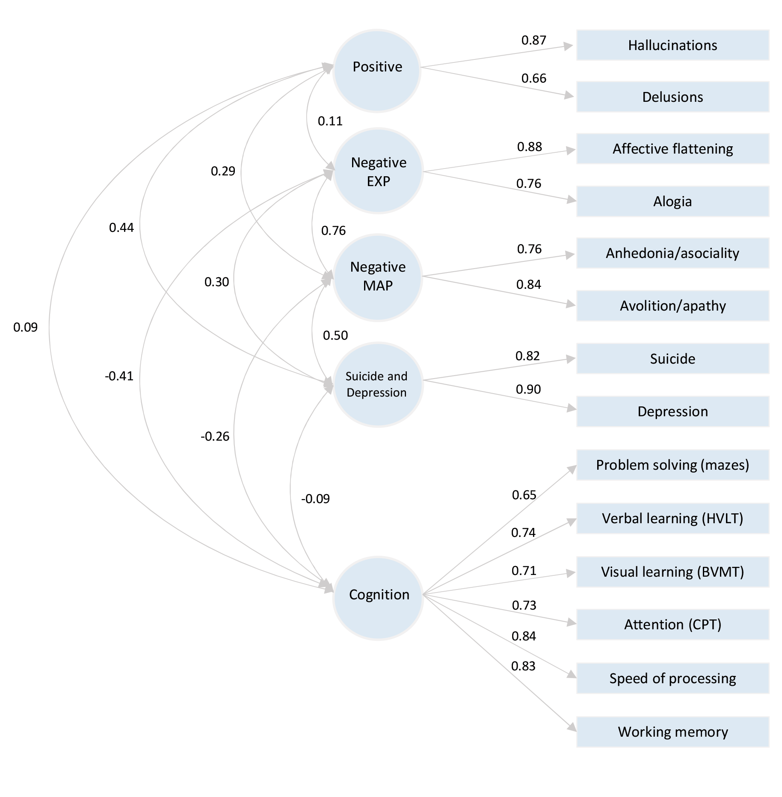

<style> 


body {
  max-width: 1920px;
  margin-left: auto ;
  margin-right: auto;
}


#header { 
/* Permalink - use to edit and share this gradient: https://colorzilla.com/gradient-editor/#e3adff+0,9841db+88 */
background: #e3adff; /* Old browsers */
/* IE9 SVG, needs conditional override of 'filter' to 'none' */
background: url(data:image/svg+xml;base64,PD94bWwgdmVyc2lvbj0iMS4wIiA/Pgo8c3ZnIHhtbG5zPSJodHRwOi8vd3d3LnczLm9yZy8yMDAwL3N2ZyIgd2lkdGg9IjEwMCUiIGhlaWdodD0iMTAwJSIgdmlld0JveD0iMCAwIDEgMSIgcHJlc2VydmVBc3BlY3RSYXRpbz0ibm9uZSI+CiAgPHJhZGlhbEdyYWRpZW50IGlkPSJncmFkLXVjZ2ctZ2VuZXJhdGVkIiBncmFkaWVudFVuaXRzPSJ1c2VyU3BhY2VPblVzZSIgY3g9IjUwJSIgY3k9IjUwJSIgcj0iNzUlIj4KICAgIDxzdG9wIG9mZnNldD0iMCUiIHN0b3AtY29sb3I9IiNlM2FkZmYiIHN0b3Atb3BhY2l0eT0iMSIvPgogICAgPHN0b3Agb2Zmc2V0PSI4OCUiIHN0b3AtY29sb3I9IiM5ODQxZGIiIHN0b3Atb3BhY2l0eT0iMSIvPgogIDwvcmFkaWFsR3JhZGllbnQ+CiAgPHJlY3QgeD0iLTUwIiB5PSItNTAiIHdpZHRoPSIxMDEiIGhlaWdodD0iMTAxIiBmaWxsPSJ1cmwoI2dyYWQtdWNnZy1nZW5lcmF0ZWQpIiAvPgo8L3N2Zz4=);
background: -moz-radial-gradient(center, ellipse cover,  #e3adff 0%, #9841db 88%); /* FF3.6-15 */
background: -webkit-gradient(radial, center center, 0px, center center, 100%, color-stop(0%,#e3adff), color-stop(88%,#9841db)); /* Chrome4-9,Safari4-5 */
background: -webkit-radial-gradient(center, ellipse cover,  #e3adff 0%,#9841db 88%); /* Chrome10-25,Safari5.1-6 */
background: -o-radial-gradient(center, ellipse cover,  #e3adff 0%,#9841db 88%); /* Opera 12+ */
background: -ms-radial-gradient(center, ellipse cover,  #e3adff 0%,#9841db 88%); /* IE10 preview */
background: radial-gradient(ellipse at center,  #e3adff 0%,#9841db 88%); /* W3C, IE10+, FF16+, Chrome26+, Opera12+, Safari7+ */
filter: progid:DXImageTransform.Microsoft.gradient( startColorstr='#e3adff', endColorstr='#9841db',GradientType=1 ); /* IE6-8 fallback on horizontal gradient */


  color: #EFEFEF;
  height: 400px;
  padding: 15px;
  }

.main-container {
  max-width: 1200px;
  margin-left: auto;
  margin-right: auto;
  }

div.blue { background-color:#EFEFEF; border-radius: 20px; padding: 20px;}

</style>

<br>
<br>

```{r set up, echo = F, warning= FALSE}
#### markdown settings ####
knitr::opts_chunk$set(warning = FALSE, message = FALSE, echo = TRUE, fig.align = "center", dev = "png", dev.args=list(bg="transparent")) 
options(knitr.kable.NA = '')
options(scipen = 0)
options(digits = 3)

set.seed(666)

library(beepr)

#### functions ####
#### function to beep on error or upon completing knit ####
options(error = function(){    
  beepr::beep(sound = 10)
  Sys.sleep(time = 1)
  }
 )

.Last <- function() {          
  beepr::beep(sound = 5)
  Sys.sleep(time = 1)
}


#### function for summing across chromosomes ####
analyze <- function(threshold) {
  #prepare
  dat <- lapply(threshold,read.table, header = TRUE, sep= "")
  my_cols <- c("FID", "SCORESUM")
  dat <- lapply(dat, "[", , my_cols)
  #sum
  sum <- bind_rows(dat) %>%
  group_by(FID) %>%
  summarise(ALL_CHR_SUM = sum(SCORESUM))
  }


#### functions for creating regression tables ####
# results tables with confidence intervals
make_tab_ci <- function(x){
  stat <- data.frame(coef(summary(x)))[c(1,4)] %>% # extract estimates/p vals
    rownames_as_column(var = "Predictor")
  ci <- data.frame(confint(x)) %>%  round(2) %>%                # extract cis
    rownames_as_column(var = "Predictor")

  out <- left_join(stat, ci, by = "Predictor")
  out$CI<- paste0(out$X2.5.., ", ", out$X97.5..)
  out$Estimate <- round(out$Estimate, 3)
  out$p <- out$Pr...t.. 
  out$Outcome <- colnames(x$model)[1]
  out$`Estimate (95% CI)` <- paste0(out$Estimate, " (", out$CI, ")")
  df <- dplyr::select(out, c("Outcome", "Predictor", "Estimate (95% CI)", "p")) # join and format
  df <- df[-1,] 
  return(df)
}

make_tab_ci2 <- function(x){
  stat <- data.frame(coef(summary(x)))[c(1,4)] %>% # extract estimates/p vals
    rownames_as_column(var = "Predictor")
  ci <- data.frame(confint(x)) %>%  round(2) %>%                # extract cis
    rownames_as_column(var = "Predictor")

  out <- left_join(stat, ci, by = "Predictor")
  out$Estimate <- round(out$Estimate, 3)
  out$p <- out$Pr...t.. 
  out$Outcome <- colnames(x$model)[1]
  out$Lower <- out$X2.5..
  out$Upper <- out$X97.5..
  df <- dplyr::select(out, c("Outcome", "Predictor", "Estimate", "Lower", "Upper", "p")) # join and format
  df <- df[-1,] 
  return(df)
}

# results tables with standard error
make_tab <- function(x){
  out <- data.frame(coef(summary(x)))[-c(3)] %>% # extract estimates, standard errors, p vals
    rownames_as_column(var = "Predictor")
  out$Estimate <- round(out$Estimate, 3)
  out$SE <- round(out$Std..Error, 2)
  out$p <- out$Pr...t.. 
  out$Outcome <- colnames(x$model)[1]
  out$`Estimate (SE)` <- paste0(out$Estimate, " (", out$SE, ")")
  df <- dplyr::select(out, c("Outcome", "Predictor", "Estimate (SE)", "p")) # join and format
  df <- df[-1,] 
  return(df)
}

# model statistics 
get_fit <- function(x){
  n <-round(nobs(x), digits = 3)
  mod <- summary(x)
  r2 <- mod$r.squared
  ar2 <- mod$adj.r.squared
  df <- data.frame(label = c("R2", "adjusted R2", "N"), 
                             fit = c(r2, ar2, n)) 
  return(df)
}

# transforms numbers to superscript
to_superscript <- function(x) {
  superscript_digits <- c(
    '0' = '\u2070', '1' = '\u00B9', '2' = '\u00B2', '3' = '\u00B3', 
    '4' = '\u2074', '5' = '\u2075', '6' = '\u2076', '7' = '\u2077', 
    '8' = '\u2078', '9' = '\u2079', '-' = '\u207B'
  )
  chars <- strsplit(x, NULL)[[1]]
  superscript <- sapply(chars, function(char) superscript_digits[char])
  return(paste0(superscript, collapse = ""))
}

# transforms numbers from 6e-5 to 6x10-5
format_p <- function(x) {
  significant_digits <- ifelse(x < 0.01, 1, ifelse(x < 0.1, 2, 3))  
  tmp <- as.character(signif(x, digits = significant_digits))
   
  tmp <- gsub("e-0", "x10^-", tmp)
  tmp <- gsub("e", "x10^", tmp)

  tmp <- gsubfn("x10\\^(-?\\d+)", function(y) {
    power <- gsub("x10\\^", "", y)
    paste0("x10", to_superscript(power))
  }, tmp)
  return(tmp)
}

#### function to calculate descriptive statistics for a variable ####
summary_stats <- function(variable) {
  mean_value <- mean(variable)
  sd_value <- sd(variable)
  min_value <- min(variable)
  max_value <- max(variable)
  
  result <- list(
    Mean = mean_value,
    SD = sd_value,
    Min = min_value,
    Max = max_value
  )
  
  return(result)
}

#### function to re-code antipsychotic medication codes to names ####
recode_selected_codes <- function(df, recode_vector, columns_to_recode) {
  # Create a function to map the recode_vector to case_when
  recode_case_when <- function(x, recode_vector) {
    dplyr::case_when(
      x %in% names(recode_vector) ~ recode_vector[as.character(x)],
      TRUE ~ as.character(x)
    )
  }
  # Recode specified columns based on the recode_vector
  df_recoded <- df %>%
    mutate(across(all_of(columns_to_recode), ~ recode_case_when(.x, recode_vector)))
  return(df_recoded)
}

#### function to convert drugs into cpz-eq regardless of admin ####
convert <- function(df, x, y){
  
  df$admin <- ifelse(is.na(df$admin), "NA_value", df$admin)
  admin_values <- unique(df$admin[df$admin != "NA_value"])
  
  # Define the commands for each condition
  if (all(admin_values == "oral")) {
    message("Only oral drugs found.")
    oral <- filter(df, admin == "oral")
    if (nrow(oral) > 0) {
      # convert
      cpz_oral <- to_cpz(oral, ap_label = x, dose_label = y, 
                         route = "oral",  key = gardner_leucht) 
      cpz <- cpz_oral
      return(cpz)
    } else {
      message("No data found for oral drugs.")
      return(NULL)
      }
    # Your command for "oral" goes here
  } else if (all(admin_values == "lai")) {
    message("Only LAI drugs found.")
    depot <- filter(df, admin == "lai")
    if (nrow(depot) > 0) {
      # convert
      cpz_depot <- to_cpz(depot, ap_label = x, dose_label = y, 
                          route = "lai", q_label = 1, key = gardner_leucht) 
      cpz <- cpz_depot
      return(cpz)
    } else {
      message("No data found for LAI drugs.")
      return(NULL)
    }
  } else if (all(admin_values %in% c("oral", "lai"))) {
    message("Oral and LAI drugs found.")
    # split by route
    oral <- filter(df, admin == "oral")
    depot <- filter(df, admin == "lai")
    
    if (nrow(oral) > 0 & nrow(depot) > 0) {
      # convert
      cpz_oral <- to_cpz(oral, ap_label = x, dose_label = y, 
                         route = "oral",  key = gardner2010) 
      cpz_depot <- to_cpz(depot, ap_label = x, dose_label = y, 
                          route = "lai", q_label = 1, key = gardner_leucht) 
      cpz <- rbind(cpz_oral, cpz_depot) 
      return(cpz)
    } else {
      message("No data found for one or both routes.")
      return(NULL)
    }
  } 
  else {
    message("Unexpected values in 'admin' column.")
  }
}

#### extract core fit measures from lavaan object ####
core_fitmeasures <- function(fit = fit, fitindicies=v$fitindicies, digits=3) {
  x <- fitmeasures(fit)
  round(x[fitindicies], digits)
}

#### add row to df ####
insertRow2 <- function(existingDF, newrow, r) {
  existingDF <- rbind(existingDF,newrow)
  existingDF <- existingDF[order(c(1:(nrow(existingDF)-1),r-0.5)),]
  row.names(existingDF) <- 1:nrow(existingDF)
  return(existingDF)  
}

```


```{r load packages, include=FALSE}
# load required packages
library(haven)
library(tidyverse)
library(ggpubr)
library(psych)
library(kableExtra)
library(reshape2)
library(tidyselect)
library(scales)
library(data.table)
library(datawizard)
library(arsenal)
library(AER)
library(chlorpromazineR)
library(sjPlot)
library(thematic)
library(lavaan)
library(flextable)
library(gtsummary)
library(shiny)
library(gsubfn)
library(rvest)
library(phenoconverter)
```

```{r load CardiffCOGS data}
# set working directory
setwd(dir = "D:/siobh/Documents/Uni/PhD/Y1/Symptoms Project/symptoms-cogs/")

# load in CardiffCOGS dataset
pheno <- read_sav("Complete CardiffCogs 2022.sav")

# load in samples with genetic information
geno <-  read.delim("genetic.ids", header = F)

# filter to those with phenotype and genotype information
pheno <- pheno[pheno$Study_ID %in% geno$V1, ] # 

# inclusion criteria
pheno <- pheno %>%
  # filter to people with schizophrenia or schizoaffective disorder depressed type.
  filter(SZ_SZAFFDEP_diag == 1) %>%
  # remove individuals with inappropriate ratings (above 3 on Calgary, above 5 on SAPs/SANS) or NA values in phenotype measures. 
  subset(Calgary_Depression <4) %>%   
  subset(Calgary_Suicide <4) %>%   
  subset(SAPS_Global_Hals <6) %>%
  subset(SAPS_Global_Delusions <6) %>%
  subset(SANS_Global_Alogia <6) %>%
  subset(SANS_Global_Anhedonia_Asociality <6) %>%
  subset(SANS_Global_Affective_Flattening <6) %>%
  subset(SANS_Global_Avolition_Apathy <6) %>%
  subset(!is.na(ZNAB_Mazes_Imp)) %>%
  subset(!is.na(ZHVLT_Imp)) %>%
  subset(!is.na(ZBVMT_Imp)) %>%
  subset(!is.na(ZCPT_Imp)) %>%
  subset(!is.na(ZSoP_Imp)) %>%
  subset(!is.na(ZWM_Imp)) %>%
  # remove individuals with missing medication information.
  subset(AP_dose != 9999) %>% # dose unknown
  subset(AP_dose != 7777) %>% # pro re nata
  subset(Antipsychotic != 89) %>% # antipsychotic name unknown
  subset(!is.na(Adherence))

# exclude IDs in CardiffCOGS that are also present in CLOZUK2/3 or with missing dose information in 2nd or 3rd antipsychotics
remove_1 <- read.delim("prs/CLOZUK23_CardiffCOGS_overlaps.txt", header = F)
remove_2 <- read.delim("missing_dose.ids", header = F)
remove <- rbind(remove_1, remove_2)
remove_ids <- unique(remove$V1)
pheno <- pheno[!pheno$Study_ID %in% remove_ids, ]

rm(remove_1, remove_2, remove, remove_ids)

# extract IDs for calculating genetic PCs
# ids <- pheno[1]
# ids$Study_ID2 <- ids$Study_ID
# write_tsv(x = ids, file = "COGS_SZ_SZAFF.ids", col_names = F) 

```

```{r find number excluded for incomplete meds, include = FALSE}
# set working directory
setwd(dir = "D:/siobh/Documents/Uni/PhD/Y1/Symptoms Project/symptoms-cogs/")

a <- read_sav("Complete CardiffCogs 2022.sav")

a <- a[a$Study_ID %in% geno$V1, ] # 

a <- a %>%
  filter(SZ_SZAFFDEP_diag == 1) %>%
  subset(Calgary_Depression <4) %>%   
  subset(Calgary_Suicide <4) %>%   
  subset(SAPS_Global_Hals <6) %>%
  subset(SAPS_Global_Delusions <6) %>%
  subset(SANS_Global_Alogia <6) %>%
  subset(SANS_Global_Anhedonia_Asociality <6) %>%
  subset(SANS_Global_Affective_Flattening <6) %>%
  subset(SANS_Global_Avolition_Apathy <6) %>%
  subset(!is.na(ZNAB_Mazes_Imp)) %>%
  subset(!is.na(ZHVLT_Imp)) %>%
  subset(!is.na(ZBVMT_Imp)) %>%
  subset(!is.na(ZCPT_Imp)) %>%
  subset(!is.na(ZSoP_Imp)) %>%
  subset(!is.na(ZWM_Imp))

remove <- read.delim("prs/CLOZUK23_CardiffCOGS_overlaps.txt", header = F)
remove_ids <- unique(remove$V1)
a <- a[!a$Study_ID %in% remove_ids, ]

b <- a %>%
  subset(AP_dose != 9999) %>%
  subset(AP_dose != 7777) %>%
  subset(Antipsychotic != 89) %>% 
  subset(!is.na(Adherence))

remove <- read.delim("missing_dose.ids", header = F)
remove_ids <- unique(remove$V1)
b <- b[!b$Study_ID %in% remove_ids, ]

n_excl <- nrow(a) - nrow(b) 

remove(a, b, remove, remove_ids, geno)
```


```{r load pypgx pgx data, include=FALSE}
# set working directory
setwd(dir = "D:/siobh/Documents/Uni/PhD/Y1/Symptoms Project/symptoms-cogs/")

#### 1a2 ####
pypgx_1a2 <-  read_delim("pgx/pypgx/cyp1a2.tsv",delim="\t", col_names = c("Study_ID", "Genotype", "Phenotype", "Haplotype1", "Haplotype2", "AlternativePhase", "VariantData", "CNV")) %>%
  dplyr::select(1:5)
pypgx_1a2 <-  pypgx_1a2[-1,]

#### 2d6 ####
pypgx_2d6 <-  read_delim("pgx/pypgx/cyp2d6.tsv",delim="\t", col_names = c("Study_ID", "Genotype", "Phenotype", "Haplotype1", "Haplotype2", "AlternativePhase", "VariantData", "CNV")) %>%
  dplyr::select(1:5)
pypgx_2d6 <-  pypgx_2d6[-1,]

pypgx_2d6$Phenotype<-gsub("Metabolizer","metaboliser",as.character(pypgx_2d6$Phenotype))

#### 2c9 ####
pypgx_2c9 <-  read_delim("pgx/pypgx/cyp2c9.tsv",delim="\t", col_names = c("Study_ID", "Genotype", "Phenotype", "Haplotype1", "Haplotype2", "AlternativePhase", "VariantData", "CNV")) %>%
  dplyr::select(1:5)
pypgx_2c9 <-  pypgx_2c9[-1,]

pypgx_2c9$Phenotype<-gsub("Metabolizer","metaboliser",as.character(pypgx_2c9$Phenotype))

#### 2c19 ####
pypgx_2c19 <-  read_delim("pgx/pypgx/cyp2c19.tsv",delim="\t", col_names = c("Study_ID", "Genotype", "Phenotype", "Haplotype1", "Haplotype2", "AlternativePhase", "VariantData", "CNV")) %>%
  dplyr::select(1:5)
pypgx_2c19 <-  pypgx_2c19[-1,]

pypgx_2c19$Phenotype<-gsub("Metabolizer","metaboliser",as.character(pypgx_2c19$Phenotype))

#### 3a5 ####
pypgx_3a5 <-  read_delim("pgx/pypgx/cyp3a5.tsv",delim="\t", col_names = c("Study_ID", "Genotype", "Phenotype", "Haplotype1", "Haplotype2", "AlternativePhase", "VariantData", "CNV")) %>%
  dplyr::select(1:5)
pypgx_3a5 <-  pypgx_3a5[-1,]
pypgx_3a5$Phenotype<-gsub("Metabolizer","metaboliser",as.character(pypgx_3a5$Phenotype))


```

```{r cyp1a2 activity scores, include=FALSE}
# create columns for a1 and clean haplotype
pypgx_1a2$score1 = NA
pypgx_1a2$Haplotype1<-gsub(";","",as.character(pypgx_1a2$Haplotype1))

# assign as for a1
pypgx_1a2$score1[pypgx_1a2$Haplotype1 =="*1A"] <- 1
pypgx_1a2$score1[pypgx_1a2$Haplotype1=="*1F"] <- 1.5
pypgx_1a2$score1[pypgx_1a2$Haplotype1=="*1C"] <- 0.5
pypgx_1a2$score1[pypgx_1a2$Haplotype1=="*1K"] <- 0.5
pypgx_1a2$score1[pypgx_1a2$Haplotype1=="*1C*1F"] <- 1

# create columns for a2 and clean haplotype
pypgx_1a2$score2 = NA
pypgx_1a2$Haplotype2<-gsub(";","",as.character(pypgx_1a2$Haplotype2))

# assign  as for a2
pypgx_1a2$score2[pypgx_1a2$Haplotype2 =="*1A"] <- 1
pypgx_1a2$score2[pypgx_1a2$Haplotype2=="*1F"] <- 1.5
pypgx_1a2$score2[pypgx_1a2$Haplotype2=="*1C"] <- 0.5
pypgx_1a2$score2[pypgx_1a2$Haplotype2=="*1K"] <- 0.5
pypgx_1a2$score2[pypgx_1a2$Haplotype2=="*1C*1F"] <- 1

# give total as
pypgx_1a2$est_score = pypgx_1a2$score1 + pypgx_1a2$score2

```

```{r activity scores cyp2d6, include=FALSE}
# using allele table from pypgx api/data on github 10/11/23
# pypgx/pypgx/api/data/allele-table.csv

# split genotype column
pypgx_2d6 <- separate(pypgx_2d6, col=Genotype, into=c('Geno1', 'Geno2'), sep='/', remove = F)

# create columns
pypgx_2d6$score1 = NA
pypgx_2d6$score2 = NA
pypgx_2d6$est_score = NA

# assign as for a1
pypgx_2d6$score1[pypgx_2d6$Geno1 == "*1"] <- 1 # normal function allele
pypgx_2d6$score1[pypgx_2d6$Geno1 == "*10"] <- 0.25 # decreased function allele
pypgx_2d6$score1[pypgx_2d6$Geno1 == "*17"] <- 0.5 # decreased function allele
pypgx_2d6$score1[pypgx_2d6$Geno1 == "*2"] <- 1 # normal function allele
pypgx_2d6$score1[pypgx_2d6$Geno1 == "*28"] <- NA # uncertain function allele
pypgx_2d6$score1[pypgx_2d6$Geno1 == "*35"] <- 1 # normal function allele
pypgx_2d6$score1[pypgx_2d6$Geno1 == "*4"] <- 0 # null function allele
pypgx_2d6$score1[pypgx_2d6$Geno1 == "*41"] <- 0.5 # decreased function allele

# assign as for a2
pypgx_2d6$score2[pypgx_2d6$Geno2 == "*1"] <- 1 # normal function allele
pypgx_2d6$score2[pypgx_2d6$Geno2 == "*10"] <- 0.25 # decreased function allele
pypgx_2d6$score2[pypgx_2d6$Geno2 == "*17"] <- 0.5 # decreased function allele
pypgx_2d6$score2[pypgx_2d6$Geno2 == "*117"] <- NA # uncertain function allele
pypgx_2d6$score2[pypgx_2d6$Geno2 == "*2"] <- 1 # normal function allele
pypgx_2d6$score2[pypgx_2d6$Geno2 == "*28"] <- NA # uncertain function allele
pypgx_2d6$score2[pypgx_2d6$Geno2 == "*29"] <- 0.5 # decreased function allele
pypgx_2d6$score2[pypgx_2d6$Geno2 == "*35"] <- 1 # normal function allele
pypgx_2d6$score2[pypgx_2d6$Geno2 == "*4"] <- 0 # null function allele
pypgx_2d6$score2[pypgx_2d6$Geno2 == "*41"] <- 0.5 # decreased function allele
pypgx_2d6$score2[pypgx_2d6$Geno2 == "*45"] <- 1 # normal function allele
pypgx_2d6$score2[pypgx_2d6$Geno2 == "*59"] <- 0.5 # decreased function allele
pypgx_2d6$score2[pypgx_2d6$Geno2 == "*65"] <- NA # uncertain function allele

# give total as
pypgx_2d6$est_score <- pypgx_2d6$score1 + pypgx_2d6$score2

```

```{r activity scores cyp2c9, include=FALSE}
# using allele table from pypgx api/data on github 10/11/23
# pypgx/pypgx/api/data/allele-table.csv

# split genotype column
pypgx_2c9 <- separate(pypgx_2c9, col=Genotype, into=c('Geno1', 'Geno2'), sep='/', remove = F)

# create columns
pypgx_2c9$score1 = NA
pypgx_2c9$score2 = NA
pypgx_2c9$est_score = NA

# assign as for a1
pypgx_2c9$score1[pypgx_2c9$Geno1 == "*1"] <- 1 # normal function allele
pypgx_2c9$score1[pypgx_2c9$Geno1 == "*2"] <- 0.5 # decreased function
pypgx_2c9$score1[pypgx_2c9$Geno1 == "*3"] <- 0 # no function
pypgx_2c9$score1[pypgx_2c9$Geno1 == "*11"] <- 0.5 # decreased function

# assign as for a2
pypgx_2c9$score2[pypgx_2c9$Geno2 == "*1"] <- 1 # normal function
pypgx_2c9$score2[pypgx_2c9$Geno2 == "*2"] <- 0.5 # decreased function
pypgx_2c9$score2[pypgx_2c9$Geno2 == "*3"] <- 0  # null function
pypgx_2c9$score2[pypgx_2c9$Geno2 == "*9"] <- 1 # normal function
pypgx_2c9$score2[pypgx_2c9$Geno2 == "*11"] <- 0.5 # decreased function
pypgx_2c9$score2[pypgx_2c9$Geno2 == "*12"] <- 0.5 # decreased function

# give total as
pypgx_2c9$est_score <- pypgx_2c9$score1 + pypgx_2c9$score2

```

```{r activity scores cyp2c19, include=FALSE}
# activity scores for *1 (1.0), *2 (0), *17 (1.5) obtained from Lesche et al., 2019 .
# activity scores for *8 (null = 0), *11 (normal = 1), *13 (normal = 1), *15 (normal = 1) inferred from allele function in CPIC PharmGKB CYP2C19 allele functionality reference (https://www.pharmgkb.org/page/cyp2c19RefMaterials). 
# these all match up with the allele functions in the pypgx allele table.

# split genotype column
pypgx_2c19 <- separate(pypgx_2c19, col=Genotype, into=c('Geno1', 'Geno2'), sep='/', remove = F)

# create columns
pypgx_2c19$score1 = NA
pypgx_2c19$score2 = NA
pypgx_2c19$est_score = NA

# assign as for a1
pypgx_2c19$score1[pypgx_2c19$Geno1 == "*1"] <- 1 # normal function allele
pypgx_2c19$score1[pypgx_2c19$Geno1 == "*15"] <- 1 # normal function allele
pypgx_2c19$score1[pypgx_2c19$Geno1 == "*17"] <- 1.5 # increased function allele
pypgx_2c19$score1[pypgx_2c19$Geno1 == "*2"] <- 0 # null function allele
pypgx_2c19$score1[pypgx_2c19$Geno1 == "*8"] <- 0 # null function allele

# assign as for a2
pypgx_2c19$score2[pypgx_2c19$Geno2 == "*1"] <- 1 # normal function allele
pypgx_2c19$score2[pypgx_2c19$Geno2 == "*13"] <- 1 # normal function allele
pypgx_2c19$score2[pypgx_2c19$Geno2 == "*15"] <- 1 # normal function allele
pypgx_2c19$score2[pypgx_2c19$Geno2 == "*17"] <- 1.5 # increased function allele
pypgx_2c19$score2[pypgx_2c19$Geno2 == "*2"] <- 0 # null function allele
pypgx_2c19$score2[pypgx_2c19$Geno2 == "*8"] <- 0 # null function allele

pypgx_2c19$est_score <- pypgx_2c19$score1 + pypgx_2c19$score2
```

```{r activity scores cyp3a5, include=FALSE}

# allele functions obtained from CPIC PharmGKB CYP3A5 allele functionality reference file 10/11/23
# activity scores inferred from allele function, only normal and null function alleles are present which makes things easy.
# 1 assigned to normal function alleles and 0 to null function alleles. 

# split genotype column
pypgx_3a5 <- separate(pypgx_3a5, col=Genotype, into=c('Geno1', 'Geno2'), sep='/', remove = F)

# create columns
pypgx_3a5$score1 = NA
pypgx_3a5$score2 = NA
pypgx_3a5$est_score = NA

# assign as to a1
pypgx_3a5$score1[pypgx_3a5$Geno1 == "*1"] <- 1 # normal function
pypgx_3a5$score1[pypgx_3a5$Geno1 == "*3"] <- 0 # null function

# assign as to a2
pypgx_3a5$score2[pypgx_3a5$Geno2 == "*1"] <- 1 # normal function
pypgx_3a5$score2[pypgx_3a5$Geno2 == "*3"] <- 0 # null function
pypgx_3a5$score2[pypgx_3a5$Geno2 == "*6"] <- 0 # null function

# give total as
pypgx_3a5$est_score <- pypgx_3a5$score1 + pypgx_3a5$score2
```

```{r create combo variable, include=FALSE}
# merge all relevant pgx information together
all_pgx <- left_join(dplyr::select(pypgx_1a2, c("Study_ID", "est_score")), dplyr::select(pypgx_2d6, c("Study_ID", "est_score")), by = "Study_ID")
all_pgx <- left_join(all_pgx, dplyr::select(pypgx_2c9, c("Study_ID", "est_score")), by = "Study_ID")
all_pgx <- left_join(all_pgx, dplyr::select(pypgx_2c19, c("Study_ID", "est_score")), by = "Study_ID")
all_pgx <- left_join(all_pgx, dplyr::select(pypgx_3a5, c("Study_ID", "est_score")), by = "Study_ID")

# rename columns
colnames(all_pgx) <- c("Study_ID", "CYP1A2_AS", "CYP2D6_AS",  "CYP2C9_AS", "CYP2C19_AS", "CYP3A5_AS")

```


```{r initial pcs, include=FALSE}
# set working directory
setwd(dir = "D:/siobh/Documents/Uni/PhD/Y1/Symptoms Project/symptoms-cogs/")

# load in genetic principal components
pca <- read.table("COGS.allchr.eigenvec",header=F)

pca <- pca[2:12]

colnames(pca) <- c( "Study_ID", "PC1", "PC2", "PC3", "PC4", "PC5", "PC6", "PC7", "PC8", "PC9", "PC10")

```


```{r load PGS, include=FALSE}
# load schizophrenia PGS 
setwd(dir = "D:/siobh/Documents/Uni/PhD/Y1/Symptoms Project/symptoms-cogs/prs/sz/cs_prs/")

# find all .profile files
list_file <- list.files(pattern = "*.profile") %>% 
 gtools::mixedsort()

# sum across chromosomes
prs_cs_sz <- analyze(list_file)
colnames(prs_cs_sz) <- c("Study_ID", "SZ_PRScs")

# load intelligence PGS
setwd(dir = "D:/siobh/Documents/Uni/PhD/Y1/Symptoms Project/symptoms-cogs/prs/intelligence/")

# find all .profile files
list_file <- list.files(pattern = "*.profile") %>% 
 gtools::mixedsort()

# sum across chromosomes
prs_cs_int <- analyze(list_file)
colnames(prs_cs_int) <- c("Study_ID", "Int_PRScs")

# load educational attainment PGS 
setwd(dir = "D:/siobh/Documents/Uni/PhD/Y1/Symptoms Project/symptoms-cogs/prs/edu/")

# find all .profile files
list_file <- list.files(pattern = "*.profile") %>% 
 gtools::mixedsort()

# sum across chromosomes
prs_cs_ea <- analyze(list_file)
colnames(prs_cs_ea) <- c("Study_ID", "EA_PRScs")


```


```{r combine prs, include=FALSE}
# merge PRS information
all_prs <- left_join(prs_cs_sz, prs_cs_int, by = "Study_ID")
all_prs <- left_join(all_prs, prs_cs_ea, by = "Study_ID")

rm(prs_cs_sz, prs_cs_int, prs_cs_ea)
```

```{r convert set up, warning=FALSE, echo=FALSE}

# get only the medication variables
meds <- dplyr::select(pheno, c("Study_ID", "Antipsychotic", "AP_dose", "antidepressant", "AD_dose", "Mood_Stabiliser", "MS_dose", "Benzodiazepine", "Ben_dose", "Anticholinergic", "Anticholinergic_dose" , "other_medication", "Other_medication_dose", "Current_smoking"))

AP_codes <- c(1:16, 18:29, 87) # corresponds to antipsychotic medication only

# remove all drugs (and corresponding doses) that aren't useful AP (i.e., 1 - 29 & 87, excluding 17)
meds$Antipsychotic[!(meds$Antipsychotic %in% AP_codes)] <- NA
meds$antidepressant[!(meds$antidepressant %in% AP_codes)] <- NA
meds$Mood_Stabiliser[!(meds$Mood_Stabiliser%in% AP_codes)] <- NA
meds$Benzodiazepine[!(meds$Benzodiazepine %in% AP_codes)] <- NA
meds$Anticholinergic[!(meds$Anticholinergic %in% AP_codes)] <- NA
meds$other_medication[!(meds$other_medication %in% AP_codes)] <- NA

# remove doses for non-useful drugs
meds$AP_dose[is.na(meds$Antipsychotic)] <- NA
meds$AD_dose[is.na(meds$antidepressant)] <- NA
meds$MS_dose[is.na(meds$Mood_Stabiliser)] <- NA
meds$Ben_dose[is.na(meds$Benzodiazepine)] <- NA
meds$Anticholinergic_dose[is.na(meds$Anticholinergic)] <- NA
meds$Other_medication_dose[is.na(meds$other_medication)] <- NA

# remove participant where no dose (strict) 
#meds$antidepressant <- ifelse(!is.na(meds$antidepressant) & is.na(meds$AD_dose), 9999, meds$antidepressant)
#meds$Mood_Stabiliser <- ifelse(!is.na(meds$Mood_Stabiliser) & is.na(meds$MS_dose), 9999, meds$Mood_Stabiliser)
#meds$Benzodiazepine <- ifelse(!is.na(meds$Benzodiazepine) & is.na(meds$Ben_dose), 9999, meds$Benzodiazepine)
#meds$Anticholinergic <- ifelse(!is.na(meds$Anticholinergic) & is.na(meds$Anticholinergic_dose), 9999, meds$Anticholinergic_dose)
#meds$other_medication <- ifelse(!is.na(meds$other_medication) & is.na(meds$Other_medication_dose), 9999, meds$other_medication)

#remove_ids <- meds$Study_ID[meds$antidepressant == 9999 | meds$Mood_Stabiliser == 9999 | meds$Benzodiazepine == 9999 | meds$Anticholinergic == 9999 | meds$other_medication == 9999]

# remove_ids <- as.data.frame(na.omit(remove_ids))
# write_tsv(x = remove_ids, file = "missing_dose.ids", col_names = F)


# depot medication found within the following columns
# create new 'daily' variable by dividing all depot drugs doses by 7 

meds$daily_AP <- meds$AP_dose
meds$daily_antichol <- meds$Anticholinergic_dose
meds$daily_other <- meds$Other_medication_dose

meds <- meds %>%
  mutate(daily_AP = case_when(Antipsychotic == 6 ~ (daily_AP / 7), # this is the DEPOT Version
                                                Antipsychotic == 8 ~ (daily_AP / 7), # this is the DEPOT version
                                                Antipsychotic == 10 ~ (daily_AP / 7), # this is the DEPOT version
                                                Antipsychotic == 16 ~ (daily_AP / 7), # this is the DEPOT version
                                                Antipsychotic == 22 ~ (daily_AP / 7), # this is the DEPOT version
                                                Antipsychotic == 29 ~ (daily_AP / 7), # this is the DEPOT version
                                                Antipsychotic == 87 ~ (daily_AP / 7), # this is the DEPOT version
                                                TRUE ~ as.double(daily_AP)
  ))

meds <- meds %>%
    mutate(daily_antichol = case_when(Anticholinergic == 6 ~ (daily_antichol / 7), # this is the DEPOT Version
                                                Anticholinergic == 8 ~ (daily_antichol / 7), # this is the DEPOT version
                                                Anticholinergic == 10 ~ (daily_antichol / 7), # this is the DEPOT version
                                                Anticholinergic == 16 ~ (daily_antichol / 7), # this is the DEPOT version
                                                Anticholinergic == 22 ~ (daily_antichol / 7), # this is the DEPOT version
                                                Anticholinergic == 29 ~ (daily_antichol / 7), # this is the DEPOT version
                                                Anticholinergic == 87 ~ (daily_antichol / 7), # this is the DEPOT version
                                                TRUE ~ as.double(daily_antichol) ) )

meds <- meds %>%
    mutate(daily_other = case_when(other_medication == 6 ~ (daily_other / 7), # this is the DEPOT Version
                                                other_medication == 8 ~ (daily_other / 7), # this is the DEPOT version
                                                other_medication == 10 ~ (daily_other / 7), # this is the DEPOT version
                                                other_medication == 16 ~ (daily_other / 7), # this is the DEPOT version
                                                other_medication == 22 ~ (daily_other / 7), # this is the DEPOT version
                                                other_medication == 29 ~ (daily_other / 7), # this is the DEPOT version
                                                other_medication == 87 ~ (daily_other / 7), # this is the DEPOT version
                                                TRUE ~ as.double(daily_other) ) )

# divide 
ap <- meds %>% dplyr::select(Study_ID, Antipsychotic, daily_AP)
ad <- meds %>% dplyr::select(Study_ID, antidepressant, AD_dose)
ms <- meds %>% dplyr::select(Study_ID, Mood_Stabiliser, MS_dose)
bz <- meds %>% dplyr::select(Study_ID, Benzodiazepine, Ben_dose)
ac <- meds %>% dplyr::select(Study_ID, Anticholinergic, daily_antichol)
ot <- meds %>% dplyr::select(Study_ID, other_medication, daily_other)

#### assign route ####
# antipsychotic
ap$admin[!is.na(ap$Antipsychotic)] <- "oral"
ap$admin[ap$Antipsychotic == 6] <- "lai"
ap$admin[ap$Antipsychotic == 8] <- "lai"
ap$admin[ap$Antipsychotic == 10] <- "lai"
ap$admin[ap$Antipsychotic == 16] <- "lai"
ap$admin[ap$Antipsychotic == 22] <- "lai"
ap$admin[ap$Antipsychotic == 29] <- "lai"     
ap$admin[ap$Antipsychotic == 87] <- "lai"     

# creating a depot variable
ap$depot_current <- NA
ap$depot_current[ap$admin == "oral"] <- 0
ap$depot_current[ap$admin == "lai"] <- 1

# antidepressant
ad$admin[!is.na(ad$antidepressant)] <- "oral"
ad$admin[ad$antidepressant == 6] <- "lai"
ad$admin[ad$antidepressant == 8] <- "lai"
ad$admin[ad$antidepressant == 10] <- "lai"
ad$admin[ad$antidepressant == 16] <- "lai"
ad$admin[ad$antidepressant == 22] <- "lai"
ad$admin[ad$antidepressant == 29] <- "lai"     
ad$admin[ad$antidepressant == 87] <- "lai"     

# creating a depot variable
ad$depot_current <- NA
ad$depot_current[ad$admin == "oral"] <- 0
ad$depot_current[ad$admin == "lai"] <- 1

# Mood_Stabiliser
ms$admin[!is.na(ms$Mood_Stabiliser)] <- "oral"
ms$admin[ms$Mood_Stabiliser == 6] <- "lai"
ms$admin[ms$Mood_Stabiliser == 8] <- "lai"
ms$admin[ms$Mood_Stabiliser == 10] <- "lai"
ms$admin[ms$Mood_Stabiliser == 16] <- "lai"
ms$admin[ms$Mood_Stabiliser == 22] <- "lai"
ms$admin[ms$Mood_Stabiliser == 29] <- "lai"     
ms$admin[ms$Mood_Stabiliser == 87] <- "lai"     

# creating a depot variable
ms$depot_current <- NA
ms$depot_current[ms$admin == "oral"] <- 0
ms$depot_current[ms$admin == "lai"] <- 1

# Benzodiazepine
bz$admin[!is.na(bz$Benzodiazepine)] <- "oral"
bz$admin[bz$Benzodiazepine == 6] <- "lai"
bz$admin[bz$Benzodiazepine == 8] <- "lai"
bz$admin[bz$Benzodiazepine == 10] <- "lai"
bz$admin[bz$Benzodiazepine == 16] <- "lai"
bz$admin[bz$Benzodiazepine == 22] <- "lai"
bz$admin[bz$Benzodiazepine == 29] <- "lai"     
bz$admin[bz$Benzodiazepine == 87] <- "lai"     

# creating a depot variable
bz$depot_current <- NA
bz$depot_current[bz$admin == "oral"] <- 0
bz$depot_current[bz$admin == "lai"] <- 1

# Anticholinergic
ac$admin[!is.na(ac$Anticholinergic)] <- "oral"
ac$admin[ac$Anticholinergic == 6] <- "lai"
ac$admin[ac$Anticholinergic == 8] <- "lai"
ac$admin[ac$Anticholinergic == 10] <- "lai"
ac$admin[ac$Anticholinergic == 16] <- "lai"
ac$admin[ac$Anticholinergic == 22] <- "lai"
ac$admin[ac$Anticholinergic == 29] <- "lai"     
ac$admin[ac$Anticholinergic == 87] <- "lai"     

# creating a depot variable
ac$depot_current <- NA
ac$depot_current[ac$admin == "oral"] <- 0
ac$depot_current[ac$admin == "lai"] <- 1

# other
ot$admin[!is.na(ot$other_medication)] <- "oral"
ot$admin[ot$other_medication == 6] <- "lai"
ot$admin[ot$other_medication == 8] <- "lai"
ot$admin[ot$other_medication == 10] <- "lai"
ot$admin[ot$other_medication == 16] <- "lai"
ot$admin[ot$other_medication == 22] <- "lai"
ot$admin[ot$other_medication == 29] <- "lai"     
ot$admin[ot$other_medication == 87] <- "lai"     

# creating a depot variable
ot$depot_current <- NA
ot$depot_current[ot$admin == "oral"] <- 0
ot$depot_current[ot$admin == "lai"] <- 1

#### medication code - name mapping ####
recode_vector <- c(
  "1" = "amisulpride",
  "2" = "aripiprazole",
  "3" = "chlorpromazine",
  "4" = "clozapine",
  "5" = "flupenthixol",
  "6" = "flupentixol", 
# americanised spelling to force use of Leucht 2016 DDD conversion for flupenthixol lai. The size of conversion differs greatly between the two (75.2, DDD vs 210, Gardner) and using Gardner's equivalents results in people having a total daily dose > 6000 mg (compared to > 2000mg when the DDD flupentixol LAI conversion is used).
  "7" = "fluphenazine",
  "8" = "fluphenazine",
  "9" = "haloperidol",
  "10" = "haloperidol",
  "12" = "olanzapine",
  "15" = "pimozide",
  "16" = "pipotiazine",
  "20" = "quetiapine",
  "21" = "risperidone",
  "22" = "risperidone",
  "24" = "sulpiride",
  "26" = "trifluoperazine",
  "28" = "zuclopenthixol",
  "29" = "zuclopenthixol",
  "87" = "paliperidone"
)

# recode all numeric codes to medication names
ap <- as.data.frame(recode_selected_codes(df = ap, recode_vector = recode_vector, columns_to_recode = "Antipsychotic"))

ad <- as.data.frame(recode_selected_codes(df = ad, recode_vector = recode_vector, columns_to_recode = "antidepressant"))

ms <- as.data.frame(recode_selected_codes(df = ms, recode_vector = recode_vector, columns_to_recode = "Mood_Stabiliser"))

bz <- as.data.frame(recode_selected_codes(df = bz, recode_vector = recode_vector, columns_to_recode = "Benzodiazepine"))

ac <- as.data.frame(recode_selected_codes(df = ac, recode_vector = recode_vector, columns_to_recode = "Anticholinergic"))

ot <- as.data.frame(recode_selected_codes(df = ot, recode_vector = recode_vector, columns_to_recode = "other_medication"))

```


```{r chlorpromazineR conversion, warning=FALSE, echo=FALSE}

# making custom conversion, which uses the conversions from Gardner et al., (2010) first then the DDD from Leucht et al., (2016) when conversions absent from Gardner et al., (2010), as recommended in the documentation, and by Leucht et al., (2016).
gardner_leucht <- add_key(base = gardner2010, add = leucht2016, trim = TRUE)

# checks: do we have keys for all antipsychotics in dataset
  # check_ap(ms, ap_label = "Mood_Stabiliser", route = "oral", key=gardner_leucht)
  # check_ap(example_pheno, ap_label = "antipsychotic", route = "lai", key=gardner_leucht)
  # colSums(is.na(example_pheno))

# convert all antipsychotics
apc <- convert(ap, "Antipsychotic", "daily_AP") %>% dplyr::select(c("Study_ID", "cpz_eq"))
adc <- convert(ad, "antidepressant", "AD_dose") %>% dplyr::select(c("Study_ID", "cpz_eq"))
msc <- convert(ms, "Mood_Stabiliser", "MS_dose") %>% dplyr::select(c("Study_ID", "cpz_eq"))
bzc <- convert(bz, "Benzodiazepine", "Ben_dose") %>% dplyr::select(c("Study_ID", "cpz_eq"))
acc <- convert(ac, "Anticholinergic", "daily_antichol") %>% dplyr::select(c("Study_ID", "cpz_eq"))
otc <- convert(ot, "other_medication", "daily_other") %>% dplyr::select(c("Study_ID", "cpz_eq"))

# join together to form cpz dataset
cpz <- full_join(apc, adc, by = "Study_ID")
cpz <- full_join(cpz, msc, by = "Study_ID")
cpz <- full_join(cpz, bzc, by = "Study_ID")
cpz <- full_join(cpz, acc, by = "Study_ID")
cpz <- full_join(cpz, otc, by = "Study_ID")

cols <- colnames(cpz)

# sum all chlorpromazine equivalents
cpz$total <- rowSums(cpz[, cols[-1]], na.rm = TRUE)
cpz <- cpz %>% dplyr::select("Study_ID", "total") 
colnames(cpz) <- c("Study_ID", "cpz_eq") 

pheno <- left_join(pheno, cpz, by = "Study_ID")

# remove intermediates
rm(ac, acc, ad, adc, ap, apc, bz, bzc, ms,msc, ot, otc)

```


```{r important variables, warning=FALSE, echo=FALSE}
#### extracting phenotype variables ####
# only current symptoms (used for deriving factors)
positive <- dplyr::select(pheno, c("Study_ID", "SAPS_Global_Hals",  "SAPS_Global_Delusions"))

negative <- dplyr::select(pheno, c("Study_ID", "SANS_Global_Affective_Flattening",  "SANS_Global_Alogia",  "SANS_Global_Anhedonia_Asociality","SANS_Global_Avolition_Apathy"))

others <- dplyr::select(pheno, c("Study_ID", 
                                 "Calgary_Suicide", "Calgary_Depression" , 
                                 "ZNAB_Mazes_Imp","ZHVLT_Imp", "ZBVMT_Imp", "ZCPT_Imp", "ZSoP_Imp", "ZWM_Imp"))

# join symptoms together
symptoms <- left_join(positive, negative, by = "Study_ID")
symptoms <- left_join(symptoms, others, by = "Study_ID")

#### extracting additional variables ####
# select other covariates
covariates <- dplyr::select(pheno, c("Study_ID",  "Sex", "Age_at_Interview", "AP_dose", "cpz_eq", "Antipsychotic", "antidepressant", "Mood_Stabiliser", "Benzodiazepine", "Anticholinergic", "other_medication", "Adherence", "GAS_Past_Week", "Pt_Highest_Educn", "NARTIQ"
                                     ))
#### preparng medication variables ####
# select columns for coding medication variables
meds <- dplyr::select(pheno, c("Study_ID", "Antipsychotic", "antidepressant", "Mood_Stabiliser", "Benzodiazepine", "Anticholinergic", "other_medication", "Current_smoking"))

# code clozapine current (checking for clozapine code (4) across all medication columns)
# code fluoxetine current (checking for fluoxetine code (38) across all medication columns)
# code carbamazepine current (checking for carbamazepine code (58) across all medication columns)

meds <- meds %>%
  mutate(cloz_present = rowSums(dplyr::select(., c(2:7)) == 4, na.rm = TRUE),
         fluox_present = rowSums(dplyr::select(., c(2:7)) == 38, na.rm = TRUE),
         carb_present = rowSums(dplyr::select(., c(2:7)) == 58, na.rm = TRUE))

# create binary variable for above
meds$clozapine_current <- 0
meds$clozapine_current[meds$cloz_present >= 1] <- 1

meds$fluoxetine <- 0
meds$fluoxetine[meds$fluox_present >= 1] <- 1

meds$carbamazepine <- 0
meds$carbamazepine[meds$carb_present >= 1] <- 1

# re-code current smoking status so it makes more sense 1 = presence, 0 = absence.
meds$smoking <- NA
meds$smoking[meds$Current_smoking == 1] <- 1 # labels 1 = yes, 2 = no
meds$smoking[meds$Current_smoking == 2] <- 0 # labels 1 = yes, 2 = no

# create anticholinergic variable identifying anticholinergics (80-83 and 17) across medication columns
anti <- meds %>%
  mutate(antich_present = rowSums(dplyr::select(., c(2:7)) == 80 | dplyr::select(., c(2:7)) == 81 | dplyr::select(., c(2:7)) == 82 | dplyr::select(., c(2:7)) == 83 | dplyr::select(., c(2:7)) == 17, na.rm = TRUE))

# create binary variable for anticholinergic presence (1) / absence (0) 
anti$antichol_present <- 0
anti$antichol_present[anti$antich_present >= 1] <- 1

anti_p <- dplyr::select(anti, c("Study_ID", "antichol_present"))

# create antipsychotic polypharmacy variable
pp <- dplyr::select(pheno, c("Study_ID", "Antipsychotic", "antidepressant", "Mood_Stabiliser", "Benzodiazepine", "Anticholinergic", "other_medication"))

# need to remove 0s and treat as NAs
pp$Benzodiazepine[pp$Benzodiazepine == 0] <- NA
pp$other_medication[pp$other_medication == 0] <- NA

# need to create new columns as some have antipsychotics in other columns
# create app variable from antipsychotics being input into other drug categories:
# antipsychotics are anything under 29 (not 17) or 87 
pp <- pp %>%
  mutate(app = rowSums((dplyr::select(., c(2:7)) <= 29 & dplyr::select(., c(2:7)) != 17) | dplyr::select(., c(2:7)) == 87, na.rm = TRUE))

pp$ap_poly <- 0 
pp$ap_poly[pp$app > 1] <- 1

pp <- dplyr::select(pp, c("Study_ID", "ap_poly", "app"))

# join new variables together
covariates  <- left_join(covariates, dplyr::select(meds, c("Study_ID", "clozapine_current", "fluoxetine", "carbamazepine" ,"smoking")))
covariates <- left_join(covariates, anti_p, by = "Study_ID" )
covariates <- left_join(covariates, pp, by = "Study_ID" )

# code adherence items
covariates$Adherence[covariates$Adherence == 7] <- NA
covariates$Adherence_coded[covariates$Adherence >=4] <- 1 
covariates$Adherence_coded[covariates$Adherence <=3] <- 0 
covariates$Adherence_coded <- as.factor(covariates$Adherence_coded)
covariates$Adherence <- as.factor(covariates$Adherence)
# levels = c("Doesn't take medication", "Takes medication only rarely", "Misses over 50% doses", "Misses doses every week", "Rarely misses doses", "Medication supervised and takes as prescribed"))

# make binary variables factors
covariates$Sex <- as.factor(covariates$Sex)
covariates$clozapine_current <- as.factor(covariates$clozapine_current)
covariates$smoking <- as.factor(covariates$smoking)
covariates$fluoxetine <- as.factor(covariates$fluoxetine)
covariates$carbamazepine <- as.factor(covariates$carbamazepine)
covariates$antichol_present <- as.factor(covariates$antichol_present)
covariates$ap_poly <- as.factor(covariates$ap_poly)


```


```{r make dataset, warning=FALSE, echo=FALSE}
# join genetic data
all_gen <- left_join(all_prs, all_pgx, by = "Study_ID")
all_gen <- left_join(all_gen, pca, by = "Study_ID")

# merge with phenotype data
df <- left_join(covariates, all_gen, by = "Study_ID")
test_df <- left_join(symptoms, df, by = "Study_ID")

# treat SAPS/SANS/Calgary variables as ordinal
test_df[,c("SAPS_Global_Delusions","SAPS_Global_Hals", "SANS_Global_Affective_Flattening", "SANS_Global_Alogia", "SANS_Global_Anhedonia_Asociality",  "SANS_Global_Avolition_Apathy", 
          "Calgary_Suicide", "Calgary_Depression"
           )] <-
     lapply(test_df[,c("SAPS_Global_Delusions","SAPS_Global_Hals", "SANS_Global_Affective_Flattening", "SANS_Global_Alogia", "SANS_Global_Anhedonia_Asociality",  "SANS_Global_Avolition_Apathy", 
                       "Calgary_Suicide", "Calgary_Depression"
                       )], ordered) 

# remove intermediate dfs
rm(all_gen, all_prs, all_pgx)
rm(positive, negative, covariates, others, pp, anti, anti_p)
```


```{r helper cfa, warning=FALSE, echo=FALSE}
fits<-list()

v<-list()
v$items<-test_df$names
v$fitindicies<-c("npar", "chisq", "df", "pvalue", "cfi", "rmsea", "rmsea.ci.lower", "rmsea.ci.upper", "srmr")

```

```{r cfa, warning=FALSE, echo=FALSE}
model4 <- 'positive =~ SAPS_Global_Hals + SAPS_Global_Delusions
           express =~ SANS_Global_Affective_Flattening + SANS_Global_Alogia 
           mandp =~  SANS_Global_Avolition_Apathy + SANS_Global_Anhedonia_Asociality
           sad =~ Calgary_Depression + Calgary_Suicide
           cog =~ ZNAB_Mazes_Imp + ZHVLT_Imp + ZBVMT_Imp + ZCPT_Imp + ZSoP_Imp + ZWM_Imp'

fits$four <- cfa(model4, data=test_df)

# get dimensions for model 4
latent_variables<-lavPredict(fits$four)

idx <- lavInspect(fits$four, "case.idx")

# select only variables relevant to downstream analysis

test_df_dim <- test_df


for (fs in colnames(latent_variables)) {
  test_df_dim[idx, fs] <- latent_variables[ , fs]
}
```

```{r standardise and stratify the dimensions data}
# standardise all variables 
test_df_dim_std <- datawizard::standardise(x = test_df_dim)

# do this for clozapine using sample (filter by current clozapine status)
test_df_dim_std_c <- datawizard::standardise(x = filter(test_df_dim, clozapine_current==1))

```

# Medication and pharmacogenomic effects on cross-sectional symptom severity and cognitive ability in schizophrenia. {.tabset}

<br>
**Siobhan K. Lock, Djenifer B. Kappel, Michael J. Owen, James T.R. Walters, Michael C. O'Donovan, <a href = "mailto: PardinasA@cardiff.ac.uk"> Antonio .F. Pardiñas, </a> and <a href = "mailto: LeggeSE8@cardiff.ac.uk"> Sophie E. Legge. </a>**

<br>

**Background:** People with schizophrenia differ in the type and severity of symptoms experienced, as well as their response to medication. A better understanding of the factors that influence this heterogeneity is necessary for the development of individualised patient care. Here, we sought to investigate the relationships between phenotypic severity and both medication and pharmacogenomic variables in a cross-sectional sample of people with schizophrenia or schizoaffective disorder depressed type.

**Methods:** Confirmatory factor analysis derived five dimensions relating to current symptoms (positive symptoms, negative symptoms of diminished expressivity, negative symptoms of reduced motivation and pleasure, depression and suicide) and cognitive ability in participants prescribed with antipsychotic medication. Linear models were fit to test for associations between medication and pharmacogenomic variables with dimension scores in the full sample (N = 585), and in a sub-sample of participants prescribed clozapine (N = 215). 

**Outcomes:** Lower cognitive ability was associated with higher chlorpromazine-equivalent daily antipsychotic dose and with the prescription of clozapine and anticholinergic medication. We also found associations between pharmacogenomics-inferred cytochrome P450 (CYP) enzyme activity and symptom dimensions. Increased genotype-predicted CYP2C19 and CYP3A5 activity were associated with reduced severity of positive and negative symptoms, respectively. Faster predicted CYP1A2 activity was associated with higher cognitive dimension scores in people taking clozapine. 

**Interpretation:** Our results confirm the importance of taking account of medication history (and particularly antipsychotic type and dose) in assessing potential causes of cognitive impairment or poor functioning in patients with schizophrenia. We also highlight the potential for pharmacogenomic variation to be a useful tool to help guide drug prescription, although these findings require further validation.  

**Funding:** This project was supported by a Medical Research Council Programme Grant (MR/Y004094/1) and The National Centre for Mental Health, funded by the Welsh Government through Health and Care Research Wales. SKL was funded by a PhD studentship from Mental Health Research UK (MHRUK). DBK, JTRW, MCOD and AFP were supported by the European Union’s Horizon 2020 research and innovation programme under grant agreement 964874.

**Acknowledgements:** We thank the participants, clinicians, field team, and Medical Research Council Centre for Neuropsychiatric Genetics and Genomics core laboratory staff for their help with the CardiffCOGS study. We thank the staff at the Broad Institute of Harvard and MIT, and deCODE Genetics for sample genotyping. We thank the Psychosis team at Cardiff University’s Centre for Neuropsychiatric Genetics and Genomics, particularly Isabella Willcocks and Sophie Smart for their help and guidance over the course of this project. We acknowledge the support of the Supercomputing Wales project, which is part-funded by the European Regional Development Fund (ERDF) via Welsh Government.


<br>
<br>
<br>


## <strong> Introduction </strong>


### Introduction

Schizophrenia is characterised by positive, negative, and disorganised symptoms alongside affective features and cognitive deficits. The presentation of schizophrenia is heterogeneous in the range and severity of symptoms and in the degree to which those respond to antipsychotic treatment. Heterogeneity in treatment response has been associated with pre-morbid functioning, initial symptom severity, age of onset, duration of untreated psychosis, as well as comorbid psychiatric and substance abuse disorders^1^. Genetic factors may also play a role, with one study suggesting that higher common variant liability to schizophrenia, as indexed by polygenic scores (PGS), is associated with poorer response to antipsychotics after 12 weeks of treatment^2^. Similarly, both longitudinal and cross-sectional research has demonstrated an association between higher schizophrenia PGS and greater severity of negative and cognitive symptom dimensions^3–5^.  

Beyond polygenic risk, variation in genes encoding proteins key to pharmacokinetic or pharmacodynamic processes (“pharmacogenes”) may also influence response to antipsychotic medication^6^. Pharmacogenomic star alleles describe single or multiple genetic markers that alter the function of proteins influencing drug response. The most widely researched pharmacogenes are within the cytochrome P450 (CYP) family, which are implicated in drug metabolism and are highly variable within and across populations. While drug metabolism pathways are often well-studied biochemically, the extent to which between-person variability in these pathways influences drug effectiveness is still unclear. **Figure 1** illustrates how a pharmacogenomic alteration in a key metabolic enzyme might affect response to a medication. While such effects are intuitive and form the basis of successful prospective trials^7^, as of June 2024, only 10 antipsychotics have regulator-approved guidelines with actionable pharmacogenomic markers in the PharmGKB database^8^. Reviews from expert consortia report a similar number of drugs where pharmacogenomic information might be of use in clinical settings^9^, though they also highlight the paucity of studies in the area.  

```{r fig 1, fig.cap= "Figure 1. The majority of CYP-mediated drug metabolism occurs hepatically. Pharmacogenomic variation can result in increased, decreased, or no change to enzyme activity. Increased enzyme activity leads to faster metabolism, resulting in a lower drug concentration. This can be expected to lead to its reduced effectiveness but also a reduced risk for toxicity and adverse drug reactions. Conversely, variation leading to reduced enzyme activity results in slower metabolism of enzyme substrates. This can result in higher drug concentrations that might result in increased effectiveness but also increased risk of toxicity. The exact consequences of pharmacogenomic variation depend on the enzyme, drug, and metabolite(s) in question; for example, effects might vary if the metabolite has the potential to cause side effects or if the administered drug is a prodrug."}


```

<br>


Establishing a pharmacogenomic marker as “actionable” requires an evaluation of its effects on phenotypes beyond drug metabolism and pharmacokinetics, and studies on clinical outcomes can be valuable in these decisions^9^. There is preliminary evidence that leveraging pharmacogenomic star alleles to infer enzyme activity may help predict schizophrenia symptom severity in those taking clozapine, the only evidence-based medication for treatment-resistant schizophrenia (TRS). Clozapine has a complex metabolic pathway but most of its first-pass bioconversion is driven by CYP1A2, with minor contributions of CYP2C19 and CYP2D6^10^. Two recent studies reported associations between schizophrenia symptom severity and genotype-predicted enzyme activity for CYP1A2^11^ and CYP2C19^12^ in people with TRS taking this medication. However, the effects reported were inconsistent between studies, and their interpretation is complicated by differences in the statistical methodology and symptom rating scales used.

The present study aims to investigate possible links between medication and pharmacogenomic variables with current schizophrenia symptom severity and cognitive ability in a UK-based sample of individuals treated with antipsychotic medication. Although cross-sectional, the inclusion of pharmacogenomic information alongside medication variables offers the potential to inform the causal direction of associations. We also reproduced previous pharmacogenomic analyses^11,12^ in a subsample restricted to patients prescribed clozapine. Our work follows recent calls to overcome “one size fits all” approaches in psychopharmacology by directly searching for predictors of clinical outcomes and pharmacodynamics^13,14^, as these are essential to advancing the field of precision psychiatry through effective patient stratification. 

<br>
<br>
<br>
<br>

## <strong> Methods </strong> 
### Methods

#### Participants

We included `r nrow(test_df_dim_std)` individuals from the Cardiff COGnition in Schizophrenia (CardiffCOGS) cohort (**Supplementary Figure 1**). CardiffCOGS received approval from the South-East Wales Research Ethics Committee (07/WSE03/110) and all participants provided written informed consent. Participants were recruited from inpatient and community adult mental health services and voluntary services across the UK. Patients were also recruited from clozapine clinics; therefore, the cohort was enriched for those with treatment resistance (TRS; N = `r round(nrow(test_df_dim_std_c)/nrow(test_df_dim_std)*100, 0)`%).  All participants completed a clinical research interview based on the Schedules for Clinical Assessment in Neuropsychiatry^15^ (SCAN) and provided a blood sample for genetic analyses. All participants met DSM-IV^16^ or ICD-10^17^ diagnoses for schizophrenia or schizoaffective disorder, depressed type based on the SCAN-based interview and clinical case note review. A full description of the cohort with additional details is provided elsewhere^4^. 


<br>

#### Phenotype Data

The severity of positive, negative, affective, and disorganised symptoms were assessed at the time of the interview and are referred to hereafter as “current” symptoms. Symptoms were rated using the Scale for the Assessment of Positive Symptoms^18^ (SAPS), the Scale for the Assessment of Negative Symptoms^19^ (SANS), and the Calgary Depression Scale for Schizophrenia^20^. Cognitive ability was assessed using the MATRICS Consensus Cognitive Battery^21^ (MCCB). Missing values for MATRICS variables were imputed in accordance with guidance from the MCCB handbook before being standardised against unaffected controls. 

All participants were treated with antipsychotics at the time of the interview. Medication data were obtained via self-report and case note review. A binary medication adherence variable was created from an ordinal questionnaire response that was based on the Medication Adherence Rating Scale^22^ (see **Supplementary Materials**). Antipsychotic doses were converted to chlorpromazine equivalents using the *ChlorpromazineR* package^23^. Doses were converted based on international consensus values where available, and World Health Organisation Daily Defined Dose variables otherwise^24,25^. Where individuals reported taking multiple antipsychotics concurrently, each antipsychotic dose was converted and then summed to give the total chlorpromazine-equivalent dose. Participants  (N = `r n_excl`) were excluded when (i) no adherence information was available or when, for any antipsychotic reported: (ii) the drug name was not documented or (iii) no dose information was reported.

A binary index for the presence/absence of current anticholinergic drug use was created based on the current prescription of Procyclidine, Hyoscine, Benztropine, Benzhexol, or Pirenzepine.  The Global Assessment Scale^26^  was used as a measure of current functioning. 

<br>

#### Genetic Data

Participants were genotyped with the Illumina HumanOmniExpressExome v8 or the Illumina HumanOmniExpress v12 (Illumina Inc, USA) at the Broad Institute of Harvard and MIT, MA, USA and deCODE Genetics, Reykjavík, Iceland. This procedure and the curation and harmonisation of data from different arrays have been described previously^27^. Combined genetic data for all samples were processed using the DRAGON-data quality-control pipeline “GenotypeQCtoHRC”^28^ with default parameters and imputed on the Michigan Imputation Server (see **Supplementary Materials**). 

Pharmacogenomic markers for enzymes known to metabolise antipsychotic drugs (CYP1A2, CYP2C9, CYP2C19, CYP2D6, and CYP3A5) were called using the *run-chip-pipeline* command in PyPGx v0.20.0^29^ in Python v3.9.2^30^. Activity scores were derived from pharmacogenomic alleles as described in the **Supplementary Materials** and **Supplementary Table 1**.

PGS for schizophrenia^31^, intelligence^32^, and educational attainment^33^ were calculated using PRS-CS^34^ and PLINK v1.9^35^. SNP effect sizes (BETA/Odds Ratio) were used alongside standard errors to compute posterior effect sizes in PRS-CS. The 1000 Genomes Project phase 3 European Linkage Disequilibrium (LD) reference panel was used to account for linkage disequilibrium^36^. Additional parameters in PRS-CS included 10,000 burn-in iterations, 25,000 Markov chain Monte Carlo iterations, and a global shrinkage parameter phi of 1 for schizophrenia or “auto” for intelligence and education attainment. Effect sizes generated in PRS-CS were passed to PLINK v1.9 for scoring. PGS were based on custom GWAS datasets from which all participants of the current study had been excluded.

To account for population stratification, a subset of common SNPs with high imputation quality (MAF > 0.05, INFO > 0.9), and low levels of LD (r2 < 0.2) was selected to calculate principal components using the principal component analysis function in PLINK v2^35^. 


<br>

#### Statistical Analysis

Data were analysed using R v4.4.0 in R Studio 2024.04.0 Build 735^37^. Confirmatory Factor Analysis (CFA) was used to derive a latent factor model for current symptom severity in schizophrenia based on other latent models^4,5,38,39^. Variables contributing to the model were global symptom measures from the SAPS and SANS, the self-report depressed mood and suicidal ideation and acts items from the Calgary Depression Scale for Schizophrenia, and the domain scores (excluding social cognition) from MATRICS. Ratings from SAPS, SANS, and Calgary Depression Scale for Schizophrenia were ordinal (0 – 5, SAPS and SANS; 0 – 3, Calgary Depression Scale for Schizophrenia). MATRICS variables were continuous. *lavaan* was used to fit the CFA, using default settings^40^. Dimension scores based on the best fit CFA model were calculated for each participant. Model fit was guided by the Comparative Fit Index, Root Mean Square Error of Approximation, and the Standardised Root Mean Squared Residual. We would expect that current phenotype severity, indexed by latent variable scores, would be associated with functional impairments. Therefore, as an in-sample validity check of our derived variables, we regressed each factor against the Global Assessment Scale.

Linear regression models were used to test for associations between medication variables and symptom dimensions. Medication variables included daily chlorpromazine-equivalent antipsychotic dose, clozapine use, and anticholinergic use. All continuous variables were standardised, and all models controlled for schizophrenia PGS, medication adherence, age, sex, and the first 5 genetic principal components. Finally, intelligence and educational attainment PGS were used as an estimate for premorbid intelligence in the analyses investigating the cognitive ability dimension.  We chose these PGS as together they are the strongest genetic predictor of intelligence in previous research^41,42^, and neither variable was associated with chlorpromazine-equivalent antipsychotic dose in our total sample. In contrast, premorbid intelligence estimated from the National Adult Reading Test (NART)^43^ was associated with dose indicating the possibility that antipsychotic dose influenced performance on the NART or vice versa. Nevertheless, an alternative analysis using premorbid intelligence as estimated by the NART is provided in the **Supplementary Materials**.  

The model was extended by including activity scores for CYP1A2, CYP2C9, CYP2C19, CYP2D6, and CYP3A5 to test their potential to mediate or moderate any associations in the total sample, and in the subgroup of participants prescribed clozapine (N = `r nrow(test_df_dim_std_c)`) separately. Note that analyses of the effects of the pharmacogenomic variables are adjusted for dose, clozapine use, and anticholinergic use. Finally, we performed a sensitivity analysis to test whether our pharmacogenomic models changed after controlling for concomitant medication or lifestyle factors that may influence enzyme function (“phenoconversion”^44^) as described in the **Supplementary Materials**. 

This study followed the STrengthening the REporting of Genetic Association Studies reporting recommendations^45^ (STREGA), an extension of the STROBE Statement^46^. The checklist can be found <a href=figs/STREGA.pdf target="_blank">here</a>. 

<br>
<br>
<br>
<br>


## <strong> Results </strong> 
### Results

```{r descriptives}

#get descriptive statistics for in-text
df_total <- test_df_dim %>%
   filter(if_all(c(Study_ID, positive, express, mandp, sad, cog, cpz_eq, Adherence_coded, clozapine_current, antichol_present, SZ_PRScs, Age_at_Interview, Sex, PC1, PC2, PC3, PC4, PC5), complete.cases))

meds <- dplyr::select(pheno, c("Study_ID", "Antipsychotic", "AP_dose", "antidepressant", "AD_dose", "Mood_Stabiliser", "MS_dose", "Benzodiazepine", "Ben_dose", "Anticholinergic", "Anticholinergic_dose" , "other_medication", "Other_medication_dose", "Current_smoking"))

meds$Antipsychotic[!(meds$Antipsychotic %in% AP_codes)] <- NA
meds$antidepressant[!(meds$antidepressant %in% AP_codes)] <- NA
meds$Mood_Stabiliser[!(meds$Mood_Stabiliser%in% AP_codes)] <- NA
meds$Benzodiazepine[!(meds$Benzodiazepine %in% AP_codes)] <- NA
meds$Anticholinergic[!(meds$Anticholinergic %in% AP_codes)] <- NA
meds$other_medication[!(meds$other_medication %in% AP_codes)] <- NA

# remove doses for non-useful drugs
meds$AP_dose[is.na(meds$Antipsychotic)] <- NA
meds$AD_dose[is.na(meds$antidepressant)] <- NA
meds$MS_dose[is.na(meds$Mood_Stabiliser)] <- NA
meds$Ben_dose[is.na(meds$Benzodiazepine)] <- NA
meds$Anticholinergic_dose[is.na(meds$Anticholinergic)] <- NA
meds$Other_medication_dose[is.na(meds$other_medication)] <- NA

aps <- table(meds$Antipsychotic) %>% as.data.frame()
ads <- table(meds$antidepressant) %>% as.data.frame()
mss <- table(meds$Mood_Stabiliser) %>% as.data.frame()
bzs <- table(meds$Benzodiazepine) %>% as.data.frame()
acs <- table(meds$Anticholinergic) %>% as.data.frame()
ots <- table(meds$other_medication) %>% as.data.frame()

med_freq <- full_join(aps, ads, by = "Var1")
med_freq <- full_join(med_freq, mss, by = "Var1")
med_freq <- full_join(med_freq, bzs, by = "Var1")
med_freq <- full_join(med_freq, acs, by = "Var1")
med_freq <- full_join(med_freq, ots, by = "Var1")

cols <- colnames(med_freq)

med_freq$total <- rowSums(med_freq[, cols[-1]], na.rm = TRUE)

med_freq <- as.data.frame(recode_selected_codes(df = med_freq, recode_vector = recode_vector, columns_to_recode = "Var1"))

med_df <- dplyr::select(med_freq, c("Var1", "total"))
med_df <- med_df %>%
    mutate(Var1 = str_to_sentence(Var1))
colnames(med_df) <- c("Antipsychotic", "N")

med_df$Administration <- c("Oral", "Oral", "Oral", "Oral", "Oral", "Depot", "Oral", "Depot", "Oral", "Depot", "Oral", "Oral", "Depot", "Oral", "Oral", "Depot", "Oral", "Oral", "Oral","Depot", "Depot")

med_df <- med_df %>% dplyr::select(c("Antipsychotic", "Administration", "N"))

med_df$Antipsychotic[6] <- "Flupenthixol"

rm(meds, aps, ads, mss, bzs, acs, ots, cols,  med_freq)

```

We included `r nrow(df_total)` participants with schizophrenia or schizoaffective disorder, depressed type (`r as.numeric(table(df_total$Sex)[2])` [`r round((as.numeric(table(df_total$Sex)[2], 1) / nrow(df_total)) * 100, 1)`%] female; mean [SD] age of `r round(mean(df_total$Age_at_Interview), 1)` [`r round(sd(df_total$Age_at_Interview),1)`] years). At the time of the interview, participants were prescribed at least one of `r length(unique(med_df$Antipsychotic))` different antipsychotics, administered orally or by long-acting injection. Clozapine (`r round(med_df$N[med_df$Antipsychotic == "Clozapine"]/nrow(df_total)*100, 1)`%) and olanzapine (`r round(med_df$N[med_df$Antipsychotic == "Olanzapine"]/nrow(df_total)*100, 1)`%) were the most frequently prescribed antipsychotics. Descriptive statistics (**Supplementary Table 2**), the frequency of antipsychotics reported (**Supplementary Table 3**), and the allele frequency of pharmacogenomic star alleles (**Supplementary Table 4**) are found in the **Supplementary Materials**.  Only associations that pass the 5% False Discovery Rate (FDR) threshold are highlighted. Effect sizes are standardised and reported alongside uncorrected and FDR-corrected *p* values. 

<br>

#### Confirmatory Factor Analysis of Schizophrenia Phenotypes.

Four factor structures were fit to determine which best represented the data as described in **Supplementary Table 5**. The model with the best fit (Comparative Fit Index = `r as.data.frame(core_fitmeasures(fits$four))[5,1]`, Square Error of Approximation = `r as.data.frame(core_fitmeasures(fits$four))[6,1]`, Standardised Root Mean Square Residual = `r as.data.frame(core_fitmeasures(fits$four))[9,1]`) had five dimensions related to positive symptoms, negative symptoms of diminished expressivity, negative symptoms of reduced motivation and pleasure, depression and suicide, and cognitive ability (**Figure 2**). The derived factors were all significantly associated with the Global Assessment Scale in the expected direction (**Supplementary Materials**). Further information about the pre-morbid variables considered and their associations with the cognitive dimension and dose are reported in the **Supplementary Materials**.

```{r cfa 4 plot paper, fig.cap= "Figure 2. Factor structure from the confirmatory factor analysis of current schizophrenia phenotypes within the CardiffCOGS sample. Standardised loadings between latent factors (circles) and contributing phenotypes (rectangles) are reported on straight lines. Curved lines represent correlations between latent factors.  EXP, Diminished Expressivity; MAP, Reduced Motivation and Pleasure; HVLT, Hopkins Visual Learning Test; BVMT, Brief Visuospatial Memory Test-Revised; CPT, Continuous Performance Test."}




```


<br>
<br>

#### Associations between Phenotype Dimensions and Medication Variables.

```{r main model, include = FALSE}

# testing whether medication variables are associated with phenotype dimensions in the total sample. 

pos <- lm(positive ~  cpz_eq + clozapine_current + antichol_present  +  Adherence_coded + SZ_PRScs + Age_at_Interview + Sex + PC1 + PC2 + PC3 + PC4 + PC5, data = test_df_dim_std)

exp <- lm(express ~  cpz_eq + clozapine_current + antichol_present  +  Adherence_coded + SZ_PRScs +  Age_at_Interview  + Sex  + PC1 + PC2 + PC3 + PC4 + PC5, data = test_df_dim_std)

map <- lm(mandp ~  cpz_eq + clozapine_current + antichol_present  +  Adherence_coded + SZ_PRScs +  Age_at_Interview  + Sex  + PC1 + PC2 + PC3 + PC4 + PC5 , data = test_df_dim_std)

cog <- lm(cog ~  cpz_eq + clozapine_current + antichol_present +  Adherence_coded + SZ_PRScs + Int_PRScs + EA_PRScs + Age_at_Interview  + Sex  + PC1 + PC2 + PC3 + PC4 + PC5, data = test_df_dim_std)

sad <- lm(sad ~  cpz_eq + clozapine_current + antichol_present   +  Adherence_coded + SZ_PRScs +  Age_at_Interview  + Sex + PC1 + PC2 + PC3 + PC4 + PC5, data = test_df_dim_std)

coefs1a <- data.frame(coef(summary(pos))) 
coefs1b <- data.frame(coef(summary(exp))) 
coefs1c <- data.frame(coef(summary(map))) 
coefs1d <- data.frame(coef(summary(sad))) 
coefs1e <- data.frame(coef(summary(cog))) 

```

Only associations that passed the 5% False Discovery Rate (FDR) threshold were considered significant. Effect sizes were standardised and shown alongside uncorrected p values. The results of association tests between phenotype dimensions and medication variables are shown in **Table 1**. Extended versions of this (and other tables) that include associations between further covariates and phenotype dimensions are given in **Supplementary Tables 6 – 8**.

Higher scores on the positive dimension were associated with higher chlorpromazine-equivalent antipsychotic dose (β = `r coefs1a$Estimate[2]`; 95%CI, `r round(confint(pos)[2,1], 2)` to `r round(confint(pos)[2,2], 2)`; *p* = `r format_p(coefs1a$Pr...t..[2])`). Higher scores on the diminished expressivity dimension were associated with clozapine use (β = `r coefs1b$Estimate[3]`; 95%CI, `r round(confint(exp)[3,1], 2)` to `r round(confint(exp)[3,2], 2)`; *p* = `r format_p(coefs1b$Pr...t..[3])`). Higher scores on the reduced motivation and pleasure dimension were also associated with clozapine use (β = `r coefs1c$Estimate[3]`; 95%CI, `r round(confint(map)[3,1], 2)` to `r round(confint(map)[3,2], 2)`; *p* = `r format_p(coefs1c$Pr...t..[3])`). Higher scores on the suicide and depression dimension were associated with higher chlorpromazine-equivalent antipsychotic dose (β = `r coefs1d$Estimate[2]`; 95%CI, `r round(confint(sad)[2,1], 2)` to `r round(confint(sad)[2,2], 2)`; *p* = `r format_p(coefs1d$Pr...t..[2])`).

Lower scores on the cognition dimension, indicating poorer cognitive ability, were associated with higher chlorpromazine-equivalent daily antipsychotic dose (β = `r coefs1e$Estimate[2]`; 95%CI, `r round(confint(cog)[2,1], 2)` to `r round(confint(cog)[2,2], 2)`; *p* = `r format_p(coefs1e$Pr...t..[2])`), clozapine use (β = `r coefs1e$Estimate[3]`; 95%CI, `r round(confint(cog)[3,1], 2)` to `r round(confint(cog)[3,2], 2)`; *p* = `r format_p(coefs1e$Pr...t..[3])`), and anticholinergic use (β = `r coefs1e$Estimate[4]`; 95%CI, `r round(confint(cog)[4,1], 2)` to `r round(confint(cog)[4,2], 2)`; *p* = `r format_p(coefs1e$Pr...t..[4])`). 

```{r Table 1}
#### create table ####
t1 <- make_tab(pos)
t2 <- make_tab(exp)
t3 <- make_tab(map)
t4 <- make_tab(sad)
t5 <- make_tab(cog)

f1 <- get_fit(pos)
f2 <- get_fit(exp)
f3 <- get_fit(map)
f4 <- get_fit(sad)
f5 <- get_fit(cog)

main_res <- rbind(t1, t2, t3, t4, t5)
extra <- cbind(f1, f2[2], f3[2], f4[2], f5[2])

main_res_fdr <- mutate(group_by(main_res, Predictor), FDR=p.adjust(p,"fdr"))

main_res_fdr$p <- format_p(main_res_fdr$p)
main_res_fdr$FDR <- format_p(main_res_fdr$FDR)

main_res_fdr$`p (FDR)` <- paste0(main_res_fdr$p, " (", main_res_fdr$FDR, ")")
main_res_fdr <- dplyr::select(main_res_fdr, -c("p", "FDR"))

tmp <- split(main_res_fdr, f = main_res_fdr$Outcome)  

t1 <- as.data.frame(tmp$positive[-1]) 
t1 <- t1[-c(4:12), ]
t2 <- as.data.frame(tmp$express[-1])
t2 <- t2[-c(4:12), ]
t3 <- as.data.frame(tmp$mandp[-1])
t3 <- t3[-c(4:12), ]
t4 <- as.data.frame(tmp$sad[-1])
t4 <- t4[-c(4:12), ]
t5 <- as.data.frame(tmp$cog[-1])
t5 <- t5[-c(4:14), ]

main <- left_join(t1, t2, by = "Predictor")
main <- left_join(main, t3, by = "Predictor")
main <- left_join(main, t4, by = "Predictor")
main <- full_join(main, t5, by = "Predictor")

main <- column_as_rownames(main, var = "Predictor")
rownames(main) <- c("CPZ-eq Antipsychotic Dose (mg/day)", "Clozapine (Yes)", "Anticholinergic (Yes)")

main %>% 
  kable(format = "html", escape = F, col.names = c("Estimate (SE)", "p (FDR)", "Estimate (SE)", "p (FDR)", "Estimate (SE)", "p (FDR)", "Estimate (SE)", "p (FDR)", "Estimate (SE)", "p (FDR)" ), caption = "Table 1. Associations between medication variables with schizophrenia symptom and cognitive ability dimensions in CardiffCOGS. Five separate models were fit, each with severity scores for a schizophrenia phenotype as the outcome variable. Variables of interest included the medication variables, chlorpromazine-equivalent daily antipsychotic dose, clozapine use, and anticholinergic use. All models controlled for medication adherence, schizophrenia PGS, age, sex, and the first five genetic principal components. Intelligence PGS and Educational Attainment PGS were included as additional covariates in the model where the cognitive ability dimension is the outcome. Standardised regression estimates are reported. CPZ-eq = chlorpromazine-equivalent; SE = Standard Error; PGS = Polygenic Score.") %>% 
   add_header_above(header = c( " " = 1, "Positive" = 2, "Diminished Expressivity" = 2, "Reduced Motivation and Pleasure" = 2, "Suicide and Depression" = 2, "Cognition" = 2)) %>%
  kable_classic(full_width = T) 
```

<br>

#### Pharmacogenomic Associations with the Phenotype Dimensions.

```{r pgx model, include = FALSE}
# testing whether medication or pharmacogenomic variables are associated with phenotype dimensions in the total sample. 

pos_pgx <- lm(positive ~  cpz_eq + clozapine_current + antichol_present + CYP1A2_AS + CYP2D6_AS + CYP3A5_AS + CYP2C19_AS + CYP2C9_AS + Adherence_coded + SZ_PRScs  + Age_at_Interview  + Sex + PC1 + PC2 + PC3 + PC4 + PC5, data = test_df_dim_std)

exp_pgx <- lm(express ~  cpz_eq + clozapine_current + antichol_present + CYP1A2_AS + CYP2D6_AS + CYP3A5_AS + CYP2C19_AS + CYP2C9_AS + Adherence_coded + SZ_PRScs  + Age_at_Interview  + Sex + PC1 + PC2 + PC3 + PC4 + PC5, data = test_df_dim_std)

map_pgx <- lm(mandp ~  cpz_eq + clozapine_current + antichol_present + CYP1A2_AS + CYP2D6_AS + CYP3A5_AS + CYP2C19_AS + CYP2C9_AS + Adherence_coded + SZ_PRScs + Age_at_Interview  + Sex + PC1 + PC2 + PC3 + PC4 + PC5, data = test_df_dim_std)

sad_pgx <- lm(sad ~  cpz_eq  + clozapine_current+ antichol_present + CYP1A2_AS + CYP2D6_AS + CYP3A5_AS + CYP2C19_AS + CYP2C9_AS + Adherence_coded + SZ_PRScs  + Age_at_Interview  + Sex + PC1 + PC2 + PC3 + PC4 + PC5, data = test_df_dim_std)

cog_pgx <- lm(cog ~  cpz_eq + clozapine_current + antichol_present + CYP1A2_AS + CYP2D6_AS + CYP3A5_AS + CYP2C19_AS + CYP2C9_AS + Adherence_coded + SZ_PRScs + Int_PRScs + EA_PRScs + Age_at_Interview  + Sex + PC1 + PC2 + PC3 + PC4 + PC5, data = test_df_dim_std)

coefs2a <- data.frame(coef(summary(pos_pgx))) 
coefs2b <- data.frame(coef(summary(exp_pgx))) 
coefs2c <- data.frame(coef(summary(map_pgx))) 
coefs2e <- data.frame(coef(summary(cog_pgx))) 

```

All pharmacogenomic associations were adjusted for medication variables. The addition of pharmacogenomic variables into the models did not substantially influence the associations between the medication variables and schizophrenia phenotype dimensions described above. While some attenuation of p values was observed, there was no change to the overall pattern of results, with previously significant associations remaining so. 

In the full sample, we found several associations in which lower symptom dimension scores, and so less severe symptoms, were associated with faster genotype-inferred enzyme activity. Lower scores on the positive symptom dimension were associated with higher CYP2C19 activity scores (β = `r coefs2a$Estimate[8]`; 95%CI, `r round(confint(pos_pgx)[8,1], 2)` to `r round(confint(pos_pgx)[8,2], 2)`; *p* = `r format_p(coefs2a$Pr...t..[8])`). Lower scores on the diminished expressivity dimension were associated with higher CYP3A5 activity score (β = `r coefs2b$Estimate[7]`; 95%CI, `r round(confint(exp_pgx)[7,1], 2)` to `r round(confint(exp_pgx)[7,2], 2)`; *p* = `r format_p(coefs2b$Pr...t..[7])`). Similarly, we also found an association between lower scores on the reduced motivation and pleasure dimension and higher CYP3A5 activity score (β = `r coefs2c$Estimate[7]`; 95%CI, `r round(confint(map_pgx)[7,1], 2)` to `r round(confint(map_pgx)[7,2], 2)`; *p* = `r format_p(coefs2c$Pr...t..[7])`). There were no pharmacogenomic associations with either the suicide and depression or the cognitive ability dimension (**Table 2**).

```{r Table 2}
#### create table ####
t1 <- make_tab(pos_pgx)
t2 <- make_tab(exp_pgx)
t3 <- make_tab(map_pgx)
t4 <- make_tab(sad_pgx)
t5 <- make_tab(cog_pgx)

f1 <- get_fit(pos_pgx)
f2 <- get_fit(exp_pgx)
f3 <- get_fit(map_pgx)
f4 <- get_fit(sad_pgx)
f5 <- get_fit(cog_pgx)

main_res <- rbind(t1, t2, t3, t4, t5)
extra <- cbind(f1, f2[2], f3[2], f4[2], f5[2])

main_res_fdr <- mutate(group_by(main_res, Predictor), FDR=p.adjust(p,"fdr"))

main_res_fdr$p <- format_p(main_res_fdr$p)
main_res_fdr$FDR <- format_p(main_res_fdr$FDR)

main_res_fdr$`p (FDR)` <- paste0(main_res_fdr$p, " (", main_res_fdr$FDR, ")")
main_res_fdr <- dplyr::select(main_res_fdr, -c("p", "FDR"))

tmp <- split(main_res_fdr, f = main_res_fdr$Outcome)  

t1 <- as.data.frame(tmp$positive[-1]) 
t1 <- t1[-c(9:17), ]
t2 <- as.data.frame(tmp$express[-1])
t2 <- t2[-c(9:17), ]
t3 <- as.data.frame(tmp$mandp[-1])
t3 <- t3[-c(9:17), ]
t4 <- as.data.frame(tmp$sad[-1])
t4 <- t4[-c(9:17), ]
t5 <- as.data.frame(tmp$cog[-1])
t5 <- t5[-c(9:19), ]

main <- left_join(t1, t2, by = "Predictor")
main <- left_join(main, t3, by = "Predictor")
main <- left_join(main, t4, by = "Predictor")
main <- full_join(main, t5, by = "Predictor")

main <- column_as_rownames(main, var = "Predictor")
rownames(main) <- c("CPZ-eq Antipsychotic Dose (mg/day)", "Clozapine (Yes)", "Anticholinergic (Yes)","CYP1A2 Activity Score", "CYP2D6 Activity Score", "CYP3A5 Activity Score", "CYP2C19 Activity Score", "CYP2C9 Activity Score")

main %>% 
  kable(format = "html", escape = F, col.names = c("Estimate (SE)", "p (FDR)", "Estimate (SE)", "p (FDR)", "Estimate (SE)", "p (FDR)", "Estimate (SE)", "p (FDR)", "Estimate (SE)", "p (FDR)" ), caption = "Table 2. Associations between medication and pharmacogenomic variables with schizophrenia symptom and cognitive ability dimensions in CardiffCOGS. Five separate models were fit, each with severity scores for a schizophrenia phenotype as the outcome variable. Variables of interest included the medication variables (i.e., chlorpromazine-equivalent daily antipsychotic dose, clozapine use, and anticholinergic use) and pharmacogenomic variables (i.e., the genetics-inferred enzyme activity scores). All models controlled for medication adherence, schizophrenia PGS, age, sex, and the first five genetic principal components. Intelligence PGS and Educational Attainment PGS were included as additional covariates in the model where the cognitive ability dimension is the outcome. Standardised regression estimates are reported. CPZ-eq = chlorpromazine-equivalent; SE = Standard Error; PGS = Polygenic Score.") %>% 
   add_header_above(header = c( " " = 1, "Positive" = 2, "Diminished Expressivity" = 2, "Reduced Motivation and Pleasure" = 2, "Suicide and Depression" = 2, "Cognition" = 2)) %>%
  kable_classic(full_width = T) 

```

<br>
<br>


```{r pgx model in clozapine subgroup, include = FALSE}
cpos_pgx <- lm(positive ~  cpz_eq + antichol_present + CYP1A2_AS + CYP2D6_AS + CYP3A5_AS + CYP2C19_AS + CYP2C9_AS + Adherence_coded + SZ_PRScs +  Age_at_Interview  + Sex + PC1 + PC2 + PC3 + PC4 + PC5, data = test_df_dim_std_c)

cexp_pgx <- lm(express ~  cpz_eq + antichol_present + CYP1A2_AS + CYP2D6_AS + CYP3A5_AS + CYP2C19_AS + CYP2C9_AS + Adherence_coded + SZ_PRScs +  Age_at_Interview  + Sex + PC1 + PC2 + PC3 + PC4 + PC5, data = test_df_dim_std_c)

cmap_pgx <- lm(mandp ~  cpz_eq + antichol_present + CYP1A2_AS + CYP2D6_AS + CYP3A5_AS + CYP2C19_AS + CYP2C9_AS + Adherence_coded + SZ_PRScs +  Age_at_Interview  + Sex + PC1 + PC2 + PC3 + PC4 + PC5, data = test_df_dim_std_c)

csad_pgx <- lm(sad ~  cpz_eq  + antichol_present + CYP1A2_AS + CYP2D6_AS + CYP3A5_AS + CYP2C19_AS + CYP2C9_AS + Adherence_coded + SZ_PRScs +  Age_at_Interview  + Sex + PC1 + PC2 + PC3 + PC4 + PC5, data = test_df_dim_std_c)

ccog_pgx <- lm(cog ~  cpz_eq + antichol_present + CYP1A2_AS + CYP2D6_AS + CYP3A5_AS + CYP2C19_AS + CYP2C9_AS + Adherence_coded + SZ_PRScs +  Int_PRScs + EA_PRScs + Age_at_Interview  + Sex + PC1 + PC2 + PC3 + PC4 + PC5, data = test_df_dim_std_c)


coefs3b <- data.frame(coef(summary(cexp_pgx))) 
coefs3e <- data.frame(coef(summary(ccog_pgx))) 

```

Within the subgroup of participants taking clozapine, higher CYP1A2 activity score was associated with higher cognitive ability (β = `r coefs3e$Estimate[4]`; 95%CI, `r round(confint(ccog_pgx)[4,1], 2)` to `r round(confint(ccog_pgx)[4,2], 2)`; *p* = `r format_p(coefs3e$Pr...t..[4])`). No other pharmacogenomic variables were significantly associated with schizophrenia phenotype severity after correcting for multiple comparisons in this clozapine taking group (Table 3), although higher dose of antipsychotic was nominally associated with lower cognitive ability (β = `r coefs3e$Estimate[2]`; 95%CI, `r round(confint(ccog_pgx)[2,1], 2)` to `r round(confint(ccog_pgx)[2,2], 2)`; *p* = `r format_p(coefs3e$Pr...t..[2])`).


```{r Table 3}
#### create table ####
t1 <- make_tab(cpos_pgx)
t2 <- make_tab(cexp_pgx)
t3 <- make_tab(cmap_pgx)
t4 <- make_tab(csad_pgx)
t5 <- make_tab(ccog_pgx)

f1 <- get_fit(cpos_pgx)
f2 <- get_fit(cexp_pgx)
f3 <- get_fit(cmap_pgx)
f4 <- get_fit(csad_pgx)
f5 <- get_fit(ccog_pgx)

main_res <- rbind(t1, t2, t3, t4, t5)
extra <- cbind(f1, f2[2], f3[2], f4[2], f5[2])

main_res_fdr <- mutate(group_by(main_res, Predictor), FDR=p.adjust(p,"fdr"))

main_res_fdr$p <- format_p(main_res_fdr$p)
main_res_fdr$FDR <- format_p(main_res_fdr$FDR)

main_res_fdr$`p (FDR)` <- paste0(main_res_fdr$p, " (", main_res_fdr$FDR, ")")
main_res_fdr <- dplyr::select(main_res_fdr, -c("p", "FDR"))

tmp <- split(main_res_fdr, f = main_res_fdr$Outcome)  

t1 <- as.data.frame(tmp$positive[-1]) 
t1 <- t1[-c(8:16), ]
t2 <- as.data.frame(tmp$express[-1])
t2 <- t2[-c(8:16), ]
t3 <- as.data.frame(tmp$mandp[-1])
t3 <- t3[-c(8:16), ]
t4 <- as.data.frame(tmp$sad[-1])
t4 <- t4[-c(8:16), ]
t5 <- as.data.frame(tmp$cog[-1])
t5 <- t5[-c(8:18), ]

main <- left_join(t1, t2, by = "Predictor")
main <- left_join(main, t3, by = "Predictor")
main <- left_join(main, t4, by = "Predictor")
main <- full_join(main, t5, by = "Predictor")

main <- column_as_rownames(main, var = "Predictor")
rownames(main) <- c("CPZ-eq Antipsychotic Dose (mg/day)", "Anticholinergic (Yes)","CYP1A2 Activity Score", "CYP2D6 Activity Score", "CYP3A5 Activity Score", "CYP2C19 Activity Score", "CYP2C9 Activity Score")

main %>% 
  kable(format = "html", escape = F, col.names = c("Estimate (SE)", "p (FDR)", "Estimate (SE)", "p (FDR)", "Estimate (SE)", "p (FDR)", "Estimate (SE)", "p (FDR)", "Estimate (SE)", "p (FDR)" ), caption = "Table 3. Associations between medication and pharmacogenomic variables with schizophrenia symptom and cognitive ability dimensions in the subgroup of CardiffCOGS participants prescribed clozapine. Five separate models were fit, each with severity scores for a schizophrenia phenotype as the outcome variable. Variables of interest included the medication variables (i.e., chlorpromazine-equivalent daily antipsychotic dose, clozapine use, and anticholinergic use) and pharmacogenomic variables (i.e., the genetics-inferred enzyme activity scores). All models controlled for medication adherence, schizophrenia PGS, age, sex, and the first five genetic principal components. Intelligence PGS and Educational Attainment PGS were included as additional covariates in the model where the cognitive ability dimension is the outcome. Standardised regression estimates are reported. CPZ-eq = chlorpromazine-equivalent; SE = Standard Error; PGS = Polygenic Score.") %>% 
   add_header_above(header = c( " " = 1, "Positive (Clozapine Subgroup)" = 2, "Diminished Expressivity (Clozapine Subgroup)" = 2, "Reduced Motivation and Pleasure (Clozapine Subgroup)" = 2, "Suicide and Depression (Clozapine Subgroup)" = 2, "Cognition (Clozapine Subgroup)" = 2)) %>%
  kable_classic(full_width = T) 

```

<br>
<br>

As recommended in the STREGA guidelines, we provide unadjusted estimates for associations between pharmacogenomic variables and symptom dimensions (**Supplementary Tables 9 & 10**). Sensitivity analyses in which we controlled for medication that may lead to phenoconversion did not lead to different results (**Supplementary Tables 11 & 12**). However, inclusion of an interaction term between CYP1A2 and smoking status in our model attenuated the association between CYP1A2 activity score and the cognitive dimension (**Supplementary Table 13**). This suggests that this pharmacogenomic association may be partly explained by patient lifestyle factors. However, our sensitivity analysis is limited by incomplete smoking information in the sample; thus, diminished statistical power may also account for this weakened association.

<br>
<br>
<br>
<br>

## <strong> Discussion </strong>

### Discussion

This cross-sectional study investigated medication and pharmacogenomic correlates of current phenotype severity in people with schizophrenia or schizoaffective disorder depressed-type. We found that higher daily chlorpromazine-equivalent antipsychotic dose was associated with more severe scores on both the positive symptom and the suicide and depression dimensions, while clozapine use was associated with worse scores on the two negative symptom dimensions (i.e., diminished expressivity, reduced motivation and pleasure). We also found that chlorpromazine-equivalent daily antipsychotic dose, clozapine use, and anticholinergic use were all associated with lower scores on the cognitive dimension, indicating poorer cognitive ability. 

Some of the associations we have observed between drug dosage and symptomatology are likely to reflect influences of the latter on prescribing patterns. Higher doses of antipsychotic medication are likely to be prescribed to help manage more severe or incompletely resolved positive symptoms, while negative symptoms do not generally respond well to typical antipsychotics and may trigger the prescription of clozapine which does have efficacy in this domain^47^. 

Our findings that antipsychotic dose, clozapine use, and anticholinergic use were associated with poorer cognition are consistent with other research^48–53^. Moreover, our effect sizes were, in some instances, substantial, with our strongest association indicating that scores on the cognitive ability dimension are nearly 0.5 standard deviations lower in patients prescribed clozapine. These findings could be plausibly related, in part, to causal effects of drug treatment. However, interpreting cross-sectional findings relating to cognition and medication use is challenging due to the possibility of reverse causation whereby patients with cognitive impairment could be more likely to receive higher doses of medication. The situation with respect to clozapine may be even more complex because a prescription of clozapine usually necessitates a diagnosis of TRS, which is itself associated with greater cognitive impairment than treatment-responsive schizophrenia^54–56^.  Nevertheless, the associations observed between both antipsychotic dose and clozapine use with poorer cognition were significant after controlling for premorbid intelligence as indexed by PGS for intelligence and educational attainment. These medication associations mostly replicate in the alternative analysis described in the **Supplementary Materials** using NART to estimate premorbid intelligence, albeit with weaker signals. In all, our analyses tentatively support the interpretation that the association may be causally related to medication use, instead of reflecting the confounding effects of lower premorbid cognitive ability in those who subsequently receive clozapine or higher doses of antipsychotics.

Our combined analysis of pharmacogenomic and medication variables offers a potential means of drawing causal inferences in regard to the observed associations between drug treatment and cognition. CYP1A2 is the main enzyme responsible for clozapine first-pass metabolism^57,58^. Higher enzyme activity can be expected to result in lower clozapine bioavailability for a given dose. Under a causal model, this should lead to fewer clozapine-induced cognitive effects. We indeed observed this in the association between higher cognitive ability and faster genotype-inferred CYP1A2 activity in people prescribed clozapine (**Table 3**), which points to the possibility that any negative impact of clozapine in cognition could be ameliorated in those with faster clozapine metabolism. In parallel, a nominally significant association also exists between higher cognitive ability and lower dose in those prescribed clozapine. In the context of all these results, we remark the use of pharmacogenetic information to phenotype enzyme activity and thus drug metabolism, highlighting individuals that could be particularly vulnerable to dose-dependent adverse drug reactions (ADRs). We also note that while this research takes advantage of such a phenotyping approach, the atypical instances of clozapine metabolism that would characterise these individuals in clinical scenarios can already be detected by therapeutic drug monitoring. For this reason, we echo the recent recommendations for therapeutic drug monitoring procedures to be more readily adopted as a routine part of the clinical management of those on clozapine^59^.

We also reported an inverse association between prescription of anticholinergic medication and cognition. Some antipsychotics cause extra-pyramidal side effects, generally as a dose-dependent ADR^60,61^. Extra pyramidal side effects are managed with anticholinergic medication, and although not recommended, these drugs may be prescribed prophylactically, pre-empting the onset of these ADRs^62,63^. The association between anticholinergic prescription and cognition is independent of daily antipsychotic dose. Therefore, this likely reflects a distinct contribution of anticholinergics on cognition, as opposed to capturing our reported dose-cognition association given the higher rates of anticholinergic prescription amongst people on high antipsychotic doses^64^. 

We observed several associations between faster genotype-inferred enzyme activity with lower schizophrenia symptom severity. Increased CYP2C19 activity was associated with lower severity of positive symptoms. Associations between CYP2C19 with both schizophrenia severity^12,65^ and symptom improvement^66^ have been reported although those studies included only people taking clozapine and employed a single, general measure of symptom severity. In the absence of longitudinal symptom scores, we cannot investigate the rather counter-intuitive hypothesis suggested by our data that greater antipsychotic clearance, indexed by CYP2C19 activity, might lead to increased drug effectiveness. CYP2C19 is thought to play a minor part within the clozapine metabolic pathway^67^ but its role in antipsychotic metabolism more widely is poorly documented^68^. This is an avenue for future studies to follow. 

Increased genetically inferred CYP3A5 activity was associated with lower scores on both the negative symptom dimensions. While associations with the two domains increases confidence in the findings, caution is warranted given that these are moderately correlated (see **Figure 2**), and we did not find orthogonal evidence that either of these dimensions were associated with antipsychotic dose.  Thus, replication of these associations is required. CYP3A5 is relatively under-examined in antipsychotic research^69^ and its main genotype that leads to poor metabolism (\*1/\*3) is common worldwide but particularly in European populations. Indeed, it has been observed that major differences in genotype/phenotype distributions for this enzyme are mainly driven by the inclusion of African ancestries in studies^70,71^, as functional CYP3A5 alleles are more common in Africa. Populations from Asian countries also seem to have higher diversity of CYP3A5 alleles than Europe, though research in this continent is still scarce^72^. Future research aiming to investigate the relevance of CYP3A5 for outcomes in psychiatric populations should therefore aim to include more cohorts from admixed and non-European ancestral makeups. 

Finally, we did not observe evidence for an association between CYP1A2 activity score and either the positive or negative schizophrenia symptom dimensions. A correlation between CYP1A2 activity and symptom severity has been reported^11^, and while several differences exist between the methods and sample employed in our own and the previous study, the observed trends in our data are not consistent with their findings. We also found no association between the CYP2C9 activity score and any of our phenotype severity scores.

The primary limitation of this study is its cross-sectional nature which means we are unable to assess drug treatment response, constraining our ability to make robust inferences about the causal directions for any of the associations. Second, our best fitting CFA model did not include a disorganised dimension, and therefore our study cannot address the possible relationships between this symptom dimension with medication and pharmacogenomic variables. Finally, although no individuals were excluded based on ancestry, 95% of the sample reported UK/European as their ethnic background. Cross-cultural differences permeate most aspects of psychiatry, with variation existing in diagnostic criteria, prognosis, therapeutic/prescribing practices, and more^73^. While ancestrally diverse samples are becoming more common, particularly in larger scale genetics studies, this hasn’t always been the case. Therefore, replication of this work across ancestrally diverse samples is required to determine whether these results are generalisable outside of White European backgrounds.

Overall, our findings indicate that poorer cognitive ability in individuals with schizophrenia was associated with the use of clozapine and anticholinergics, alongside high doses of antipsychotic medication. Cognition is an important predictor of schizophrenia functional outcomes^74^. Therefore, understanding the potentially multifaceted burden of these drugs could help clinicians minimise the likelihood of cognitive impairment and other poor outcomes during schizophrenia pharmacotherapy. Longitudinal studies, particularly randomised controlled trials, are required to fully understand the role that pharmacotherapy, especially clozapine and anticholinergics, has on cognitive outcomes for those with schizophrenia. However, given the lack of evidence-based guidelines for optimising antipsychotic doses in the maintenance phase of treatment^75^, addressing potential cognitive impacts might be an actionable target for future interventional research. For example, if information from prescription records (e.g. drug classes and doses) could contribute to identifying patients at high risk of reduced cognition, they could be prioritised for closer monitoring and/or mitigations (e.g., cognitive remediation therapy or avoiding prophylactic anticholinergics). 

We also identify associations between the increased activity of certain CYP enzymes and the reduced severity of positive, negative, and cognitive symptoms. Except for CYP1A2 in patients taking clozapine, which we discuss earlier, the mechanisms by which variation within these pharmacogenes could influence schizophrenia severity are unclear. While our results implicate pharmacogenomic variation in antipsychotic pharmacodynamics, an area of psychopharmacology where robust predictors are particularly scarce, further validation of our findings in larger, more diverse samples is required before charting a course from this basic evidence towards improved strategies for patient support and care. 

<br>
<br>
<br>
<br>

## <strong> References </strong>
### References 

<br>
1	Carbon M, Correll CU. Clinical predictors of therapeutic response to antipsychotics in schizophrenia. Dialogues Clin Neurosci 2014; 16: 505–24.

2	Zhang J-P, Robinson D, Yu J, et al. Schizophrenia Polygenic Risk Score as a Predictor of Antipsychotic Efficacy in First-Episode Psychosis. AJP 2019; 176: 21–8.

3	Jonas KG, Lencz T, Li K, et al. Schizophrenia polygenic risk score and 20-year course of illness in psychotic disorders. Transl Psychiatry 2019; 9: 1–8.

4	Legge SE, Cardno AG, Allardyce J, et al. Associations Between Schizophrenia Polygenic Liability, Symptom Dimensions, and Cognitive Ability in Schizophrenia. JAMA Psychiatry 2021; 78: 1143–51.

5	Ahangari M, Bustamante D, Kirkpatrick R, et al. Relationship between polygenic risk scores and symptom dimensions of schizophrenia and schizotypy in multiplex families with schizophrenia. The British Journal of Psychiatry 2023; 223: 301–8.

6	van Westrhenen R, Aitchison KJ, Ingelman-Sundberg M, Jukić MM. Pharmacogenomics of Antidepressant and Antipsychotic Treatment: How Far Have We Got and Where Are We Going? Frontiers in Psychiatry 2020; 11.

7	Swen JJ, van der Wouden CH, Manson LE, et al. A 12-gene pharmacogenetic panel to prevent adverse drug reactions: an open-label, multicentre, controlled, cluster-randomised crossover implementation study. The Lancet 2023; 401: 347–56.

8	Whirl-Carrillo M, Huddart R, Gong L, et al. An Evidence-Based Framework for Evaluating Pharmacogenomics Knowledge for Personalized Medicine. Clinical Pharmacology & Therapeutics 2021; 110: 563–72.

9	Beunk L, Nijenhuis M, Soree B, et al. Dutch Pharmacogenetics Working Group (DPWG) guideline for the gene-drug interaction between CYP2D6, CYP3A4 and CYP1A2 and antipsychotics. Eur J Hum Genet 2024; 32: 278–85.

10	Pardiñas AF, Owen MJ, Walters JTR. Pharmacogenomics: A road ahead for precision medicine in psychiatry. Neuron 2021; 109: 3914–29.

11	Lesche D, Mostafa S, Everall I, Pantelis C, Bousman CA. Impact of CYP1A2, CYP2C19, and CYP2D6 genotype- and phenoconversion-predicted enzyme activity on clozapine exposure and symptom severity. The Pharmacogenomics Journal 2020; 20: 192–201.

12	Okhuijsen-Pfeifer C, van der Horst MZ, Bousman CA, et al. Genome-wide association analyses of symptom severity among clozapine-treated patients with schizophrenia spectrum disorders. Transl Psychiatry 2022; 12: 145.

13	Leucht S, Chaimani A, Krause M, et al. The response of subgroups of patients with schizophrenia to different antipsychotic drugs: a systematic review and meta-analysis. The Lancet Psychiatry 2022; 9: 884–93.

14	Bousman CA, Maruf AA, Marques DF, Brown LC, Müller DJ. The emergence, implementation, and future growth of pharmacogenomics in psychiatry: a narrative review. Psychol Med 2023; 53: 7983–93.

15	Wing JK, Babor T, Brugha T, et al. SCAN: Schedules for Clinical Assessment in Neuropsychiatry. Archives of General Psychiatry 1990; 47: 589–93.

16	American Psychiatric Association. Diagnostic and Statistical Manual of Mental Disorders: DSM-IV., 4th edn. American Psychiatric Association., 1994.

17	World Health Organization. The ICD-10 classification of mental and behavioural disorders: clinical descriptions and diagnostic guidelines. World Health Organization, 1992.

18	Andreasen NC. Scale for the Assessment of Positive Symptoms. 1986.

19	Andreasen NC. The Scale for the Assessment of Negative Symptoms (SANS): conceptual and theoretical foundations. The British journal of psychiatry 1989; 155: 49–52.

20	Addington D, Addington J, Maticka-Tyndale E. Assessing Depression in Schizophrenia: The Calgary Depression Scale. The British Journal of Psychiatry 1993; 163: 39–44.

21	Nuechterlein KH, Green MF, Kern RS, et al. The MATRICS Consensus Cognitive Battery, Part 1: Test Selection, Reliability, and Validity. AJP 2008; 165: 203–13.

22	Thompson K, Kulkarni J, Sergejew AA. Reliability and validity of a new Medication Adherence Rating Scale (MARS) for the psychoses. Schizophrenia Research 2000; 42: 241–7.

23	Brown E, Shah P, Kim J. ChlorpromazineR: Convert Antipsychotic Doses to Chlorpromazine Equivalents. 2021. https://github.com/ropensci/chlorpromazineR.

24	Gardner D, Murphy A, O’Donnell H, Centorrino F, Baldessarini R. International Consensus Study of Antipsychotic Dosing. American Journal of Psychiatry 2010; 167: 686–93.

25	Leucht S, Samara M, Heres S, Davis JM. Dose Equivalents for Antipsychotic Drugs: The DDD Method. Schizophrenia Bulletin 2016; 42: S90–4.

26	Endicott J, Spitzer RL, Fleiss JL, Cohen J. The Global Assessment Scale: A procedure for measuring overall severity of psychiatric disturbance. Archives of general psychiatry 1976; 33: 766–71.

27	Pardiñas AF, Holmans P, Pocklington AJ, et al. Common schizophrenia alleles are enriched in mutation-intolerant genes and in regions under strong background selection. Nature Genetics 2018; 50: 381–9.

28	Lynham AJ, Knott S, Underwood JFG, et al. DRAGON-Data: a platform and protocol for integrating genomic and phenotypic data across large psychiatric cohorts. BJPsych Open 2023; 9: 1–8.

29	Lee S, Shin J-Y, Kwon N-J, Kim C, Seo J-S. ClinPharmSeq: A targeted sequencing panel for clinical pharmacogenetics implementation. PLOS ONE 2022; 17: 1–19.

30	Van Rossum G, Drake FL. Python 3 Reference Manual. 2009.

31	Trubetskoy V, Pardiñas AF, Qi T, et al. Mapping genomic loci implicates genes and synaptic biology in schizophrenia. Nature 2022; 604: 502–8.

32	Savage JE, Jansen PR, Stringer S, et al. Genome-wide association meta-analysis in 269,867 individuals identifies new genetic and functional links to intelligence. Nat Genet 2018; 50: 912–9.

33	Okbay A, Wu Y, Wang N, et al. Polygenic prediction of educational attainment within and between families from genome-wide association analyses in 3 million individuals. Nat Genet 2022; 54: 437–49.

34	Ge T, Chen C-Y, Ni Y, Feng Y-CA, Smoller JW. Polygenic prediction via Bayesian regression and continuous shrinkage priors. Nat Commun 2019; 10: 1776.

35	Chang CC, Chow CC, Tellier LCAM, Vattikuti S, Purcell SM, Lee JJ. Second-generation PLINK: rising to the challenge of larger and richer datasets. GigaScience 2015; 4: 7.

36	The 1000 Genomes Project Consortium, Auton A, Abecasis GR, et al. A global reference for human genetic variation. Nature 2015; 526: 68–74.

37	R Core Team. R: A Language and Environment for Statistical Computing. 2021. https://www.R-project.org/.

38	Fanous AH, Zhou B, Aggen SH, et al. Genome-Wide Association Study of Clinical Dimensions of Schizophrenia: Polygenic Effect on Disorganized Symptoms. AJP 2012; 169: 1309–17.

39	Quattrone D, Forti MD, Gayer-Anderson C, et al. Transdiagnostic dimensions of psychopathology at first episode psychosis: findings from the multinational EU-GEI study. Psychological Medicine 2019; 49: 1378–91.

40	Rosseel Y. lavaan: An R Package for Structural Equation Modeling. Journal of Statistical Software 2012; 48: 1–36.

41	Allegrini AG, Selzam S, Rimfeld K, von Stumm S, Pingault JB, Plomin R. Genomic prediction of cognitive traits in childhood and adolescence. Mol Psychiatry 2019; 24: 819–27.

42	von Stumm S, Plomin R. Using DNA to predict intelligence. Intelligence 2021; 86: 101530.

43	Nelson HE. THE NATIONAL ADULT READING TEST (NART). NFER-NELSON, 1991.

44	Mostafa S, Polasek TM, Bousman CA, et al. Pharmacogenomics in Psychiatry – the Challenge of Cytochrome P450 Enzyme Phenoconversion and Solutions to Assist Precision Dosing. Pharmacogenomics 2022; 23: 857–67.

45	Little J, Higgins JPT, Ioannidis JPA, et al. Strengthening the reporting of genetic association studies (STREGA): an extension of the STROBE Statement. Hum Genet 2009; 125: 131–51.

46	von Elm E, Altman DG, Egger M, et al. The Strengthening the Reporting of Observational Studies in Epidemiology (STROBE) statement: guidelines for reporting observational studies. Ann Intern Med 2007; 147: 573–7.

47	Siskind D, McCartney L, Goldschlager R, Kisely S. Clozapine v. first- and second-generation antipsychotics in treatment-refractory schizophrenia: systematic review and meta-analysis. The British Journal of Psychiatry 2016; 209: 385–92.

48	Hori H, Noguchi H, Hashimoto R, et al. Antipsychotic medication and cognitive function in schizophrenia. Schizophrenia Research 2006; 86: 138–46.

49	Ballesteros A, Sánchez-Torres AM, López-Ilundain JM, et al. Is cognitive impairment associated with antipsychotic dose and anticholinergic equivalent loads in first-episode psychosis? Psychological Medicine 2018; 48: 2247–56.

50	Baldez DP, Biazus TB, Rabelo-da-Ponte FD, et al. The effect of antipsychotics on the cognitive performance of individuals with psychotic disorders: Network meta-analyses of randomized controlled trials. Neuroscience & Biobehavioral Reviews 2021; 126: 265–75.

51	Lu C, Jin X, Liu N, et al. The relationship of cardiovascular disease risk, clozapine antipsychotic use and cognitive function in a large Chinese schizophrenia cohort. Brain Research 2024; 1845: 149220.

52	Haddad C, Salameh P, Sacre H, Clément J-P, Calvet B. Effects of antipsychotic and anticholinergic medications on cognition in chronic patients with schizophrenia. BMC Psychiatry 2023; 23.

53	Feber L, Peter NL, Chiocchia V, et al. Antipsychotic Drugs and Cognitive Function: A Systematic Review and Pairwise Network Meta-Analysis. JAMA Psychiatry 2024; published online Oct 16. DOI:10.1001/jamapsychiatry.2024.2890.

54	Iasevoli F, Avagliano C, Altavilla B, et al. Disease Severity in Treatment Resistant Schizophrenia Patients Is Mainly Affected by Negative Symptoms, Which Mediate the Effects of Cognitive Dysfunctions and Neurological Soft Signs. Front Psychiatry 2018; 9.

55	Legge SE, Dennison CA, Pardiñas AF, et al. Clinical indicators of treatment-resistant psychosis. The British Journal of Psychiatry 2020; 216: 259–66.

56	Sun J, Yee JY, See YM, et al. Association between treatment resistance and cognitive function in schizophrenia. Singapore Medical Journal 2024; 65: 552.

57	Bertilsson L, Carrillo J, Dahl M, et al. Clozapine disposition covaries with CYP1A2 activity determined by a caffeine test. British Journal of Clinical Pharmacology 1994; 38: 471–3.

58	Eiermann B, Engel G, Johansson I, Zanger UM, Bertilsson L. The involvement of CYP1A2 and CYP3A4 in the metabolism of clozapine. British Journal of Clinical Pharmacology 1997; 44: 439–46.

59	Flanagan RJ, Gee S, Belsey S, Couchman L, Lally J. Therapeutic monitoring of plasma clozapine and N-desmethylclozapine (norclozapine): practical considerations. BJPsych Advances 2023; 29: 92–102.

60	Siafis S, Wu H, Wang D, et al. Antipsychotic dose, dopamine D2 receptor occupancy and extrapyramidal side-effects: a systematic review and dose-response meta-analysis. Mol Psychiatry 2023; 28: 3267–77.

61	Yoshida K, Takeuchi H. Dose-dependent effects of antipsychotics on efficacy and adverse effects in schizophrenia. Behavioural Brain Research 2021; 402: 113098.

62	Ogino S, Miyamoto S, Miyake N, Yamaguchi N. Benefits and limits of anticholinergic use in schizophrenia: Focusing on its effect on cognitive function. Psychiatry and Clinical Neurosciences 2014; 68: 37–49.

63	Chatterjee K, Dangi A, Sharma R, Yadav P, Chauhan VS, Prakash J. Adding pre-emptive anticholinergics to antipsychotics: Is it justified? Ind Psychiatry J 2022; 31: 370–3.

64	Hori H, Yasui-Furukori N, Hasegawa N, et al. Prescription of Anticholinergic Drugs in Patients With Schizophrenia: Analysis of Antipsychotic Prescription Patterns and Hospital Characteristics. Front Psychiatry 2022; 13. DOI:10.3389/fpsyt.2022.823826.

65	Rodrigues-Silva C, Semedo AT, Neri HF da S, et al. The CYP2C19*2 and CYP2C19*17 Polymorphisms Influence Responses to Clozapine for the Treatment of Schizophrenia. Neuropsychiatric Disease and Treatment 2020; 16: 427–32.

66	Piatkov I, Caetano D, Assur Y, et al. CYP2C19*17 protects against metabolic complications of clozapine treatment. World J Biol Psychiatry 2017; 18: 521–7.

67	Dean L, Kane M. Medical Genetics Summaries Expert Reviewers. National Center for Biotechnology Information (US), 2021 https://www.ncbi.nlm.nih.gov/books/NBK436916/.

68	de Brabander E, Kleine Schaars K, van Amelsvoort T, et al. Influence of CYP2C19 and CYP2D6 on side effects of aripiprazole and risperidone: A systematic review. Journal of Psychiatric Research 2024; 174: 137–52.

69	Ragia G, Dahl M-L, Manolopoulos VG. Influence of CYP3A5 polymorphism on the pharmacokinetics of psychiatric drugs. Curr Drug Metab 2016; 17: 227–36.

70	Bains RK, Kovacevic M, Plaster CA, et al. Molecular diversity and population structure at the Cytochrome P450 3A5 gene in Africa. BMC Genetics 2013; 14: 34.

71	Masimirembwa C, Dandara C, Hasler J. Chapter 43 - Population Diversity and Pharmacogenomics in Africa. In: Padmanabhan S, ed. Handbook of Pharmacogenomics and Stratified Medicine. San Diego: Academic Press, 2014: 971–98.

72	Dorji PW, Tshering G, Na-Bangchang K. CYP2C9, CYP2C19, CYP2D6 and CYP3A5 polymorphisms in South-East and East Asian populations: A systematic review. Journal of Clinical Pharmacy and Therapeutics 2019; 44: 508–24.

73	Gopalkrishnan N. Cultural Diversity and Mental Health: Considerations for Policy and Practice. Front Public Health 2018; 6. DOI:10.3389/fpubh.2018.00179.

74	McCutcheon RA, Keefe RSE, McGuire PK. Cognitive impairment in schizophrenia: aetiology, pathophysiology, and treatment. Mol Psychiatry 2023; 28: 1902–18.

75	Shimomura Y, Kikuchi Y, Suzuki T, Uchida H, Mimura M, Takeuchi H. Antipsychotic treatment in the maintenance phase of schizophrenia: An updated systematic review of the guidelines and algorithms. Schizophrenia Research 2020; 215: 8–16.

<br>
<br>
<br>
<br>

## <strong> Supplementary Notes - Methods </strong> {.tabset}
### Adherence Questionnaire Item
#### Adherence Questionnaire Item

Adherence to current medication was measured on an ordinal scale as described below. Participants were rated according to the most appropriate statement:

0)	Doesn't take medication.
1)	Takes medication only rarely (1-2/week).
2)	Misses over 50% doses.
3)	Misses doses every week. 
4)	Rarely misses doses.
5)	Medication supervised and takes as prescribed.

Responses were dichotomised due to low numbers of ratings in certain categories. Participants who missed doses every week, or more frequently (0-3) were assigned as non-adherent. Those who reported rarely missed doses, or were medication supervised (4-5) were assigned as adherent.

<br>
<br>

### QC of Genetic Data
#### Quality control of Genetic Data

Pre-imputation quality control (QC) was performed as follows; SNPs were excluded due to call rates < 0.95, MAF < 0.01, or a Hardy-Weinberg Equilibrium mid-p < 10^-6^. Individuals were excluded with genotyping coverage rates < 0.95 or potential errors in a PLINK “sex check” analysis (i.e., ambiguous genetic sex, or mismatch between self-reported and genetic sex). 

The Michigan Imputation server^1^ and Minimac-4 were utilised for imputation, using the Haplotype Reference Consortium v1.1 as the reference panel. Pre-imputation statistical phasing was carried out in the Michigan built-in service using Eagle 2.4^2^. Post imputation, SNPs were removed when they had a hard-call genotype probability threshold < 0.9, R2 < 0.9, MAF < 0.01, and genotyping rates < 0.95. Relatedness was assessed through the PC-Relate algorithm^3^ and a cutoff of π > 0.4 was used to remove related individuals^4^. 

For pharmacogenomic allele calling we retained any monomorphic variants in the dataset and used a more relaxed imputation quality threshold (R2 < 0.7; Hard-call genotype probability < 0.8). This allowed us to retain a greater number of pharmacogenomic informative SNPs to increase the allele calling accuracy, while still being stringent enough to avoid imputation errors in common genetic variants^5,6^

<br>
<br>

### Pharmacogenomic Activity Score Mapping
#### Pharmacogenomic Activity Score Mapping
PyPGx v0.20.0^7^ predicts enzyme metabolism phenotypes in two ways, through activity scores or diplotype-phenotype mapping. Despite this, it does not explicitly report activity scores in its output. Where available, activity scores were mapped to pharmacogenomic alleles called using the allele table within the PyPGx package. This was feasible for CYP2D6 and CYP2C9. For the remaining enzymes, the mapping of pharmacogenomic alleles to activity scores was based on existing literature or inferred from PharmGKB Allele Functionality Reference Tables (see **Supplementary Table 1**). 

For CYP1A2, PharmGKB does not yet provide an allele functionality table. Thus, activity score assignment was based on consensus values from the literature^8,9^. No guidance was available for \*1K, therefore it was assigned the same activity score as \*1C, also a decreased function allele. Where CYP1A2\*1F/\*1C was called on a single haplotype, we assigned an activity score of 1 based on past work^10^.


| **Enzyme** | **Allele** | **Function** | **Activity Score** | **Source**                     |
| ---------- | ---------- | ------------ | ------------------ | ------------------------------ |
| CYP1A2     | 1A         | Normal       | 1                  | Lesche et al., 2019            |
| CYP1A2     | 1C         | Decreased    | 0.5                | Saiz-Rodriguez et al., 2019    |
| CYP1A2     | 1F         | Increased    | 1.5                | Lesche et al., 2019            |
| CYP1A2     | 1K         | Decreased    | 0.5                | \-                             |
| CYP2D6     | 1          | Normal       | 1                  | pypgx                          |
| CYP2D6     | 2          | Normal       | 1                  | pypgx                          |
| CYP2D6     | 4          | Null         | 0                  | pypgx                          |
| CYP2D6     | 10         | Decreased    | 0.25               | pypgx                          |
| CYP2D6     | 17         | Decreased    | 0.5                | pypgx                          |
| CYP2D6     | 28         | Uncertain    | N/A                | pypgx                          |
| CYP2D6     | 35         | Normal       | 1                  | pypgx                          |
| CYP2D6     | 41         | Decreased    | 0.5                | pypgx                          |
| CYP2D6     | 59         | Decreased    | 0.5                | pypgx                          |
| CYP2D6     | 117        | Uncertain    | N/A                | pypgx                          |
| CYP3A5     | 1          | Normal       | 1                  | CPIC PharmGKB Reference Tables |
| CYP3A5     | 3          | Null         | 0                  | CPIC PharmGKB Reference Tables |
| CYP2C19    | 1          | Normal       | 1                  | Lesche et al., 2019            |
| CYP2C19    | 2          | Null         | 0                  | Lesche et al., 2019            |
| CYP2C19    | 8          | Null         | 0                  | CPIC PharmGKB Reference Tables |
| CYP2C19    | 15         | Normal       | 1                  | CPIC PharmGKB Reference Tables |
| CYP2C19    | 17         | Increased    | 1.5                | Lesche et al., 2019            |
| CYP2C9     | 1          | Normal       | 1                  | pypgx                          |
| CYP2C9     | 2          | Decreased    | 0.5                | pypgx                          |
| CYP2C9     | 3          | Null         | 0                  | pypgx                          |
| CYP2C9     | 9          | Normal       | 1                  | pypgx                          |
| CYP2C9     | 11         | Decreased    | 0.5                | pypgx                          |
| CYP2C9     | 12         | Decreased    | 0.5                | pypgx                          |

<br>

Supplementary Table 1. CYP pharmacogenomic star alleles called in the CardiffCOGS sample. Star allele function, and corresponding activity scores are listed, alongside sources for mapping of star alleles to activity scores.

<br>
<br>

### Additional Analyses
#### Accounting for Phenoconversion

Phenoconversion describes the gap between genetically inferred enzymatic status and actual enzyme activity^11^. Many different factors can influence enzyme activity, and in particular CYP enzymes may be induced or inhibited by a host of variables including concomitant medication, lifestyle factors, diet, and inflammation^12^. 

We observed associations between three pharmacogenomic activity scores and schizophrenia phenotype dimensions. Based on the Food and Drug Administration’s (FDA) table of CYP Enzyme- and Transporter System-Based Clinical Substrates, Inhibitors, or Inducers^13^, we identified three drugs within the CardiffCOGS sample that could influence the activity of these enzymes. These drugs include the CYP2C19 strong inhibitor fluoxetine (N = `r  nrow(filter(test_df_dim, fluoxetine == 1))`), the CYP3A5 strong inducer carbamazepine  (N = `r nrow(filter(test_df_dim, carbamazepine == 1))`), and the CYP1A2 moderate inducer cigarette smoking (N = `r `nrow(filter(test_df_dim, smoking == 1))`). We are however unable to account for other drugs and factors not reported in our study (e.g., oral contraceptives, dietary factors, disease, and inflammation) that may further influence enzyme activity^11,12^. 

We accounted for phenoconversion using two methods, (i) statistically through an interaction term between the enzyme activity score and a binary variable representing use of the relevant drug, and (ii) traditionally by replacing standard activity scores with phenoconversion-corrected activity scores. Phenoconversion-corrected activity scores were calculated based on work by Lesche and colleagues^9^. Scores were multiplied by 1.5 in the presence of an inducer, and by 0 when a strong inhibitor was present. Models were fit only where a pharmacogenomic variable was associated with a phenotype dimension in our previous analyses, for example:

> i)	positive ~ CYP2C19 activity score * fluoxetine use + …
ii)	positive ~ CYP2C19 phenoconversion-corrected activity score + …

Medication variables and control covariates were included within the models as in our main analyses, and each model only included one pharmacogenomic variable.

<br>
<br>

#### Accounting for pre-morbid Intelligence with NART IQ

Associations between cognitive ability and medication variables could reflect a causal effect of medication use on cognition, or equally that people with lower cognitive ability are more likely to be prescribed higher doses or different medications to those with higher cognitive ability. Therefore, we aimed to control for a measure of premorbid intelligence in the regression models. For analysis, NART was converted to predicted WAIS-R full scale IQ via the recommended transformation IQ = 130.6-1.24*NART error score. We compared two measures that estimate premorbid intelligence (the NART and intelligence and education PRS) by investigating their association with current cognition and chlorpromazine-equivalent antipsychotic dose in the total sample:

> i)	cognition ~ NART score + Age + Sex
ii)	cognition ~ intelligence PGS + education attainment PGS + Age + Sex + PC1:5
iii)	daily dose ~ NART score + Age + Sex
iv)	daily dose ~ intelligence PGS + education attainment PGS + Age + Sex + PC1:5


<br>
<br>

## <strong> Supplementary Notes - Results </strong> {.tabset}
### Sample Information {.tabset}
#### Sample Ascertainment
##### Ascertainment of sample size 

```{r SF 1 (Sample N), fig.align = 'centre',fig.cap= "Supplementary Figure 1. Diagram showing participant exclusion based on several criteria and ascertainment of the final sample."}
knitr::include_graphics("figs/SF1.png")
```

<br>
<br>


#### Model Variables
##### Model Variables in CardiffCOGS
```{r ST 2 (Descriptive Statistics)}
df_total <- test_df_dim %>%
   filter(if_all(c(Study_ID, positive, express, mandp, sad, cog, cpz_eq, Adherence_coded, clozapine_current, antichol_present, SZ_PRScs, Age_at_Interview, Sex, PC1, PC2, PC3, PC4, PC5), complete.cases))

a <- df_total %>%
  tbl_summary(include = c(cpz_eq, clozapine_current, antichol_present,  Adherence_coded, Age_at_Interview, Sex, ap_poly, smoking, fluoxetine,carbamazepine), statistic = list(
      all_continuous() ~ "{mean} ({sd})",
      all_categorical() ~ "{n} ({p}%)"
    ), digits =  all_continuous() ~ 1, label = list(cpz_eq ~ "Chlorpromazine Equivalent Antipsychotic Dose", clozapine_current ~ "Clozapine Use", antichol_present ~ "Anticholinergic Use", Adherence_coded ~ "Adherent", Age_at_Interview ~ "Age", Sex ~ "Sex", ap_poly ~ "Antipsychotic Polypharmacy", smoking ~ "Cigarette Use", fluoxetine ~ "Fluoxetine Use", carbamazepine ~ "Carbamazepine Use")) %>% 
  modify_header(
    label = "Variable",
    stat_0 = "Mean (SD); n (%)") %>%
  modify_footnote(update = everything() ~ NA) 

#####
b <- as.data.frame(a)
b[3,1] <- "No"
b[4,1] <- "Yes"

b[6,1] <- "No"
b[7,1] <- "Yes"

b[9,1] <- "No"
b[10,1] <- "Yes"

b[13,1] <- "Male"
b[14,1] <- "Female"

b[16,1] <- "No"
b[17,1] <- "Yes"

b[19,1] <- "No"
b[20,1] <- "Yes"

b[23,1] <- "No"
b[24,1] <- "Yes"

b[26,1] <- "No"
b[27,1] <- "Yes"


row_head <- c("Variable", "n (%)")
age <- b[11,]

b <- b[-11,]
b <- insertRow2(b, age, 2)
b <- insertRow2(b, row_head, 3)


#####
kable(b, row.names = F, digits = T, caption = "Supplementary Table 2. Descriptive statistics for key variables in the analysed sample (N = 585). Mean (SD) is reported for continuous variables and n (%) is reported for categorical variables.", col.names = c("Variable", "Mean (SD)")) %>% 
  row_spec(0,bold=TRUE) %>% 
  row_spec(3,bold=TRUE) %>% 
  add_indent(
  c(5,6, 8,9, 11,12, 14,15, 17,18, 20,21,22, 24,25, 27,28),
  level_of_indent = 1,
  all_cols = FALSE,
  target_cols = 1
) %>%
  kable_styling(full_width = F)
```

<br>
<br>

#### Antipsychotic Use
##### Antipsychotic Use in CardiffCOGS
```{r ST3 (AP Breakdown)}

meds <- dplyr::select(pheno, c("Study_ID", "Antipsychotic", "AP_dose", "antidepressant", "AD_dose", "Mood_Stabiliser", "MS_dose", "Benzodiazepine", "Ben_dose", "Anticholinergic", "Anticholinergic_dose" , "other_medication", "Other_medication_dose", "Current_smoking"))

meds$Antipsychotic[!(meds$Antipsychotic %in% AP_codes)] <- NA
meds$antidepressant[!(meds$antidepressant %in% AP_codes)] <- NA
meds$Mood_Stabiliser[!(meds$Mood_Stabiliser%in% AP_codes)] <- NA
meds$Benzodiazepine[!(meds$Benzodiazepine %in% AP_codes)] <- NA
meds$Anticholinergic[!(meds$Anticholinergic %in% AP_codes)] <- NA
meds$other_medication[!(meds$other_medication %in% AP_codes)] <- NA

# remove doses for non-useful drugs
meds$AP_dose[is.na(meds$Antipsychotic)] <- NA
meds$AD_dose[is.na(meds$antidepressant)] <- NA
meds$MS_dose[is.na(meds$Mood_Stabiliser)] <- NA
meds$Ben_dose[is.na(meds$Benzodiazepine)] <- NA
meds$Anticholinergic_dose[is.na(meds$Anticholinergic)] <- NA
meds$Other_medication_dose[is.na(meds$other_medication)] <- NA

aps <- table(meds$Antipsychotic) %>% as.data.frame()
ads <- table(meds$antidepressant) %>% as.data.frame()
mss <- table(meds$Mood_Stabiliser) %>% as.data.frame()
bzs <- table(meds$Benzodiazepine) %>% as.data.frame()
acs <- table(meds$Anticholinergic) %>% as.data.frame()
ots <- table(meds$other_medication) %>% as.data.frame()

med_freq <- full_join(aps, ads, by = "Var1")
med_freq <- full_join(med_freq, mss, by = "Var1")
med_freq <- full_join(med_freq, bzs, by = "Var1")
med_freq <- full_join(med_freq, acs, by = "Var1")
med_freq <- full_join(med_freq, ots, by = "Var1")

cols <- colnames(med_freq)

med_freq$total <- rowSums(med_freq[, cols[-1]], na.rm = TRUE)

recode_vector <- c(
  "1" = "amisulpride",
  "2" = "aripiprazole",
  "3" = "chlorpromazine",
  "4" = "clozapine",
  "5" = "flupenthixol",
  "6" = "flupenthixol", 
  "7" = "fluphenazine",
  "8" = "fluphenazine",
  "9" = "haloperidol",
  "10" = "haloperidol",
  "12" = "olanzapine",
  "15" = "pimozide",
  "16" = "pipotiazine",
  "20" = "quetiapine",
  "21" = "risperidone",
  "22" = "risperidone",
  "24" = "sulpiride",
  "26" = "trifluoperazine",
  "28" = "zuclopenthixol",
  "29" = "zuclopenthixol",
  "87" = "paliperidone"
)

med_freq <- as.data.frame(recode_selected_codes(df = med_freq, recode_vector = recode_vector, columns_to_recode = "Var1"))

med_df <- dplyr::select(med_freq, c("Var1", "total"))
med_df <- med_df %>%
    mutate(Var1 = str_to_sentence(Var1))
colnames(med_df) <- c("Antipsychotic", "N")

med_df$Administration <- c("Oral", "Oral", "Oral", "Oral", "Oral", "Depot", "Oral", "Depot", "Oral", "Depot", "Oral", "Oral", "Depot", "Oral", "Oral", "Depot", "Oral", "Oral", "Oral","Depot", "Depot")

med_df <- med_df %>% dplyr::select(c("Antipsychotic", "Administration", "N"))

kable(med_df, row.names = F, digits = T, caption = "Supplementary Table 3. Frequency of currently used antipsychotics in the CardiffCOGS sample and their mode of administration.") %>% kable_styling(full_width = F)

rm(meds, aps, ads, mss, bzs, acs, ots, cols,  med_freq)
```


<br>
<br>

#### Star Allele Frequency
##### Star Allele Frequencies for CardiffCOGS
```{r ST4 (Star Alleles)}
#### cyp1a2 ####
star_cyp1a2 <- left_join(test_df_dim, pypgx_1a2)

A_1a2 <- as.data.frame(table(star_cyp1a2$Haplotype1))
B_1a2 <- as.data.frame(table(star_cyp1a2$Haplotype2))

freq_1a2 <- full_join(A_1a2, B_1a2, by = "Var1")
freq_1a2$Total <- rowSums(freq_1a2[-1], na.rm = T)
freq_1a2$Frequency <- round(freq_1a2$Total/sum(freq_1a2$Total), 3)
freq_1a2$Gene <- "CYP1A2"

freq_1a2 <- freq_1a2 %>% dplyr::select("Gene", "Var1", "Total", "Frequency")
colnames(freq_1a2) <- c("Gene", "Star Allele", "Total", "Frequency")

#### cyp2d6 ####

star_cyp2d6 <- left_join(test_df_dim, pypgx_2d6)

A_2d6 <- as.data.frame(table(star_cyp2d6$Geno1))
B_2d6 <- as.data.frame(table(star_cyp2d6$Geno2))

freq_2d6 <- full_join(A_2d6, B_2d6, by = "Var1")
freq_2d6$Total <- rowSums(freq_2d6[-1], na.rm = T)
freq_2d6$Frequency <- round(freq_2d6$Total/sum(freq_2d6$Total), 3)
freq_2d6$Gene <- "CYP2D6"

freq_2d6 <- freq_2d6 %>% dplyr::select("Gene", "Var1", "Total", "Frequency")

colnames(freq_2d6) <- c("Gene", "Star Allele", "Total", "Frequency")

#### cyp2a5 ####

star_cyp3a5 <- left_join(test_df_dim, pypgx_3a5)

A_3a5 <- as.data.frame(table(star_cyp3a5$Geno1))
B_3a5 <- as.data.frame(table(star_cyp3a5$Geno2))

freq_3a5 <- full_join(A_3a5, B_3a5, by = "Var1")
freq_3a5$Total <- rowSums(freq_3a5[-1], na.rm = T)
freq_3a5$Frequency <- round(freq_3a5$Total/sum(freq_3a5$Total), 3)
freq_3a5$Gene <- "CYP3A5"

freq_3a5 <- freq_3a5 %>% dplyr::select("Gene", "Var1", "Total", "Frequency")
colnames(freq_3a5) <- c("Gene", "Star Allele", "Total", "Frequency")

#### cyp2c19 ####

star_cyp2c19 <- left_join(test_df_dim, pypgx_2c19)

A_2c19 <- as.data.frame(table(star_cyp2c19$Geno1))
B_2c19 <- as.data.frame(table(star_cyp2c19$Geno2))

freq_2c19 <- full_join(A_2c19, B_2c19, by = "Var1")
freq_2c19$Total <- rowSums(freq_2c19[-1], na.rm = T)
freq_2c19$Frequency <- round(freq_2c19$Total/sum(freq_2c19$Total), 3)
freq_2c19$Gene <- "CYP2C19"

freq_2c19 <- freq_2c19 %>% dplyr::select("Gene", "Var1", "Total", "Frequency")
colnames(freq_2c19) <- c("Gene", "Star Allele", "Total", "Frequency")

#### cyp2c9 ####

star_cyp2c9 <- left_join(test_df_dim, pypgx_2c9)

A_2c9 <- as.data.frame(table(star_cyp2c9$Geno1))
B_2c9 <- as.data.frame(table(star_cyp2c9$Geno2))

freq_2c9 <- full_join(A_2c9, B_2c9, by = "Var1")
freq_2c9$Total <- rowSums(freq_2c9[-1], na.rm = T)
freq_2c9$Frequency <- round(freq_2c9$Total/sum(freq_2c9$Total), 3)
freq_2c9$Gene <- "CYP2C9"

freq_2c9 <- freq_2c9 %>% dplyr::select("Gene", "Var1", "Total", "Frequency")
colnames(freq_2c9) <- c("Gene", "Star Allele", "Total", "Frequency")

all_freq <- rbind(freq_1a2, freq_2d6, freq_3a5, freq_2c19, freq_2c9)

all_freq %>% 
  kable(format = "html", escape = F, caption = "Supplementary Table 4. Total allele count, and allele frequency for CYP pharmacogenomic star alleles found in the CardiffCOGS sample.") %>%
  collapse_rows(columns = 1, valign = "top") %>%
  kable_classic(full_width = T)

```

<br>
<br>

### CFA 
#### CFA Measures and Preliminary Analysis
##### Associations with Global Assessment Scale

```{r lm GAS Past Week, include = FALSE}


df_total_std <- datawizard::standardise(x = df_total)

# testing whether medication, PGx, or PRS variables are associated with symptom dimensions in the total sample. 

gas_pos <- lm(positive ~  GAS_Past_Week + Age_at_Interview  + Sex, data = test_df_dim_std)

gas_exp <- lm(express ~  GAS_Past_Week + Age_at_Interview  + Sex, data = test_df_dim_std)

gas_map <- lm(mandp ~  GAS_Past_Week + Age_at_Interview  + Sex, data = test_df_dim_std)

gas_cog <- lm(cog ~ GAS_Past_Week + Age_at_Interview  + Sex, data = test_df_dim_std)

gas_sad <- lm(sad ~  GAS_Past_Week + Age_at_Interview  + Sex, data = test_df_dim_std)

coefs4a <- data.frame(coef(summary(gas_pos))) 
coefs4b <- data.frame(coef(summary(gas_exp))) 
coefs4c <- data.frame(coef(summary(gas_map))) 
coefs4d <- data.frame(coef(summary(gas_sad))) 
coefs4e <- data.frame(coef(summary(gas_cog))) 

```

Four factor structures were fit to determine which best represented the data as described in **Supplementary Table 4**. Scores for all latent variables were significantly associated with current Global Assessment Scale ratings in models that controlled for age and sex. In all instances, increased symptom severity was associated with reduced scores on the Global Assessment Scale. This manifested as inverse associations between the positive (β = `r coefs4a[2,1] `;  95%CI, `r round(confint(gas_pos)[2,1], 2)` to `r round(confint(gas_pos)[2,2], 2)`; *p* =  `r format_p(coefs4a[2,4])`), diminished expressivity (β = `r coefs4b[2,1] `;  95%CI, `r round(confint(gas_exp)[2,1], 2)` to `r round(confint(gas_exp)[2,2], 2)`; *p* =  `r format_p(coefs4b[2,4])`), reduced motivation and pleasure (β = `r coefs4c[2,1] `;  95%CI, `r round(confint(gas_map)[2,1], 2)` to `r round(confint(gas_map)[2,2], 2)`; *p* =  `r format_p(coefs4c[2,4])`), and depression/suicide dimensions  (β = `r coefs4d[2,1] `;  95%CI, `r round(confint(gas_sad)[2,1], 2)` to `r round(confint(gas_sad)[2,2], 2)`; *p* =  `r format_p(coefs4d[2,4])`) with Global Assessment Scale scores. The cognition dimension was positively associated with GAS (β = `r coefs4e[2,1] `; 95%CI, `r round(confint(gas_cog)[2,1], 2)` to `r round(confint(gas_cog)[2,2], 2)`; *p* =  `r format_p(coefs4e[2,4])`), with higher ratings across the Global Assessment Scale and the cognition dimension both reflecting improved functioning.

<br>

```{r CFA models, warning=FALSE, echo=FALSE, include = FALSE}
#### four factor model ####
positive <- dplyr::select(pheno, c("Study_ID", "SAPS_Global_Hals",  "SAPS_Global_Delusions"))

negative <- dplyr::select(pheno, c("Study_ID", "SANS_Global_Affective_Flattening",  "SANS_Global_Alogia",  "SANS_Global_Anhedonia_Asociality","SANS_Global_Avolition_Apathy"))

others <- dplyr::select(pheno, c("Study_ID", 
                                 "ZNAB_Mazes_Imp","ZHVLT_Imp", "ZBVMT_Imp", "ZCPT_Imp", "ZSoP_Imp", "ZWM_Imp"))

symptoms <- left_join(positive, negative, by = "Study_ID")
symptoms <- left_join(symptoms, others, by = "Study_ID")

test_df <- left_join(symptoms, df, by = "Study_ID")

test_df[,c("SAPS_Global_Delusions","SAPS_Global_Hals", "SANS_Global_Affective_Flattening", "SANS_Global_Alogia", "SANS_Global_Anhedonia_Asociality",  "SANS_Global_Avolition_Apathy"
           )] <-
     lapply(test_df[,c("SAPS_Global_Delusions","SAPS_Global_Hals", "SANS_Global_Affective_Flattening", "SANS_Global_Alogia", "SANS_Global_Anhedonia_Asociality",  "SANS_Global_Avolition_Apathy"
                       )], ordered) 


model0 <- 'positive =~ SAPS_Global_Hals + SAPS_Global_Delusions
           express =~ SANS_Global_Affective_Flattening + SANS_Global_Alogia 
           mandp =~  SANS_Global_Avolition_Apathy + SANS_Global_Anhedonia_Asociality
           cog =~ ZNAB_Mazes_Imp + ZHVLT_Imp + ZBVMT_Imp + ZCPT_Imp + ZSoP_Imp + ZWM_Imp'

fits$zero <- cfa(model0, data=test_df)

a3 <- as.data.frame(core_fitmeasures(fits$zero)) %>% rownames_to_column(var = "Fit Measure") 

loadings <- as.data.frame(standardizedSolution(fits$zero))
loadings <- dplyr::filter(loadings, op == "=~")

a2 <- loadings %>% 
  kable(format = "html", escape = F, col.names = c("Latent Variable", "op", "Raw Variable", "Estimate (std)", "SE", "z", "p value", "CI (lower)", "CI (upper)"),  caption = paste0("Factor Loadings for a Four Factor Model. CFI: ", a3[5,2], ", RMSEA: ", a3[6,2], ", SRMR: ", a3[9,2])) %>%
  kable_classic(full_width = T) %>%
  column_spec(3, bold = T, border_right = T) %>%
   column_spec(2, bold = T) %>%
   column_spec(1, bold = T) 

kableExtra::remove_column(kable_input = a2, columns = c(2, 6,7))

mod_4 <- dplyr::select(loadings, c("lhs", "rhs", "est.std"))
stat_4 <- a3

#### five factor model (alternative) ####
positive <- dplyr::select(pheno, c("Study_ID", "SAPS_Global_Hals",  "SAPS_Global_Delusions"))

negative <- dplyr::select(pheno, c("Study_ID", "SANS_Global_Affective_Flattening",  "SANS_Global_Alogia",  "SANS_Global_Anhedonia_Asociality","SANS_Global_Avolition_Apathy"))

others <- dplyr::select(pheno, c("Study_ID", 
                                 "SAPS_Global_Positive_Thought_Disorder", "SANS_Inappropriate_Affect", 
                                 "ZNAB_Mazes_Imp","ZHVLT_Imp", "ZBVMT_Imp", "ZCPT_Imp", "ZSoP_Imp", "ZWM_Imp"))

symptoms <- left_join(positive, negative, by = "Study_ID")
symptoms <- left_join(symptoms, others, by = "Study_ID")

test_df <- left_join(symptoms, df, by = "Study_ID")

test_df[,c("SAPS_Global_Delusions","SAPS_Global_Hals", "SANS_Global_Affective_Flattening", "SANS_Global_Alogia", "SANS_Global_Anhedonia_Asociality",  "SANS_Global_Avolition_Apathy", 
          "SAPS_Global_Positive_Thought_Disorder", "SANS_Inappropriate_Affect"
           )] <-
     lapply(test_df[,c("SAPS_Global_Delusions","SAPS_Global_Hals", "SANS_Global_Affective_Flattening", "SANS_Global_Alogia", "SANS_Global_Anhedonia_Asociality",  "SANS_Global_Avolition_Apathy", 
                       "SAPS_Global_Positive_Thought_Disorder", "SANS_Inappropriate_Affect"
                       )], ordered) 


model1 <- 'positive =~ SAPS_Global_Hals + SAPS_Global_Delusions
           express =~ SANS_Global_Affective_Flattening + SANS_Global_Alogia 
           mandp =~  SANS_Global_Avolition_Apathy + SANS_Global_Anhedonia_Asociality
           dis =~  SAPS_Global_Positive_Thought_Disorder + SANS_Inappropriate_Affect
           cog =~ ZNAB_Mazes_Imp + ZHVLT_Imp + ZBVMT_Imp + ZCPT_Imp + ZSoP_Imp + ZWM_Imp'

fits$one <- cfa(model1, data=test_df)

a3 <- as.data.frame(core_fitmeasures(fits$one)) %>% rownames_to_column(var = "Fit Measure") 

loadings <- as.data.frame(standardizedSolution(fits$one))
loadings <- dplyr::filter(loadings, op == "=~")

xc <- seq(min(loadings$est.std), max(loadings$est.std), length.out = 10)

a2 <- loadings %>% 
  kable(format = "html", escape = F, col.names = c("Latent Variable", "op", "Raw Variable", "Estimate (std)", "SE", "z", "p value", "CI (lower)", "CI (upper)"), caption = paste0("Factor Loadings for the Five Factor Model. CFI: ", a3[5,2], ", RMSEA: ", a3[6,2], ", SRMR: ", a3[9,2])) %>%
  kable_classic(full_width = T) %>%
  column_spec(3, bold = T, border_right = T) %>%
   column_spec(2, bold = T) %>%
   column_spec(1, bold = T) 

kableExtra::remove_column(kable_input = a2, columns = c(2, 6,7))

mod_5b <- dplyr::select(loadings, c("lhs", "rhs", "est.std"))
stat_5b <- a3

#### six factor model ####
positive <- dplyr::select(pheno, c("Study_ID", "SAPS_Global_Hals",  "SAPS_Global_Delusions"))

negative <- dplyr::select(pheno, c("Study_ID", "SANS_Global_Affective_Flattening",  "SANS_Global_Alogia",  "SANS_Global_Anhedonia_Asociality","SANS_Global_Avolition_Apathy"))

others <- dplyr::select(pheno, c("Study_ID", 
                                 "SAPS_Global_Positive_Thought_Disorder", "SANS_Inappropriate_Affect", 
                                 "Calgary_Suicide", "Calgary_Depression" , 
                                 "ZNAB_Mazes_Imp","ZHVLT_Imp", "ZBVMT_Imp", "ZCPT_Imp", "ZSoP_Imp", "ZWM_Imp"))

symptoms <- left_join(positive, negative, by = "Study_ID")
symptoms <- left_join(symptoms, others, by = "Study_ID")

test_df <- left_join(symptoms, df, by = "Study_ID")

test_df[,c("SAPS_Global_Delusions","SAPS_Global_Hals", "SANS_Global_Affective_Flattening", "SANS_Global_Alogia", "SANS_Global_Anhedonia_Asociality",  "SANS_Global_Avolition_Apathy", 
           "SAPS_Global_Positive_Thought_Disorder", "SANS_Inappropriate_Affect",
          "Calgary_Suicide", "Calgary_Depression"
           )] <-
     lapply(test_df[,c("SAPS_Global_Delusions","SAPS_Global_Hals", "SANS_Global_Affective_Flattening", "SANS_Global_Alogia", "SANS_Global_Anhedonia_Asociality",  "SANS_Global_Avolition_Apathy", "SAPS_Global_Positive_Thought_Disorder", "SANS_Inappropriate_Affect",
                       "Calgary_Suicide", "Calgary_Depression"
                       )], ordered) 

model2 <- 'positive =~ SAPS_Global_Hals + SAPS_Global_Delusions
           express =~ SANS_Global_Affective_Flattening + SANS_Global_Alogia 
           mandp =~  SANS_Global_Avolition_Apathy + SANS_Global_Anhedonia_Asociality
           dis =~  SAPS_Global_Positive_Thought_Disorder + SANS_Inappropriate_Affect
           sad =~ Calgary_Suicide + Calgary_Depression
           cog =~ ZNAB_Mazes_Imp + ZHVLT_Imp + ZBVMT_Imp + ZCPT_Imp + ZSoP_Imp + ZWM_Imp'

fits$two <- cfa(model2, data=test_df)

a3 <- as.data.frame(core_fitmeasures(fits$two)) %>% rownames_to_column(var = "Fit Measure") 

loadings <- as.data.frame(standardizedSolution(fits$two))
loadings <- dplyr::filter(loadings, op == "=~")

xc <- seq(min(loadings$est.std), max(loadings$est.std), length.out = 10)

a2 <- loadings %>% 
  kable(format = "html", escape = F, col.names = c("Latent Variable", "op", "Raw Variable", "Estimate (std)", "SE", "z", "p value", "CI (lower)", "CI (upper)"), caption = paste0("Factor Loadings for a Six Factor Model. CFI: ", a3[5,2], ", RMSEA: ", a3[6,2], ", SRMR: ", a3[9,2])) %>%
  kable_classic(full_width = T) %>%
  column_spec(3, bold = T, border_right = T) %>%
   column_spec(2, bold = T) %>%
   column_spec(1, bold = T) 

kableExtra::remove_column(kable_input = a2, columns = c(2, 6,7))


loadings <- loadings %>% dplyr::select(c("lhs", "op", "rhs", "est.std", "se", "pvalue"))
loadings$pvalue <- format.pval(loadings$pvalue)
loadings$est.std <- round(loadings$est.std, 3)
loadings$se <- round(loadings$se, 3)


base_6 <- dplyr::select(loadings, c("lhs", "rhs", "est.std"))
stat_6 <- a3
```

```{r ST5 (CFA Models)}
a3 <- as.data.frame(core_fitmeasures(fits$four)) %>% rownames_to_column(var = "Fit Measure") 

loadings <- as.data.frame(standardizedSolution(fits$four))
loadings <- dplyr::filter(loadings, op == "=~")
loadings <- loadings %>% dplyr::select(c("lhs", "op", "rhs", "est.std", "se", "pvalue"))
loadings$pvalue <- format.pval(loadings$pvalue)
loadings$est.std <- round(loadings$est.std, 3)
loadings$se <- round(loadings$se, 3)


mod_5a <- dplyr::select(loadings, c("lhs", "rhs", "est.std"))
stat_5a <- a3 


tab <- full_join(base_6, mod_5a, by = c("lhs", "rhs"))
tab <- full_join(tab, mod_5b, by = c("lhs", "rhs"))
tab <- full_join(tab, mod_4, by = c("lhs", "rhs"))

results <- data.frame(
  Variable = character(),
  Mean = numeric(),
  SD = numeric(),
  Min = numeric(),
  Max = numeric(),
  stringsAsFactors = FALSE
)


sum_cols <- tab[[2]]

# Loop through the specified columns
for (column_name in sum_cols) {
  column <- pheno[[column_name]]
  stats <- summary_stats(column)
  new_row <- data.frame(
        Variable = column_name,
        Mean = stats$Mean,
        SD = stats$SD,
        Min = stats$Min,
        Max = stats$Max,
        stringsAsFactors = FALSE
      )
      # Append the new row to the results dataframe
      results <- rbind(results, new_row)
}

colnames(tab) <- c("Latent Factor", "Variable", "M1 (6)", "M2 (5)", "M3 (5b)", "M4 (4)")

df <- left_join(tab, results, by = "Variable")

df <- dplyr::select(df, c("Latent Factor", "Variable", "Mean", "SD", "Min", "Max", "M1 (6)", "M2 (5)", "M3 (5b)", "M4 (4)"))

gof <- left_join(stat_6, stat_5a)
gof <- left_join(gof, stat_5b)
gof <- left_join(gof, stat_4)

colnames(gof) <- c("Goodness of Fit Measure", "M1", "M2", "M3", "M4" )
gof <- gof[-c(1:4, 7:8),]
gof$`Goodness of Fit Measure` <- toupper(gof$`Goodness of Fit Measure`)

df %>% 
  kable(format = "html", escape = F) %>%
  kable_classic(full_width = T) %>%
   column_spec(2, bold = T, border_right = T) %>%
   column_spec(1, bold = T) 

gof %>% 
  kable(format = "html", escape = F, caption = "Supplementary Table 5. Summary of full CFA results. Descriptive statistics are listed alongside factor loadings for each variable onto its latent factors across the four considered models (M1 – M4). Key fit statistics are listed below, with the best fit highlighted in red. M1 represents the maximal model with all variables included. M2 represents the maximal model without the disorganised variables. M3 represents the maximal model without the suicide/depression variables (i.e., the 5-factor model as based on Legge et al., (2021)). M4 represents the maximal model with neither the suicide/depression nor disorganised factors. EXCL = excluded; CFI = Comparative Fit Index; RMSEA = Root Mean Square Error of Approximation; SRMR = Standardised Root Mean Square Residual.  *MATRICS variables were imputed and standardised against unaffected controls.", row.names = F, align=c("l", "r", "r", "r", "r"), digits = 3, format.args = list(nsmall = 3)) %>%
  kable_classic(full_width = T) %>%
    column_spec(3, bold = T, color = "red")


```

<br>
<br>

### Full Results {.tabset}
#### Medication Model
##### Extended Results for Manuscript Table 1.
```{r ST6 (Full Results - Main)}
#### create table ####
t1 <- make_tab(pos)
t2 <- make_tab(exp)
t3 <- make_tab(map)
t4 <- make_tab(sad)
t5 <- make_tab(cog)

f1 <- get_fit(pos)
f2 <- get_fit(exp)
f3 <- get_fit(map)
f4 <- get_fit(sad)
f5 <- get_fit(cog)

main_res <- rbind(t1, t2, t3, t4, t5)
extra <- cbind(f1, f2[2], f3[2], f4[2], f5[2])

main_res_fdr <- mutate(group_by(main_res, Predictor), FDR=p.adjust(p,"fdr"))

main_res_fdr$p <- format_p(main_res_fdr$p)
main_res_fdr$FDR <- format_p(main_res_fdr$FDR)

main_res_fdr$`p (FDR)` <- paste0(main_res_fdr$p, " (", main_res_fdr$FDR, ")")
main_res_fdr <- dplyr::select(main_res_fdr, -c("p", "FDR"))

tmp <- split(main_res_fdr, f = main_res_fdr$Outcome)  

t1 <- as.data.frame(tmp$positive[-1]) 
t2 <- as.data.frame(tmp$express[-1])
t3 <- as.data.frame(tmp$mandp[-1])
t4 <- as.data.frame(tmp$sad[-1])
t5 <- as.data.frame(tmp$cog[-1])

main <- left_join(t1, t2, by = "Predictor")
main <- left_join(main, t3, by = "Predictor")
main <- left_join(main, t4, by = "Predictor")
main <- full_join(main, t5, by = "Predictor")


main <- main[c(1,2,3,4,5,13,14,6,7,8,9,10,11,12),]
main <- column_as_rownames(main, var = "Predictor")
rownames(main) <- c("CPZ-eq Antipsychotic Dose (mg/day)", "Clozapine (Yes)", "Anticholinergic (Yes)", "Adherent (Yes)", "Schizophrenia PGS", "Intelligence PGS", "Educational Attainment PGS", "Age", "Sex (Female)", "PC1", "PC2", "PC3", "PC4", "PC5")

main %>% 
  kable(format = "html", escape = F, col.names = c("Estimate (SE)", "p (FDR)", "Estimate (SE)", "p (FDR)", "Estimate (SE)", "p (FDR)", "Estimate (SE)", "p (FDR)", "Estimate (SE)", "p (FDR)" )) %>% 
   add_header_above(header = c( " " = 1, "Positive" = 2, "Expressivity" = 2, "Motivation and Pleasure" = 2, "Suicide and Depression" = 2, "Cognition" = 2)) %>%
  kable_classic(full_width = T) 

extra %>% 
  kable(format = "html", escape = F, caption = "Supplementary Table 6. Associations between medication variables with schizophrenia symptom severity and cognitive ability dimensions in CardiffCOGS, showing extended results from Table 1 in the main text. Standardised regression estimates are reported. CPZ-eq = chlorpromazine-equivalent; SE = Standard Error; PGS = Polygenic Score; PC = Genetic Principal Component.", col.names = NULL, align=c("l", "c", "c", "c", "c", "c"), digits = 3, format.args = list(nsmall = 3)) %>%
  kable_classic(full_width = T) 


```

<br>
<br>

#### Pharmacogenomic Model
##### Extended Results for Manuscript Table 2.

```{r ST7 (Full Results - PGx)}

#### create table ####
t1 <- make_tab(pos_pgx)
t2 <- make_tab(exp_pgx)
t3 <- make_tab(map_pgx)
t4 <- make_tab(sad_pgx)
t5 <- make_tab(cog_pgx)

f1 <- get_fit(pos_pgx)
f2 <- get_fit(exp_pgx)
f3 <- get_fit(map_pgx)
f4 <- get_fit(sad_pgx)
f5 <- get_fit(cog_pgx)

main_res <- rbind(t1, t2, t3, t4, t5)
extra <- cbind(f1, f2[2], f3[2], f4[2], f5[2])

main_res_fdr <- mutate(group_by(main_res, Predictor), FDR=p.adjust(p,"fdr"))

main_res_fdr$p <- format_p(main_res_fdr$p)
main_res_fdr$FDR <- format_p(main_res_fdr$FDR)

main_res_fdr$`p (FDR)` <- paste0(main_res_fdr$p, " (", main_res_fdr$FDR, ")")
main_res_fdr <- dplyr::select(main_res_fdr, -c("p", "FDR"))

tmp <- split(main_res_fdr, f = main_res_fdr$Outcome)  

t1 <- as.data.frame(tmp$positive[-1]) 
t2 <- as.data.frame(tmp$express[-1])
t3 <- as.data.frame(tmp$mandp[-1])
t4 <- as.data.frame(tmp$sad[-1])
t5 <- as.data.frame(tmp$cog[-1])

main <- left_join(t1, t2, by = "Predictor")
main <- left_join(main, t3, by = "Predictor")
main <- left_join(main, t4, by = "Predictor")
main <- full_join(main, t5, by = "Predictor")

main <- column_as_rownames(main, var = "Predictor")

main <- main[c(1,2,3,4,5,6,7,8,9,10,18,19,11,12,13,14,15,16, 17),] 

rownames(main) <- c("CPZ-eq Antipsychotic Dose (mg/day)", "Clozapine (Yes)", "Anticholinergic (Yes)", "CYP1A2 Activity Score", "CYP2D6 Activity Score", "CYP3A5 Activity Score", "CYP2C19 Activity Score", "CYP2C9 Activity Score", "Adherent (Yes)", "Schizophrenia PGS", "Intelligence PGS", "Educational Attainment PGS", "Age", "Sex (Female)", "PC1", "PC2", "PC3", "PC4", "PC5")

main %>% 
  kable(format = "html", escape = F, col.names = c("Estimate (SE)", "p (FDR)", "Estimate (SE)", "p (FDR)", "Estimate (SE)", "p (FDR)", "Estimate (SE)", "p (FDR)", "Estimate (SE)", "p (FDR)" )) %>% 
   add_header_above(header = c( " " = 1, "Positive" = 2, "Diminished Expressivity" = 2, "Motivation and Pleasure" = 2, "Suicide and Depression" = 2, "Cognition" = 2)) %>%
  kable_classic(full_width = T) 

extra %>% 
  kable(format = "html", escape = F, caption = "Supplementary Table 7. Associations between medication and pharmacogenomic variables with schizophrenia symptom severity and cognitive ability dimensions in CardiffCOGS, showing extended results from Table 2 in the main text. Standardised regression estimates are reported. CPZ-eq = chlorpromazine-equivalent; SE = Standard Error; PGS = Polygenic Score; PC = Genetic Principal Component.", col.names = NULL, align=c("l", "c", "c", "c", "c", "c"), digits = 3, format.args = list(nsmall = 3)) %>%
  kable_classic(full_width = T) 

```

<br>
<br>

#### Pharmacogenomic Model (Clozapine Subgroup)
##### Extended Results for Manuscript Table 3.

```{r ST8 (Full Results - Clozapine PGx)}

#### create table ####
t1 <- make_tab(cpos_pgx)
t2 <- make_tab(cexp_pgx)
t3 <- make_tab(cmap_pgx)
t4 <- make_tab(csad_pgx)
t5 <- make_tab(ccog_pgx)

f1 <- get_fit(cpos_pgx)
f2 <- get_fit(cexp_pgx)
f3 <- get_fit(cmap_pgx)
f4 <- get_fit(csad_pgx)
f5 <- get_fit(ccog_pgx)

main_res <- rbind(t1, t2, t3, t4, t5)
extra <- cbind(f1, f2[2], f3[2], f4[2], f5[2])

main_res_fdr <- mutate(group_by(main_res, Predictor), FDR=p.adjust(p,"fdr"))

main_res_fdr$p <- format_p(main_res_fdr$p)
main_res_fdr$FDR <- format_p(main_res_fdr$FDR)

main_res_fdr$`p (FDR)` <- paste0(main_res_fdr$p, " (", main_res_fdr$FDR, ")")
main_res_fdr <- dplyr::select(main_res_fdr, -c("p", "FDR"))

tmp <- split(main_res_fdr, f = main_res_fdr$Outcome)  

t1 <- as.data.frame(tmp$positive[-1]) 
t2 <- as.data.frame(tmp$express[-1])
t3 <- as.data.frame(tmp$mandp[-1])
t4 <- as.data.frame(tmp$sad[-1])
t5 <- as.data.frame(tmp$cog[-1])

main <- left_join(t1, t2, by = "Predictor")
main <- left_join(main, t3, by = "Predictor")
main <- left_join(main, t4, by = "Predictor")
main <- full_join(main, t5, by = "Predictor")

main <- column_as_rownames(main, var = "Predictor")

main <- main[c(1,2,3,4,5,6,7,8,9,17,18, 10,11,12,13,14,15,16),] 

rownames(main) <- c("CPZ-eq Antipsychotic Dose (mg/day)", "Anticholinergic (Yes)", "CYP1A2 Activity Score", "CYP2D6 Activity Score", "CYP3A5 Activity Score", "CYP2C19 Activity Score", "CYP2C9 Activity Score", "Adherent (Yes)", "Schizophrenia PGS", "Intelligence PGS", "Educational Attainment PGS","Age", "Sex (Female)", "PC1", "PC2", "PC3", "PC4", "PC5")

main %>% 
  kable(format = "html", escape = F, col.names = c("Estimate (SE)", "p (FDR)", "Estimate (SE)", "p (FDR)", "Estimate (SE)", "p (FDR)", "Estimate (SE)", "p (FDR)", "Estimate (SE)", "p (FDR)" )) %>% 
   add_header_above(header = c( " " = 1, "Positive (Clozapine Subgroup)" = 2, "Diminished Expressivity (Clozapine Subgroup)" = 2, "Motivation and Pleasure (Clozapine Subgroup)" = 2, "Suicide and Depression (Clozapine Subgroup)" = 2, "Cognition (Clozapine Subgroup)" = 2)) %>%
  kable_classic(full_width = T) 

extra %>% 
  kable(format = "html", escape = F, caption = "Supplementary Table 8. Associations between medication and pharmacogenomic variables with schizophrenia symptom severity and cognitive ability dimensions in CardiffCOGS participants currently prescribed clozapine, showing extended results from Table 3 in the main text. Standardised regression estimates are reported. CPZ-eq = chlorpromazine-equivalent; SE = Standard Error; PGS = Polygenic Score; PC = Genetic Principal Component.", col.names = NULL, align=c("l", "c", "c", "c", "c", "c"), digits = 3, format.args = list(nsmall = 3)) %>%
  kable_classic(full_width = T) 

```

<br>
<br>

### Unadjusted PGx Estimates
#### Unadjusted estimates for pharmacogenomic variables in total sample. 

```{r univariate total }
heat_dat <- dplyr::select(test_df_dim_std, c("positive", "express", "mandp", "sad", "cog", "CYP1A2_AS", "CYP2D6_AS", "CYP3A5_AS", "CYP2C19_AS", "CYP2C9_AS")) %>%
   filter_all(complete.cases)

colnames(heat_dat) <- c("Positive", "Expressivity", "Motivation & Pleasure", "Suicide & Depression", "Cognition", "CYP1A2 AS", "CYP2D6 AS", "CYP3A5 AS", "CYP2C19 AS", "CYP2C9 AS")

dims <-  c("Positive", "Expressivity", "Motivation & Pleasure", "Suicide & Depression", "Cognition")
vars <- c("CYP1A2 AS", "CYP2D6 AS", "CYP3A5 AS", "CYP2C19 AS", "CYP2C9 AS")

out <- data.frame(Dimension = NA,
                  Enzyme = NA,
                  Corr = NA,
                  p = NA)
test <- out

for (i in dims) {
  for (j in vars){
    x <- heat_dat[i]
    y <- heat_dat[j]
    stat <- corr.test(x, y, method = "pearson")
    test$Dimension <- i
    test$Enzyme <- j
    test$Corr <- stat$r
    test$p <- stat$p
    out <- rbind(out, test)
  }
}

out <- na.omit(out)

out$Enzyme[out$Enzyme == "CYP1A2 AS"] <- "CYP1A2 Activity Score"
out$Enzyme[out$Enzyme == "CYP2D6 AS"] <- "CYP2D6 Activity Score"
out$Enzyme[out$Enzyme == "CYP3A5 AS"] <- "CYP3A5 Activity Score"
out$Enzyme[out$Enzyme == "CYP2C19 AS"] <- "CYP2C19 Activity Score"
out$Enzyme[out$Enzyme == "CYP2C9 AS"] <- "CYP2C9 Activity Score"

mat <- out[c(1:4)]

mat_wide <- pivot_wider(mat, names_from = "Dimension", values_from = c("Corr", "p")) %>% remove_rownames() %>% column_to_rownames(var = "Enzyme")

mat_wide <- mat_wide %>% dplyr::select(c("Corr_Positive", "p_Positive", "Corr_Expressivity", "p_Expressivity", "Corr_Motivation & Pleasure", "p_Motivation & Pleasure", "Corr_Suicide & Depression", "p_Suicide & Depression", "Corr_Cognition", "p_Cognition"))

mat_wide %>% 
  kable(format = "html", escape = F, caption = "Supplementary Table 9. Unadjusted estimates for pharmacogenomic variables against schizophrenia phenotype dimensions. Table shows Pearson’s correlation coefficient and p value for each dimension-enzyme pairing.", col.names = c("r", "p", "r", "p", "r", "p", "r", "p", "r", "p")) %>% 
   add_header_above(header = c( " " = 1, "Positive" = 2, "Expressivity" = 2, "Motivation and Pleasure" = 2, "Suicide and Depression" = 2, "Cognition" = 2)) %>%
  kable_classic(full_width = T) 

```


<br>
<br>

#### Unadjusted estimates for pharmacogenomic variables in the subgroup of participants prescribed clozapine.

```{r univariate clozapine}
heat_dat <- dplyr::select(test_df_dim_std_c, c("positive", "express", "mandp", "sad", "cog", "CYP1A2_AS", "CYP2D6_AS", "CYP3A5_AS", "CYP2C19_AS", "CYP2C9_AS")) %>%
   filter_all(complete.cases)

colnames(heat_dat) <- c("Positive", "Expressivity", "Motivation & Pleasure", "Suicide & Depression", "Cognition", "CYP1A2 AS", "CYP2D6 AS", "CYP3A5 AS", "CYP2C19 AS", "CYP2C9 AS")

dims <-  c("Positive", "Expressivity", "Motivation & Pleasure", "Suicide & Depression", "Cognition")
vars <- c("CYP1A2 AS", "CYP2D6 AS", "CYP3A5 AS", "CYP2C19 AS", "CYP2C9 AS")

out <- data.frame(Dimension = NA,
                  Enzyme = NA,
                  Corr = NA,
                  p = NA)
test <- out

for (i in dims) {
  for (j in vars){
    x <- heat_dat[i]
    y <- heat_dat[j]
    stat <- corr.test(x, y, method = "pearson")
    test$Dimension <- i
    test$Enzyme <- j
    test$Corr <- stat$r
    test$p <- stat$p
    out <- rbind(out, test)
  }
}

out <- na.omit(out)

out$Enzyme[out$Enzyme == "CYP1A2 AS"] <- "CYP1A2 Activity Score"
out$Enzyme[out$Enzyme == "CYP2D6 AS"] <- "CYP2D6 Activity Score"
out$Enzyme[out$Enzyme == "CYP3A5 AS"] <- "CYP3A5 Activity Score"
out$Enzyme[out$Enzyme == "CYP2C19 AS"] <- "CYP2C19 Activity Score"
out$Enzyme[out$Enzyme == "CYP2C9 AS"] <- "CYP2C9 Activity Score"


mat <- out[c(1:4)]

mat_wide <- pivot_wider(mat, names_from = "Dimension", values_from = c("Corr", "p")) %>% remove_rownames() %>% column_to_rownames(var = "Enzyme")

mat_wide <- mat_wide %>% dplyr::select(c("Corr_Positive", "p_Positive", "Corr_Expressivity", "p_Expressivity", "Corr_Motivation & Pleasure", "p_Motivation & Pleasure", "Corr_Suicide & Depression", "p_Suicide & Depression", "Corr_Cognition", "p_Cognition"))

mat_wide %>% 
  kable(format = "html", escape = F, caption = "Supplementary Table 10. Unadjusted estimates for pharmacogenomic variables against Schizophrenia Phenotype Dimensions. Table shows Pearson’s correlation coefficient and p value for each dimension-enzyme pairing dimensions in CardiffCOGS participants currently prescribed clozapine.", col.names = c("r", "p", "r", "p", "r", "p", "r", "p", "r", "p")) %>% 
   add_header_above(header = c( " " = 1, "Positive" = 2, "Expressivity" = 2, "Motivation and Pleasure" = 2, "Suicide and Depression" = 2, "Cognition" = 2)) %>%
  kable_classic(full_width = T) 

```


<br>
<br>


### Sensitivity Analysis: Phenoconversion

```{r convert to phenoconversion corrected activity scores, include = FALSE}
meds <- dplyr::select(pheno, c("Study_ID", "Antipsychotic", "antidepressant", "Mood_Stabiliser", "Benzodiazepine", "Anticholinergic", "other_medication", "Current_smoking"))

#### medication code - name mapping ####
recode_vector <- c(
  "1" = "amisulpride",
  "2" = "aripiprazole",
  "3" = "chlorpromazine",
  "4" = "clozapine",
  "5" = "flupenthixol", 
  "6" = "flupenthixol", 
  "7" = "fluphenazine",
  "8" = "fluphenazine",
  "9" = "haloperidol",
  "10" = "haloperidol",
  "11" = "levomepromazine",
  "12" = "olanzapine",
  "13" = "pericyazine",
  "14" = "perphenazine",
  "15" = "pimozide",
  "16" = "pipotiazine",
  "17" = "pirenzepine",
  "18" = "prochlorperazine",
  "19" = "promazine",
  "20" = "quetiapine",
  "21" = "risperidone",
  "22" = "risperidone",
  "23" = "sertindole",
  "24" = "sulpiride",
  "25" = "thioridazine",
  "26" = "trifluoperazine",
  "27" = "zotepine",
  "28" = "zuclopenthixol",
  "29" = "zuclopenthixol",
  "30" = "amitriptyline",
  "31" = "amoxapine",
  "32" = "clomipramine",
  "33" = "citalopram",
  "34" = "dothiepin",
  "35" = "doxepin",
  "36" = "duloxetine",
  "37" = "escitalopram",
  "38" = "fluoxetine",
  "39" = "fluvoxamine",
  "40" = "imipramine",
  "41" = "isocarboxazid",
  "42" = "lofepramine",
  "43" = "maprotiline",
  "44" = "mianserin",
  "45" = "mirtazapine",
  "46" = "moclobemide",
  "47" = "nefazadone",
  "48" = "nortriptyline",
  "49" = "paroxetine",
  "50" = "phenelzine",
  "51" = "reboxetine",
  "52" = "sertraline",
  "53" = "tranylcypromine",
  "54" = "trazodone",
  "55" = "trimipramine",
  "56" = "tryptophan",
  "57" = "venlafaxine",
  "58" = "carbamazepine",
  "59" = "lamotrigine",
  "60" = "lithium carbonate",
  "61" = "sodium valproate",
  "62" = "valproic acid",
  "63" = "alprazolam",
  "64" = "buspirone",
  "65" = "chlordiazepoxide",
  "66" = "clobazam",
  "67" = "clonazepam",
  "68" = "diazepam",
  "69" = "flurazepam",
  "70" = "loprazolam",
  "71" = "lorazepam",
  "72" = "midazolam",
  "73" = "nitrazepam",
  "74" = "oxazepam",
  "75" = "propranolol",
  "76" = "temazepam",
  "77" = "zaleplon",
  "78" = "zolpidem",
  "79" = "zopiclone",
  "80" = "procyclidine",
  "81" = "benztropine",
  "82" = "hyoscine",
  "83" = "benzhexol",
  "84" = "thyroxine",
  "85" = "omega-3 fatty acids",
  "86" = "gabapentin",
  "87" = "paliperidone",
  "88" = "antidepressant, name unknown",
  "89" = "antipsychotic, name unknown",
  "0" = NA,
  "90" = NA,
  "91" = NA
  )


#meds$Current_smoking[is.na(meds$Current_smoking)] <- 999

recode_vector2 <- c(
  "1" = "cigarettes",
  "2" = NA)


col_names <- colnames(meds)

df <- as.data.frame(recode_selected_codes(df = meds, recode_vector = recode_vector, columns_to_recode = col_names[2:7]))
df <- as.data.frame(recode_selected_codes(df = df, recode_vector = recode_vector2, columns_to_recode = col_names[8]))

#### phenoconversion correction for all enzymes ####
# using phenoconverter::phenoconvert()

df_tc <- transform_and_clean(df, id = "Study_ID", variable_names = c("Antipsychotic", "antidepressant", "other_medication", "Anticholinergic", "Benzodiazepine", "Mood_Stabiliser", "Current_smoking"))
# a$substance_all <- gsub(",.*", "", a$substance_all)

pc_prep <- left_join(test_df_dim, dplyr::select(df_tc, c("Study_ID", "substance_all")), by = "Study_ID")

enzymes <- c("CYP1A2", "CYP2D6", "CYP2C9", "CYP2C19", "CYP3A5")

phenoconverted <- data.frame(Study_ID = pc_prep$Study_ID)

for (i in enzymes){
  pc <- phenoconvert(input_data = pc_prep, id = "Study_ID", enzyme = i, activity_score = paste0(i, "_AS"), medication = "substance_all")
  phenoconverted <- left_join(phenoconverted, pc[c(1, ncol(pc))], by = "Study_ID")
}

test_df_dim_pc <- left_join(test_df_dim, phenoconverted, by = "Study_ID")

# remove people with no smoking data
test_df_dim_pc$PC_CYP1A2_AS[is.na(test_df_dim$smoking)] <- NA 

# create phenoconversion corrected AS using mutate
test_df_dim_pc$altPC_CYP2C19_AS <- ifelse(test_df_dim_pc$fluoxetine == 1, test_df_dim_pc$CYP2C19_AS * 0, test_df_dim_pc$CYP2C19_AS)

test_df_dim_pc$altPC_CYP3A5_AS <- ifelse(test_df_dim_pc$carbamazepine == 1, test_df_dim_pc$CYP3A5_AS * 1.5, test_df_dim_pc$CYP3A5_AS)

test_df_dim_pc$altPC_CYP1A2_AS <- ifelse(test_df_dim_pc$smoking == 1, test_df_dim_pc$CYP1A2_AS * 1.5, test_df_dim_pc$CYP1A2_AS)

# # test whether phenoconversions match with those created using phenoconverter::phenoconvert() package
test_df_dim_pc$match_1a2 = ifelse(test_df_dim_pc$PC_CYP1A2_AS == test_df_dim_pc$altPC_CYP1A2_AS, 'OK', "PROBLEM") 


test_df_dim_pc$match_2c19 = ifelse(test_df_dim_pc$PC_CYP2C19_AS == test_df_dim_pc$altPC_CYP2C19_AS, 'OK', "PROBLEM") 


test_df_dim_pc$match_3a5 = ifelse(test_df_dim_pc$PC_CYP3A5_AS == test_df_dim_pc$altPC_CYP3A5_AS, 'OK', "PROBLEM") 

```


```{r phenoconversion analyses, include = FALSE}

#### CYP2C19 and fluoxetine ####
# data driven
pos_pgx_pc <- lm(positive ~  cpz_eq + clozapine_current + antichol_present + CYP2C19_AS * fluoxetine + Adherence_coded + SZ_PRScs + Age_at_Interview  + Sex + PC1 + PC2 + PC3 + PC4 + PC5, data = test_df_dim_std)

coefs6a <- data.frame(coef(summary(pos_pgx_pc))) 

# check that phenoconversion corrected activity scores match (from phenoconvertr vs using mutate)

check <- unique(test_df_dim_pc$match_2c19)

if ( !"PROBLEM" %in% check){
  
test_df_dim_pc_std <- datawizard::standardise(test_df_dim_pc)

pos_pgx_pcas <- lm(positive ~  cpz_eq + clozapine_current + antichol_present + PC_CYP2C19_AS + Adherence_coded + SZ_PRScs + Age_at_Interview  + Sex + PC1 + PC2 + PC3 + PC4 + PC5, data = test_df_dim_pc_std)

coefs6ai <- data.frame(coef(summary(pos_pgx_pcas))) 
}

#### CYP3A5 and carbamazepine ####

# not using phenoconversion corrected activity scores for cyp3a5 therefore no need for check.
# data driven (for both expressivity and motivation and pleasure dimension)

exp_pgx_pc <- lm(express ~  cpz_eq + clozapine_current + antichol_present + CYP3A5_AS + carbamazepine + Adherence_coded + SZ_PRScs + Age_at_Interview  + Sex + PC1 + PC2 + PC3 + PC4 + PC5, data = test_df_dim_std)

map_pgx_pc <- lm(mandp ~  cpz_eq + clozapine_current + antichol_present + CYP3A5_AS + carbamazepine + Adherence_coded + SZ_PRScs + Age_at_Interview  + Sex + PC1 + PC2 + PC3 + PC4 + PC5, data = test_df_dim_std)

coefs7b <- data.frame(coef(summary(exp_pgx_pc))) 
coefs7c <- data.frame(coef(summary(map_pgx_pc))) 

#### CYP1A2 and cigarette use ####

# data driven 
cog_pgx_pc <- lm(cog ~  cpz_eq + antichol_present + CYP1A2_AS * smoking + Adherence_coded + SZ_PRScs + Int_PRScs + EA_PRScs + Age_at_Interview  + Sex + PC1 + PC2 + PC3 + PC4 + PC5, data = test_df_dim_std_c)

coefs8e <- data.frame(coef(summary(cog_pgx_pc))) 

check <- unique(test_df_dim_pc$match_1a2)

# check that phenoconversion corrected activity scores match (from phenoconvertr vs using mutate) 

if ( !"PROBLEM" %in% check){
test_df_dim_pc_std_c <- datawizard::standardise(x = filter(test_df_dim_pc, clozapine_current==1))

cog_pgx_pcas <- lm(cog ~  cpz_eq + antichol_present + PC_CYP1A2_AS + Adherence_coded + SZ_PRScs + Int_PRScs + EA_PRScs + Age_at_Interview  + Sex + PC1 + PC2 + PC3 + PC4 + PC5, data = test_df_dim_pc_std_c)

coefs8ei <- data.frame(coef(summary(cog_pgx_pcas))) 
}


smo <- as.data.frame(table(test_df_dim_std_c$smoking, useNA = "ifany"))

```

#### Accounting for Phenoconversion {.tabset}
##### CYP2C19
###### CYP2C19 and Fluoxetine

There was no evidence of a significant interaction between the CYP2C19 activity score and fluoxetine use  (β = `r coefs6a$Estimate[16]`; 95%CI, `r round(confint(pos_pgx_pc)[16,1], 2)` to `r round(confint(pos_pgx_pc)[16,2], 2)`; *p* = `r format.pval(coefs6a$Pr...t..[16], 2)`). However, CYP2C19 activity remained significantly associated with the positive symptom dimension (β = `r coefs6a$Estimate[5]`; 95%CI, `r round(confint(pos_pgx_pc)[5,1], 2)` to `r round(confint(pos_pgx_pc)[5,2], 2)`; *p* = `r format.pval(coefs6a$Pr...t..[5], 2)`), and fluoxetine use was also inversely associated with positive dimension scores (β = `r coefs6a$Estimate[6]`; 95%CI, `r round(confint(pos_pgx_pc)[6,1], 2)` to `r round(confint(pos_pgx_pc)[6,2], 2)`; *p* = `r format.pval(coefs6a$Pr...t..[6], 2)`). A phenoconversion-corrected CYP2C19 activity score was not associated with the positive symptom dimension (β = `r coefs6ai$Estimate[5]`; 95%CI, `r round(confint(pos_pgx_pcas)[5,1], 2)` to `r round(confint(pos_pgx_pcas)[5,2], 2)`; *p* = `r format.pval(coefs6ai$Pr...t..[5], 2)`). Full results are available in **Supplementary Table 11**.

```{r ST9 (CYP2C19 Phenoconversion) }
t1 <- make_tab(pos_pgx_pc)
f1 <- get_fit(pos_pgx_pc)
t1$p <- format_p(t1$p)

t1 <- t1[-1]

t2 <- make_tab(pos_pgx_pcas)
f2 <- get_fit(pos_pgx_pcas)
t2$p <- format_p(t2$p)

t2 <- t2[-1]
extra <- cbind(f1, f2[2])

main <- full_join(t1, t2, by = "Predictor")
main <- column_as_rownames(main, var = "Predictor")

rownames(main) <- c("CPZ-eq Antipsychotic Dose (mg/day)", "Clozapine (Yes)", "Anticholinergic (Yes)","CYP2C19 Activity Score", "Fluoxetine (Yes)", "Adherent (Yes)", "Schizophrenia PGS", "Age", "Sex (Female)", "PC1", "PC2", "PC3", "PC4", "PC5", "CYP2C19-Fluoxetine interaction", "Phenoconversion-Corrected CYP2C19 Activity Score")

main <- main[c(1,2,3,4,5,15,16,6:14),]

main %>% 
  kable(format = "html", escape = F, col.names = c("Estimate (SE)", "p", "Estimate (SE)", "p")) %>%
  add_header_above(header = c( " " = 1, "Positive - Fluoxetine Interaction" = 2, "Positive - Corrected Scores" = 2)) %>%
  kable_classic(full_width = T) 

extra %>% 
  kable(format = "html", escape = F, caption = "Supplementary Table 11. Sensitivity analyses to account for the potential of fluoxetine to inhibit CYP2C19 activity. This is accounted for through a control (fluoxetine yes/no) covariate, or by inclusion of a phenoconversion activity score (activity score * 0 if participant reports fluoxetine). Sensitivity analyses were performed only in the positive dimension where an association with CYP2C19 was previously observed. ", col.names = NULL, align=c("l", "c", "c", "c", "c", "c"), digits = 3, format.args = list(nsmall = 3)) %>%
  kable_classic(full_width = T) 
```

<br>
<br>

##### CYP3A5
###### CYP3A5 and Carbamazepine

The number of individuals taking carbamazepine was very low (N = `r  nrow(filter(test_df_dim, carbamazepine == 1))`); therefore, we were unable to model an interaction between CYP3A5 with Carbamazepine use. Equally, we did not calculate phenoconversion-corrected activity scores as all carbamazepine users had null function alleles – thus, their activity scores would have been unchanged (i.e., 0 x 1.5 = 0). The associations between CYP3A5 activity remained with both the diminished expressivity (β = `r coefs7b$Estimate[5]`; 95%CI, `r round(confint(exp_pgx_pc)[5,1], 2)` to `r round(confint(exp_pgx_pc)[5,2], 2)`; *p* = `r format.pval(coefs7b$Pr...t..[5], 2)`) and reduced motivation and pleasure dimensions (β = `r coefs7c$Estimate[5]`; 95%CI, `r round(confint(map_pgx_pc)[5,1], 2)` to `r round(confint(map_pgx_pc)[5,2], 2)`; *p* = `r format.pval(coefs7c$Pr...t..[5], 2)`) after accounting for carbamazepine use through a covariate, which was itself not associated with either symptom dimension. Full results are available in **Supplementary Table 12**.

```{r ST10 (CYP3A5 Phenoconversion) }
t1 <- make_tab(exp_pgx_pc)
f1 <- get_fit(exp_pgx_pc)
t1$p <- format_p(t1$p)

t1 <- t1[-1]

t2 <- make_tab(map_pgx_pc)
f2 <- get_fit(map_pgx_pc)
t2$p <- format_p(t2$p)

t2 <- t2[-1]

#t3 <- make_tab(exp_pgx_pcas)
#f3 <- get_fit(exp_pgx_pcas)
#t3$p <- format_p(t3$p)

#t3 <- t3[-1]

#t4 <- make_tab(map_pgx_pcas)
#f4 <- get_fit(map_pgx_pcas)
#t4$p <- format_p(t4$p)

#t4 <- t4[-1]


extra <- cbind(f1, f2[2]) #, f3[2], f4[2])

main <- full_join(t1, t2, by = "Predictor")
#main <- full_join(main, t3, by = "Predictor")
#main <- full_join(main, t4, by = "Predictor")

main <- column_as_rownames(main, var = "Predictor")

rownames(main) <- c("CPZ-eq Antipsychotic Dose (mg/day)", "Clozapine (Yes)", "Anticholinergic (Yes)","CYP3A5 Activity Score", "Carbamazepine (Yes)", "Adherent (Yes)", "Schizophrenia PGS", "Age", "Sex (Female)", "PC1", "PC2", "PC3", "PC4", "PC5")

#main <- main[c(1,2,3,4,5,15,6:14),]

main %>% 
  kable(format = "html", escape = F, col.names = c("Estimate (SE)", "p", "Estimate (SE)", "p")) %>%
  add_header_above(header = c( " " = 1, "Diminished Expressivity - Carbamazepine Covariate" = 2, "Motivation and Pleasure - Carbamazepine Covariate" = 2)) %>%
  kable_classic(full_width = T) 

extra %>% 
  kable(format = "html", escape = F, caption = "Supplementary Table 12. Sensitivity analysis to account for the potential of carbamazepine to induce CYP3A5 activity. This is accounted for through a control (carbamazepine yes/no) covariate for both symptom dimensions (i.e., diminished expressivity, reduced motivation and pleasure) where an association with CYP3A5 activity score was previously observed.", col.names = NULL, align=c("l", "c", "c", "c", "c", "c"), digits = 3, format.args = list(nsmall = 3)) %>%
  kable_classic(full_width = T) 
```

<br>
<br>

##### CYP1A2
###### CYP1A2 and Cigarette Smoking

We saw no significant interaction between the CYP1A2 activity score and cigarette use  (β = `r coefs8e$Estimate[16]`; 95%CI, `r round(confint(cog_pgx_pc)[16,1], 2)` to `r round(confint(cog_pgx_pc)[16,2], 2)`; *p* = `r format.pval(coefs8e$Pr...t..[16], 2)`). Cigarette smoking was inversely associated with cognition (β = `r coefs8e$Estimate[5]`; 95%CI, `r round(confint(cog_pgx_pc)[5,1], 2)` to `r round(confint(cog_pgx_pc)[5,2], 2)`; *p* = `r format.pval(coefs8e$Pr...t..[5], 2)`); however, the association between CYP1A2 activity and cognitive ability weakened (β = `r coefs8e$Estimate[4]`; 95%CI, `r round(confint(cog_pgx_pc)[4,1], 2)` to `r round(confint(cog_pgx_pc)[4,2], 2)`; *p* = `r format.pval(coefs8e$Pr...t..[4], 2)`). Finally, we observed no significant association between phenoconversion-corrected CYP1A2 activity scores and cognition (β = `r coefs8ei$Estimate[4]`; 95%CI, `r round(confint(cog_pgx_pcas)[4,1], 2)` to `r round(confint(cog_pgx_pcas)[4,2], 2)`; *p* = `r format.pval(coefs8ei$Pr...t..[4], 2)`). Full results are in **Supplementary Table 13**.

The *p* value for the association between CYP1A2 activity score and cognition became larger after controlling for smoking status, suggesting that part of the variance in cognition explained by CYP1A2 is due to the inductive effect of cigarette smoking. However, information regarding patient smoking status was absent for just under 10% of the original subgroup (N = `r smo$Freq[3]`). The attenuation of the CYP1A2-cognition association could be explained in part by this loss of statistical power. We note that the negative association between cigarette smoking, and cognition is somewhat contrary to expectations. Cigarette smoke is a known CYP1A2 inducer, binding with aryl hydrocarbon receptors and resulting in increased enzyme activity^14^. However, chronic smoking is also robustly associated with cognitive impairment^15^. Therefore, smoking may be exerting dual, contradictory effects on cognition in our sample; a larger, inverse direct effect, and a more modest indirect, positive effect through induction of CYP1A2 activity. 


```{r ST11 (CYP1A2 Phenoconversion)}
t1 <- make_tab(cog_pgx_pc)
f1 <- get_fit(cog_pgx_pc)
t1$p <- format_p(t1$p)

t1 <- t1[-1]

t2 <- make_tab(cog_pgx_pcas)
f2 <- get_fit(cog_pgx_pcas)
t2$p <- format_p(t2$p)

t2 <- t2[-1]
extra <- cbind(f1, f2[2])

main <- full_join(t1, t2, by = "Predictor")
main <- column_as_rownames(main, var = "Predictor")

rownames(main) <- c("CPZ-eq Antipsychotic Dose (mg/day)", "Anticholinergic (Yes)","CYP1A2 Activity Score", "Cigarettes (Yes)", "Adherent (Yes)", "Schizophrenia PGS", "Intelligence PGS", "Educational Attainment PGS", "Age", "Sex (Female)", "PC1", "PC2", "PC3", "PC4", "PC5", "CYP1A2-Smoking interaction", "Phenoconversion-Corrected CYP1A2 Activity Score")

main <- main[c(1,2,3,4,16,17,5:15),]

main %>% 
  kable(format = "html", escape = F, col.names = c("Estimate (SE)", "p", "Estimate (SE)", "p")) %>%
  add_header_above(header = c( " " = 1, "Cognition (Clozapine Subgroup) - Smoking Interaction" = 2, "Cognition (Clozapine Subgroup) - Corrected Scores" = 2)) %>%
  kable_classic(full_width = T) 

extra %>% 
  kable(format = "html", escape = F, caption = "Supplementary Table 13. Sensitivity analysis to account for the potential of smoking to influence CYP1A2 activity. This is accounted for through a control (smoking yes/no) covariate, or by inclusion of a phenoconversion activity score (activity score * 1.5 if participant is a smoker). Sensitivity analyses were performed only in the cognitive dimension where an association with CYP1A2 activity score was previously observed.", col.names = NULL, align=c("l", "c", "c", "c", "c", "c"), digits = 3, format.args = list(nsmall = 3)) %>%
  kable_classic(full_width = T) 
```

<br>
<br>

### Alternative Analysis: Premorbid IQ
#### Exploring Measures of Premorbid Intelligence
##### Comparison of premorbid intelligence measures

```{r nart analyses}
# models for current cognition
nart_cog <- lm(cog ~  NARTIQ + Age_at_Interview  + Sex, data = test_df_dim_std)
joint_cog <- lm(cog ~ Int_PRScs + EA_PRScs + Age_at_Interview  + Sex, data = test_df_dim_std)


# linear models testing whether our intelligence measures (IQ PRS and NARTIQ) are associated with medication variables
d_nart <- lm(cpz_eq ~ NARTIQ + Age_at_Interview  + Sex, data = test_df_dim_std)
d_joint <- lm(cpz_eq ~ Int_PRScs + EA_PRScs + Age_at_Interview  + Sex, data = test_df_dim_std)

coefs5a <- data.frame(coef(summary(nart_cog)))
coefs5b <- data.frame(coef(summary(joint_cog))) 
coefs5c <- data.frame(coef(summary(d_nart))) 
coefs5d <- data.frame(coef(summary(d_joint))) 


```

Premorbid intelligence as estimated by the NART had a stronger association with the cognitive ability dimension (β = `r coefs5a[2,1] `;  95%CI, `r round(confint(nart_cog)[2,1], 2)` to `r round(confint(nart_cog)[2,2], 2)`; *p* =  `r format_p(coefs5a[2,4])`), compared to the intelligence PGS (β = `r coefs5b[2,1] `;  95%CI, `r round(confint(joint_cog)[2,1], 2)` to `r round(confint(joint_cog)[2,2], 2)`; *p* =  `r format_p(coefs5b[2,4])`) and educational attainment PGS (β = `r coefs5b[3,1] `;  95%CI, `r round(confint(joint_cog)[3,1], 2)` to `r round(confint(joint_cog)[3,2], 2)`; *p* =  `r format_p(coefs5b[3,4])`).

However, we also found premorbid intelligence as estimated by the NART was inversely associated with chlorpromazine-equivalent antipsychotic dose (β = `r coefs5c[2,1] `;  95%CI, `r round(confint(d_nart)[2,1], 2)` to `r round(confint(d_nart)[2,2], 2)`; *p* =  `r format_p(coefs5c[2,4])`) whereas there was no such association with dose for either intelligence PGS (β = `r coefs5d[2,1] `;  95%CI, `r round(confint(d_joint)[2,1], 2)` to `r round(confint(d_joint)[2,2], 2)`; *p* =  `r format_p(coefs5d[2,4])`) or educational attainment PGS  (β = `r coefs5d[3,1] `;  95%CI, `r round(confint(d_joint)[3,1], 2)` to `r round(confint(d_joint)[3,2], 2)`; *p* =  `r format_p(coefs5d[3,4])`).

The results could indicate that participants with lower premorbid intelligence scores from the NART were prescribed higher antipsychotic doses. An alternative interpretation is that performance on the NART was affected by the participant’s antipsychotic dose (i.e. sedation effects) and therefore, might not fully reflect pre-morbid intelligence in this sample^16^. As we were not able to distinguish between these potential confounding effects, we selected to use both intelligence and educational PGS as the estimates of premorbid intelligence in our primary analyses. However, we have conducted secondary analyses controlling for the NART, shown below. 

<br>

##### Alternative analyses controlling for premorbid intelligence as estimated by NART
This secondary analysis controls for premorbid intelligence as estimated by the NART, instead of PGS for intelligence and educational attainment, in analyses where the cognitive ability dimension is the outcome. Results are presented in **Supplementary Table 14**. NART data was not available for all participants in the full sample (N = `r as.data.frame(table(is.na(test_df_dim_std$NARTIQ)))[2,2]`) and those prescribed clozapine (N = `r as.data.frame(table(is.na(test_df_dim_std_c$NARTIQ)))[2,2]`); hence, these analyses have a lower sample size than those reported in the main text.

The associations between antipsychotic dose, clozapine use, and anticholinergic use with cognitive ability remained significant when including NART in the models, despite an attenuation in the strength of effect sizes and p-values.  However, in the pharmacogenomic model including only patients prescribed clozapine, covarying for NART reduced the effect size for the associations of cognitive ability with anticholinergic use and CYP1A2 activity score, rendering their p-values non-significant.

```{r nart results}
ncog <- lm(cog ~  cpz_eq + clozapine_current + antichol_present +  Adherence_coded + SZ_PRScs + NARTIQ + Age_at_Interview  + Sex  + PC1 + PC2 + PC3 + PC4 + PC5, data = test_df_dim_std)

ncog_pgx <- lm(cog ~  cpz_eq + clozapine_current + antichol_present + CYP1A2_AS + CYP2D6_AS + CYP3A5_AS + CYP2C19_AS + CYP2C9_AS + Adherence_coded + SZ_PRScs + NARTIQ + Age_at_Interview  + Sex + PC1 + PC2 + PC3 + PC4 + PC5, data = test_df_dim_std)

nccog_pgx <- lm(cog ~  cpz_eq + antichol_present + CYP1A2_AS + CYP2D6_AS + CYP3A5_AS + CYP2C19_AS + CYP2C9_AS + Adherence_coded + SZ_PRScs +  NARTIQ + Age_at_Interview  + Sex + PC1 + PC2 + PC3 + PC4 + PC5, data = test_df_dim_std_c)

#### create table ####
t1 <- make_tab(ncog)
f1 <- get_fit(ncog)
t1$p <- format_p(t1$p)
t1 <- t1[-1]

t2 <- make_tab(ncog_pgx)
f2 <- get_fit(ncog_pgx)
t2$p <- format_p(t2$p)
t2 <- t2[-1]

t3 <- make_tab(nccog_pgx)
f3 <- get_fit(nccog_pgx)
t3$p <- format_p(t3$p)
t3 <- t3[-1]

extra <- cbind(f1, f2[2], f3[2])

main <- full_join(t1, t2, by = "Predictor")
main <- full_join(main, t3, by = "Predictor")
main <- column_as_rownames(main, var = "Predictor")

rownames(main) <- c("CPZ-eq Antipsychotic Dose (mg/day)", "Clozapine (Yes)", "Anticholinergic (Yes)",  "Adherent (Yes)", "Schizophrenia PGS", "NART IQ", "Age", "Sex (Female)", "PC1", "PC2", "PC3", "PC4", "PC5", "CYP1A2 Activity Score", "CYP2D6 Activity Score", "CYP3A5 Activity Score", "CYP2C19 Activity Score", "CYP2C9 Activity Score")

main <- main[c(1,2,3,14,15,16,17,18,6,4,5,7,8,9,10,11,12,13),] 

main %>% 
  kable(format = "html", escape = F, col.names = c("Estimate (SE)", "p", "Estimate (SE)", "p", "Estimate (SE)", "p")) %>%
  add_header_above(header = c( " " = 1, "Medication Model" = 2, "Medication & Pharmacogenomic Model" = 2,  "Medication & Pharmacogenomic Model (Clozapine Subgroup)" = 2)) %>%
  kable_classic(full_width = T) 

extra %>% 
  kable(format = "html", escape = F, caption = "Supplementary Table 14. Associations between medication and pharmacogenomic variables with the cognitive ability dimensions in CardiffCOGS. NART IQ is included as a proxy of premorbid intelligence in place of the Intelligence PGS and Educational Attainment PGS used in the analyses presented in the main text. Standardised regression estimates are reported. CPZ-eq = chlorpromazine-equivalent; SE = Standard Error; PGS = Polygenic Score; PC = Genetic Principal Component.", col.names = NULL, align=c("l", "c", "c", "c", "c", "c"), digits = 3, format.args = list(nsmall = 3)) %>%
  kable_classic(full_width = T) 

```

<br>
<br>

## <strong> Supplementary References </strong> 
### Supplementary References

1	Das S, Forer L, Schönherr S, et al. Next-generation genotype imputation service and methods. Nature Genetics 2016; 48: 1284–7.

2	Loh P-R, Danecek P, Palamara PF, et al. Reference-based phasing using the Haplotype Reference Consortium panel. Nat Genet 2016; 48: 1443–8.

3	Lynham AJ, Knott S, Underwood JFG, et al. DRAGON-Data: a platform and protocol for integrating genomic and phenotypic data across large psychiatric cohorts. BJPsych Open 2023; 9: 1–8.

4	Legge SE, Cardno AG, Allardyce J, et al. Associations Between Schizophrenia Polygenic Liability, Symptom Dimensions, and Cognitive Ability in Schizophrenia. JAMA Psychiatry 2021; 78: 1143–51.

5	Surakka I, Sarin A-P, Ruotsalainen SE, et al. The rate of false polymorphisms introduced when imputing genotypes from global imputation panels. 2016; : 080770.

6	Uffelmann E, Huang QQ, Munung NS, et al. Genome-wide association studies. Nat Rev Methods Primers 2021; 1: 1–21.

7	Lee S, Shin J-Y, Kwon N-J, Kim C, Seo J-S. ClinPharmSeq: A targeted sequencing panel for clinical pharmacogenetics implementation. PLOS ONE 2022; 17: 1–19.

8	Saiz-Rodríguez M, Ochoa D, Belmonte C, et al. Polymorphisms in CYP1A2, CYP2C9 and ABCB1 affect agomelatine pharmacokinetics. Journal of Psychopharmacology 2019; 33: 522–31.

9	Lesche D, Mostafa S, Everall I, Pantelis C, Bousman CA. Impact of CYP1A2, CYP2C19, and CYP2D6 genotype- and phenoconversion-predicted enzyme activity on clozapine exposure and symptom severity. The Pharmacogenomics Journal 2020; 20: 192–201.

10	Tian D, Natesan S, White JR, Paine MF. Effects of Common CYP1A2 Genotypes and Other Key Factors on Intraindividual Variation in the Caffeine Metabolic Ratio: An Exploratory Analysis. Clinical and Translational Science 2019; 12: 39–46.

11	Mostafa S, Polasek TM, Sheffield LJ, Huppert D, Kirkpatrick CMJ. Quantifying the Impact of Phenoconversion on Medications With Actionable Pharmacogenomic Guideline Recommendations in an Acute Aged Persons Mental Health Setting. Front Psychiatry 2021; 12: 724170.

12	Klomp SD, Manson ML, Guchelaar H-J, Swen JJ. Phenoconversion of Cytochrome P450 Metabolism: A Systematic Review. Journal of Clinical Medicine 2020; 9: 2890.

13	Food and Drug Administration. Drug Development and Drug Interactions: Table of Substrates, Inhibitors and Inducers. 2023; published online April 12. https://www.fda.gov/drugs/drug-interactions-labeling/drug-development-and-druginteractions-table-substrates-inhibitors-and-inducers (accessed Feb 9, 2024).

14	Hukkanen J, Jacob P, Peng M, Dempsey D, Benowitz NL. Effect of nicotine on cytochrome P450 1A2 activity. British Journal of Clinical Pharmacology 2011; 72: 836–8.

15	Coustals N, Martelli C, Brunet-Lecomte M, Petillion A, Romeo B, Benyamina A. Chronic smoking and cognition in patients with schizophrenia: A meta-analysis. Schizophrenia Research 2020; 222: 113–21.

16	Tracy JI, McGrory AC, Josiassen RC, Monaco CA. A comparison of reading and demographic-based estimates of premorbid intelligence in schizophrenia. Schizophrenia Research 1996; 22: 103–9.

<br>
<br>
<br>
<br>

## <strong> Session Info </strong> 

```{r session info}
sessionInfo()
```


<br>
<br>

